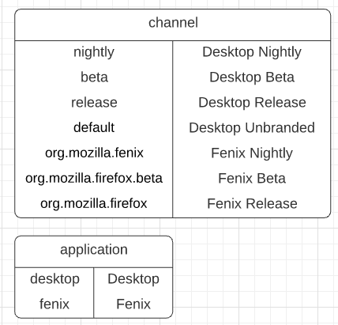

Status: proposed  
Deciders: @tdsmith, @travis79, @k88hudson, @jaredlockhart  
Date: 2020-12-18

# Context and problem statement

The Nimbus experiment DTO (“data transfer object,” i.e. the canonical
serialization) contains an “application” and “channel” field but the
contents are undefined. Jetstream, X-Man and the Rust SDK have made
different assumptions about what this field should contain based on
their different needs. How should we present this information to each
consumer?

## The current state of the world

### The model + Experimenter

As per the[<u> ER
model</u>](https://mana.mozilla.org/wiki/pages/viewpage.action?spaceKey=FJT&title=Nimbus+Engineering#NimbusEngineering-EntityRelationshipModel),
an **application** is a specific product such as “Firefox Desktop”,
“Fenix” that supports Nimbus experiments. It has **channels**, such as
“nightly” or “release”, which map to application bundle ids for mobile
and [<u>normalized update channel
</u>](https://searchfox.org/mozilla-central/source/toolkit/modules/UpdateUtils.jsm#61)for
desktop. In the experimenter database, all experiments have exactly 1
[<u>application</u>](https://github.com/mozilla/experimenter/blob/main/app/experimenter/experiments/constants/nimbus.py#L92-L93)
and
[<u>channel</u>](https://github.com/mozilla/experimenter/blob/main/app/experimenter/experiments/constants/nimbus.py#L101-L107):

Experimenter uses **application** to determine:

  - > Which remote settings collections to publish to (there are two,
    > one for fenix and one for desktop).

  - > Which audience options are relevant to an experiment, including:
    
      - > Version number
    
      - > Targeting configs (locale, first run, etc.)

  - > Which feature configs options are relevant to an experiment
    
      - > e.g. about:welcome is a Desktop feature config

  - > Which probe sets are relevant to an experiment

Experimenter uses **channel** to determine:

  - > The **targeting** JEXL expression in the DTO
    
      - > e.g. given channel is "beta", the targeting JEXL property will
        > include browserSettings.update.channel == "beta"

**<u>In the DTO,</u>** we previously mapped application constants to
**application** but as of
[<u>\#4239</u>](https://github.com/mozilla/experimenter/pull/4239) we
are sending channel constants for mobile in the application field.

### X-Man

X-Man does not use the **application** or **channel** property in the
DTO. X-Man assumes all experiments in the desktop remote settings
collection might be relevant, and then evaluates the JEXL **targeting**
property to determine eligibility, which includes the
normalized\_channel.

### Rust SDK

The SDK uses **application** property in the DTO for targeting and the
[<u>SDK
expects</u>](https://github.com/mozilla/experimenter/issues/4235) the
application field to exactly match the app store bundle identifier of
the implementing app.

### Jetstream

Jetstream currently ignores both **application** and **channel** fields
and assumes that all experiments target Desktop. Ideally this will
change in the immediate future\! Jetstream needs to know:

  - > which application family (i.e. “Fenix” or “Lockwise”) the
    > experiment is targeting, in order to choose the right default set
    > of metrics

  - > which BigQuery dataset to find the app’s data in. For Glean
    > telemetry, this is a string transformation of the bundle
    > identifier. Each release channel of the Firefox for Android and
    > iOS apps has a unique bundle identifier.

The data pipeline does not currently maintain a mapping of application
family, release channel, and bundle ID anywhere. One partial solution is
a mapping from (legacy telemetry app\_name, normalized\_os) to a product
name and canonical name in the [<u>product\_info
UDF</u>](https://github.com/mozilla/bigquery-etl/tree/master/sql/mozfun/norm/product_info),
which has a notion of product. The [<u>probe scraper repository
list</u>](https://probeinfo.telemetry.mozilla.org/glean/repositories)
enumerates bundle IDs and describes their associated release channel but
doesn’t have any unifying concept of product family to link the
different release channels together, although this is [<u>likely to
change
soon</u>](https://docs.google.com/document/d/1_zx0cxBnnFOhct1cCb_QnXntV-HN9sjqfGfiBwEBL-8/edit?ts=5fd8dab1#heading=h.151eux68loqq).

# Decision drivers

  - > Avoid standing up new information services: ideally each consumer
    > will be able to derive all of the context they need from the
    > payload

  - > Align values and labels with other systems where possible

  - > Handle quirks of existing and known-future (i.e. desktop Glean)
    > consumers

  - > Allow Experimenter to use the same mechanisms for channel
    > selection across platforms someday: it will simplify the
    > recipe-writing logic if we can rely on the metadata fields in the
    > DTO to describe channel targeting on all platforms

# Decision outcome (proposed)

Option 1b is selected because it aligns well with other systems, gives
consumers complete information, and has a coherent cross-platform
interpretation of each field. The higher short-run costs are accepted in
the name of consistency between systems.

# Considered options

Note: not taking any position on the string representation of these
names, yet, just their semantics; probably there’s a good reason to
slugify these

### Option 1a - Identify application family and application bundle ID in the DTO

**application** in the DTO will represent the app bundle ID (or
“firefox-desktop” on desktop), which can be used by both the SDK for
targeting and Jetstream for deciding the right glean datasets.

**family** (replacing “channel”) will represent a notion of application
family, like “Firefox,” “Fenix,” “Firefox iOS,” “Focus Android,” etc.

**channel** represents a release channel identifier like “release,”
“beta,” “aurora,” etc (even on mobile).

Pros

  - > Consumers have the information they need without doing any
    > additional lookups

  - > Doesn’t require a breaking schema change, since no-one is really
    > using channel yet

Cons

  - > We’d need to update some docs and code in Experimenter to prevent
    > **“application”** being different things in the DTO v.s.
    > Experimenter i.e. rename the old thing to family.

  - > Release channel is encoded implicitly in a way that isn’t obvious
    > (although this seems fine since Desktop is using the targeting
    > property to figure this out and Jetstream doesn’t need to know)

### Option 1b - Align with the proposed probe-scraper API

Jeff Klukas has [<u>a
proposal</u>](https://docs.google.com/document/d/1_zx0cxBnnFOhct1cCb_QnXntV-HN9sjqfGfiBwEBL-8/edit?ts=5fd8dab1#heading=h.151eux68loqq)
to introduce new values to the Glean probe-scraper API that represent
the concepts that we care about.

To align, we would remove “application” and “family” from the DTO and
introduce two new keys:

  - > **app\_name** is the same as “family” in 1a, e.g. “fenix”,
    > “firefox\_desktop”

  - > **app\_id** is the same as “application” in 1a, e.g.
    > “org.mozilla.firefox.”

  - > **channel** is like “release,” “beta,” etc (even on mobile)

Additional **cons** compared to 1a are a breaking change for the Rust
SDK. Additional **pros** include aligning with expected data pipeline
tooling. This is churnier in the short term but hopefully less ambiguous
in the long run.

### Option 2 - Identify application family and channel in the DTO

“Application” in the DTO will represent a notion of application family,
like “Firefox,” “Fenix,” “Firefox iOS,” “Focus Android,” etc.

“Channel” will represent a release channel, like “release,” “beta,”
“nightly.”

Tim asked for this in
[<u>EXP-673</u>](https://github.com/mozilla/experimenter/issues/4148).

Pros

  - > Human-legible

Cons

  - > No system actually needs release channel exposed this way.
    > Jetstream will need additional information in order to decide
    > which dataset to look at, which might require implementing a new
    > Experimenter API and hitting it on each invocation. This
    > *probably* gives the SDK enough information to make a decision but
    > the application bundle identifier would be more convenient.

Work involved:

  - > Experimenter: Revert
    > [<u>https://github.com/mozilla/experimenter/issues/4235</u>](https://github.com/mozilla/experimenter/issues/4235)

### Option 3 - Experimenter was right: identify application family and channelbundle in the DTO

“Application” in the DTO will represent a notion of application family,
like “Firefox,” “Fenix,” “Firefox iOS,” “Focus Android,” etc.

“Channel” on desktop will represent a release channel, like “release,”
“beta,” “nightly.” “Channel” on mobile will represent a bundle
identifier, like “org.mozilla.firefox.beta.”

Pros

  - > Consumers have the information they need without any additional
    > lookups

Cons

  - > Bundle ID and release channel are arguably two separate concepts

Work involved:

  - > Experimenter: Revert
    > [<u>https://github.com/mozilla/experimenter/issues/4235</u>](https://github.com/mozilla/experimenter/issues/4235)

# Additional considerations

How do we spell the names of the application families? Are there any
interesting systems we should agree with?
