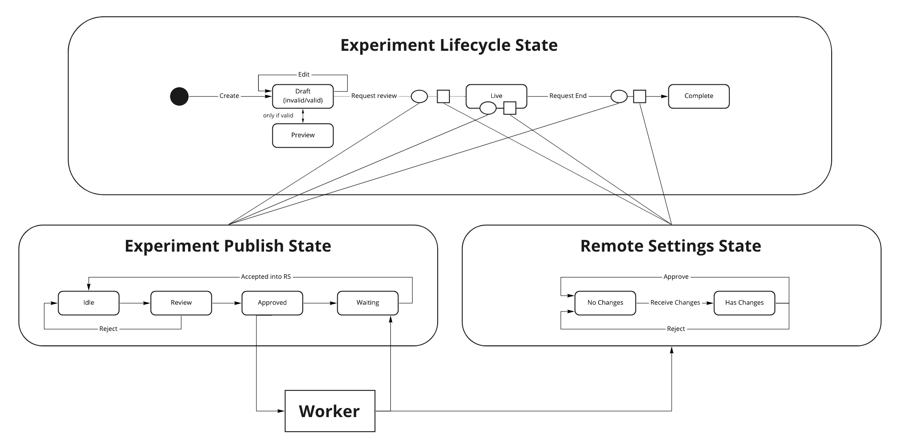
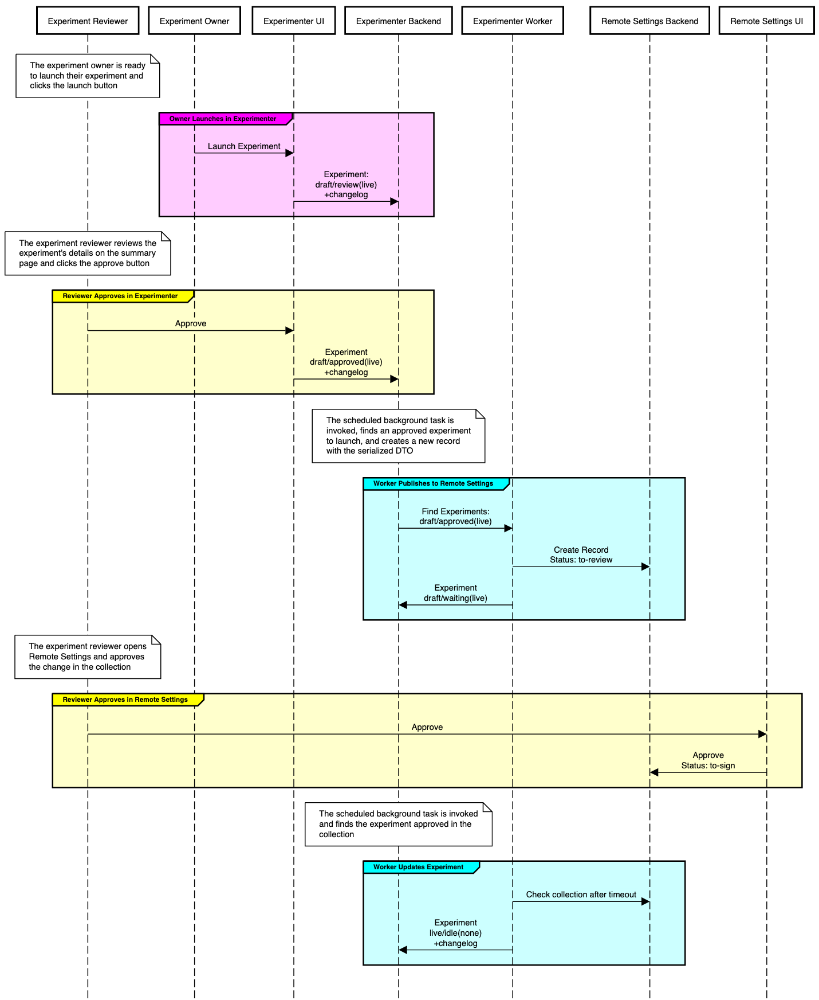

# Remote Settings (Kinto) Integration

## Overview

Experimenter uses [Remote Settings](https://remote-settings.readthedocs.io/en/latest/) to publish [Experiment Data Transfer Objects (DTOs)](https://github.com/mozilla/nimbus-shared/blob/main/types/experiments.ts) to clients. Interactions with Remote Settings are managed using [Celery Workers](https://docs.celeryproject.org/en/stable/getting-started/introduction.html). The Celery tasks are scheduled on a timer, and when invoked, check for pending changes in Experimenter to synchronize for new experiments to publish, live experiments to update, and ending experiments to delete. The following documentation and diagrams describe those interactions.

## Remote Settings

Remote Settings organizes data into buckets, which contain collections, which contain records.

### Buckets

For our purposes there are two buckets to consider:

- `main-workspace`: a staging area where all incoming changes are written
- `main`: the currently published set of data that clients read from

All collections appear in both `main` and `main-workspace`. When changes are written to a collection in `main-workspace`, the collection may be marked for review. If the change is approved, the contents of that collection in `main-workspace` will be promoted to `main` where they can be read by clients. If the change is rejected, `main-workspace` will be reverted to its previous state before the change was made. Changes can only be reviewed, approved, rejected, or promoted for an entire collection.

### Collections

Experimenter interacts with three collections:

- `nimbus-desktop-experiments`
  - The collection that Firefox Desktop is configured to read from by default.
- `nimbus-mobile-experiments`
  - The collection that Firefox for Android (Fenix) is configured to read from by default.
- `nimbus-preview`
  - Any client can be manually configured to read from the `nimbus-preview` collection for local testing, QA, and validation before an experiment launches.

A collection may or may not be configured to require reviews for changes.

- `nimbus-desktop-experiments` and `nimbus-mobile-experiments` require reviews for all changes
- `nimbus-preview` does not require reviews for any changes and can be modified directly by Experimenter as a single operation

Reviews in Remote Settings serve multiple functions:

- To ensure that erroneous data is not sent to clients which may adversely affect those clients
- To provide an additional security boundary from preventing experiments from being deployed without being approved by multiple parties

For a collection that requires reviews where multiple records are modified, there is no way to promote a change to one record from `main-workspace` to `main` without also promoting all the others. For this reason, the workflows diagrammed below enforce that only a single change can ever be made to a collection within a single review cycle.

### Experiment States

An experiment has two distinct states:

- Its lifecycle state
- Its publish state

#### Lifecycle States

- Draft: An experiment in draft has been created, and can be edited.
- Preview: An experiment in preview can not be edited and is automatically published to the `nimbus-preview` collection
- Live: An experiment in live can not be edited and is published to the collection corresponding to its target application after it has been reviewed in Experimenter and in Remote Settings
- Complete: An experiment in complete can not be edited and is no longer published in Remote Settings

#### Publish States

- Idle: An experiment has no changes that require review or modification in Remote Settings
- Review: An experiment has changes that require review in Experimenter before they can be pushed to Remote Settings
- Approved: An experiment has changes that have been approved in Experimenter and must be pushed to Remote Settings
- Waiting: An experiment has changes that have been pushed to Remote Settings and are awaiting further review in Remote Settings

In theory an experiment can occupy any combination of these two states, but in practice it will only have a publish state other than Idle in Draft and in Live. Preview experiments can be modified in Remote Settings without any review, and Complete experiments will never be published to Remote Settings.

## Workflows

The following diagrams describe every interaction between Experimenter and Remote Settings. An experiment's state is denoted as `(lifecycle state, publish state)`. Any change which requires creating a changelog includes `+changelog`.

The following actors are involved:

- Experiment Owner: The user in Experimenter that creates and edits an experiment
- Experiment Reviewer: The user in Experimenter that is not the owner that has permission to review the experiment in both Experimenter and Remote Settings
- Experimenter UI: The frontend application surface that Experimenter users interact with
- Experimenter Backend: The backend server that hosts the Experimenter API and database
- Experimenter Worker: The celery worker that can interact with the Experimenter database and make API calls to Remote Settings
- Remote Settings UI: The frontend application surface that Remote Settings users interact with and is only accessible via whitelisted VPN access
- Remote Settings Backend: The backend server that hosts the Remote Settings API and database and is only accessible via whitelisted VPN access

### Publish (Approve/Approve)

A new experiment that has been validly completed is ready to be published to Remote Settings after being reviewed and approved in Experimenter, and reviewed and approved in Remote Settings.

