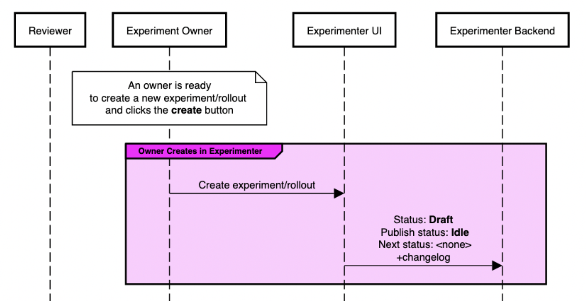
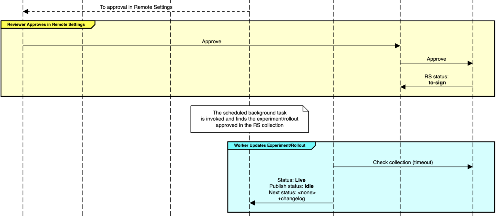
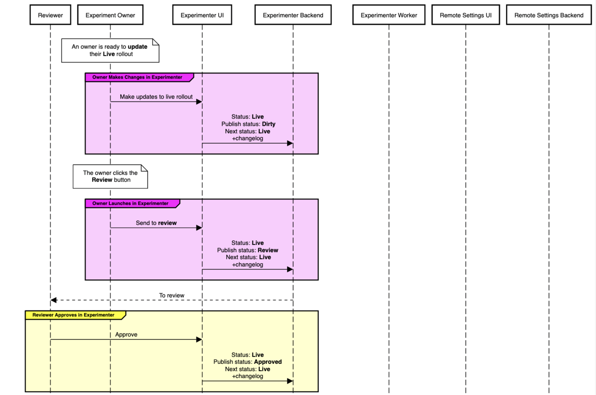

# Remote Settings (Kinto) Integration

## Table of Contents

- [Remote Settings (Kinto) Integration](#remote-settings--kinto--integration)
  - [Overview](#overview)
  - [Remote Settings](#remote-settings)
    - [Buckets](#buckets)
    - [Collections](#collections)
  - [Experiment States](#experiment-states)
    - [Lifecycle States](#lifecycle-states)
      - [States](#states)
      - [Parameters](#parameters)
    - [Publish States](#publish-states)
      - [States](#states-1)
      - [Parameters](#parameters-1)
  - [Workflows](#workflows)
    - [Preview](#preview)
    - [Publish (Approve/Approve)](#publish--approve-approve-)
    - [Publish (Reject/------)](#publish--reject--------)
    - [Publish (Approve/Reject)](#publish--approve-reject-)
    - [Publish (Approve/Reject+Rollback)](#publish--approve-reject-rollback-)
    - [Publish (Approve/Timeout)](#publish--approve-timeout-)
    - [End Enrollment (Approve/Approve)](#end-enrollment--approve-approve-)
    - [End Enrollment (Reject/------)](#end-enrollment--reject--------)
    - [End Enrollment (Approve/Reject)](#end-enrollment--approve-reject-)
    - [End Enrollment (Approve/Reject+Rollback)](#end-enrollment--approve-reject-rollback-)
    - [End Enrollment (Approve/Timeout)](#end-enrollment--approve-timeout-)
    - [End (Approve/Approve)](#end--approve-approve-)
    - [End (Reject/------)](#end--reject--------)
    - [End (Approve/Reject)](#end--approve-reject-)
    - [End (Approve/Reject+Rollback)](#end--approve-reject-rollback-)
    - [End (Approve/Timeout)](#end--approve-timeout-)
  - [Maintaining These Docs](#maintaining-these-docs)

## Overview

Experimenter uses [Remote Settings](https://remote-settings.readthedocs.io/en/latest/) to publish [Experiment Data Transfer Objects (DTOs)](https://github.com/mozilla/nimbus-shared/blob/main/types/experiments.ts) to clients. Interactions with Remote Settings are managed using [Celery Workers](https://docs.celeryproject.org/en/stable/getting-started/introduction.html). The Celery tasks are scheduled on a timer, and when invoked, check for pending changes in Experimenter to synchronize for new experiments/rollouts to publish, live experiments/rollouts to update, and ending experiments to delete. The following documentation and diagrams describe those interactions.

## Remote Settings

Remote Settings organizes data into buckets, which contain collections, which contain records.

### Buckets

For our purposes there are two buckets to consider:

- `main-workspace`: a staging area where all incoming changes are written
- `main`: the currently published set of data that clients read from

All collections appear in both `main` and `main-workspace`. When changes are written to a collection in `main-workspace`, the collection may be marked for review. If the change is approved, the contents of that collection in `main-workspace` will be promoted to `main` where they can be read by clients. If the change is rejected, `main-workspace` will be reverted to its previous state before the change was made. Changes can only be reviewed, approved, rejected, or promoted for an entire collection.

### Collections

Experimenter interacts with three collections:

- `nimbus-desktop-experiments`
  - The collection that Firefox Desktop is configured to read from by default.
- `nimbus-mobile-experiments`
  - The collection that Firefox for Android (Fenix) is configured to read from by default.
- `nimbus-preview`
  - Any client can be manually configured to read from the `nimbus-preview` collection for local testing, QA, and validation before an experiment launches.

A collection may or may not be configured to require reviews for changes.

- `nimbus-desktop-experiments` and `nimbus-mobile-experiments` require reviews for all changes
- `nimbus-preview` does not require reviews for any changes and can be modified directly by Experimenter as a single operation

Reviews in Remote Settings serve multiple functions:

- To ensure that erroneous data is not sent to clients which may adversely affect those clients
- To provide an additional security boundary from preventing experiments from being deployed without being approved by multiple parties

For a collection that requires reviews where multiple records are modified, there is no way to promote a change to one record from `main-workspace` to `main` without also promoting all the others. For this reason, the workflows diagrammed below enforce that only a single change can ever be made to a collection within a single review cycle.

## Experiment States

Historically, we have tracked only a single state for an experiment/rollout which incorporated stages from both its overall lifecycle and its publish state, however by adding the requirement of reviewing an experiment/rollout in both Experimenter as well as Remote Settings, it is necessary to track additional states. In addition, where previously an experiment was only reviewed once at launch time, experiments and rollouts can now be reviewed at three stages of its lifecycle: at launch, while live (for rollouts), and while ending. The experiment/rollout moves through the same set of "publish"-specific states during each of these three stages and so it is possible to extract them into their own "publish workflow"-specific state.

An experiment/rollout now has two distinct states:

- Its lifecycle state
- Its publish state

### Lifecycle States

#### States

- **Draft**: An experiment/rollout in draft has been created, and can be edited.
- **Preview**: An experiment/rollout in preview can not be edited and is automatically published to the `nimbus-preview` collection
- **Live**: An experiment in live can not be edited and is published to the collection corresponding to its target application after it has been reviewed in Experimenter and in Remote Settings. A rollout in the live state has certain editable fields (i.e. population size). Like experiments, a rollout is published to the collection corresponding to its target application after being reviewed in Experimenter and in Remote Settings. The same review cycle is adhered to when updates to a live rollout are made.
- **Complete**: An experiment in complete can not be edited and is no longer published in Remote Settings. Rollouts do not have a complete state.

### Publish States

#### States

- **Idle**: An experiment/rollout has no changes that require review or modification in Remote Settings.
- **Dirty**: A rollout has changes that require review or modification in Experimenter before they can be published to Remote Settings. Experiments do not have a dirty state as they are non-editable after moving to the Live lifecycle state.
- **Review**: An experiment/rollout has changes that require review in Experimenter before they can be published to Remote Settings.
- **Approved**: An experiment/rollout has changes that have been approved in Experimenter and must be published to Remote Settings.
- **Waiting**: An experiment/rollout has changes that have been published to Remote Settings and are awaiting further review in Remote Settings.

#### Parameters

- **Next**: A lifecycle status which the experiment/rollout will move to if it is successfully approved and updated in Remote Settings

In theory an experiment/rollout can occupy any combination of these two states, but in practice an experiment will only have a publish state other than Idle when the experiment is in the Draft or Live lifecycle state. For rollouts, the publish state can become dirty when in the Live state to allow updates to the rollout; this moves the rollout through the review flow and back to the Idle publish state. Preview experiments can be modified in Remote Settings without any review, and Complete experiments will never be published to Remote Settings.

## Workflows

The following diagrams describe every interaction between Experimenter and Remote Settings. An experiment/rollout's state is denoted as:

`lifecycle state/publish state(next lifecycle state)`

Any change which requires creating a changelog includes `+changelog`.

The following actors are involved:

- Experiment Owner: The user in Experimenter that creates and edits an experiment
- Experiment Reviewer: The user in Experimenter that is not the owner that has permission to review the experiment in both Experimenter and Remote Settings
- Experimenter UI: The frontend application surface that Experimenter users interact with
- Experimenter Backend: The backend server that hosts the Experimenter API and database
- Experimenter Worker: The celery worker that can interact with the Experimenter database and make API calls to Remote Settings
- Remote Settings UI: The frontend application surface that Remote Settings users interact with and is only accessible via allow listed VPN access
- Remote Settings Backend: The backend server that hosts the Remote Settings API and database and is only accessible via allow listed VPN access

### Draft (Create)

A new experiment or rollout which has yet to be sent for review or put into preview is marked for Draft.

### Preview

A draft experiment/rollout that has been validly completed is marked for Preview, is published to the preview collection in Remote Settings, and is then accessible to specially configured clients.

### Publish (Approve/Approve)

A draft experiment/rollout that has been validly completed is reviewed and approved in Experimenter, is reviewed and approved in Remote Settings, and is then accessible to clients.

### Publish (Reject/------)

A draft experiment/rollout that has been validly completed (no errors) is rejected by a reviewer in Experimenter. A rejection reason is captured in Experimenter and is displayed to the owner in Experimenter.

### Publish (Approve/Reject)

A draft experiment/rollout that has been validly completed is reviewed and approved in Experimenter, and is then reviewed and rejected in Remote Settings. A rejection reason is captured in Remote Settings and is displayed to the owner in Experimenter.

### Publish (Approve/Reject + Manual Rollback)

A draft experiment/rollout that has been validly completed is reviewed and approved in Experimenter, and is then reviewed and rejected in Remote Settings. The reviewer manually rolls back the Remote Settings collection. A rejection reason is captured in Remote Settings and but **unable to be recovered by Experimenter** because the collection as manually rolled back **before Experimenter could query its status**, and so Experimenter shows a generic rejection reason.

### Publish (Approve/Timeout)

A draft experiment/rollout that has been validly completed is reviewed and approved in Experimenter, is published to Remote Settings, and the collection is marked for review. Before the reviewer is able to review it in Remote Settings, the scheduled celery task is invoked and finds that the collection is blocked from further changes by having an unattended review pending. It rolls back the pending review to allow other queued changes to be made. This prevents unattended reviews in a collection from blocking other queued changes.

### Publish update (Approve/Approve)

A live rollout can have updates pushed to its state while remaining Live.

These updated changes must be reviewed in order to be published to the user, following the same flow to be approved in both Experimenter and Remote Settings.

### End Enrollment (Approve/Approve)

A live experiment that is published in Remote Settings has passed its planned end enrollment date and the owner requests that enrollment ends. The request is reviewed and approved in Experimenter and then Remote Settings, the record is updated, and no new clients will be enrolled in the experiment.

### End Enrollment (Reject/------)

A live experiment that is published in Remote Settings has passed its planned end enrollment date and the owner requests that enrollment ends. The request is reviewed and rejected in Experimenter. No change is made to Remote Settings and clients will continue to enroll. A rejection reason is captured in Experimenter and is displayed to the experiment owner in Experimenter.

### End Enrollment (Approve/Reject)

A live experiment that is published in Remote Settings has passed its planned end enrollment date and the owner requests that enrollment ends. The request is reviewed and approved in Experimenter, and then rejected in Remote Settings. No change is made to Remote Settings and clients will continue to enroll. A rejection reason is captured in Experimenter and is displayed to the experiment owner in Experimenter.

### End Enrollment (Approve/Reject+Rollback)

A live experiment that is published in Remote Settings has passed its planned end enrollment date and the owner requests that enrollment ends. The request is reviewed and approved in Experimenter, and then rejected in Remote Settings. No change is made to Remote Settings and clients will continue to enroll. A rejection reason is captured in Remote Settings and but unable to be recovered by Experimenter because the collection as manually rolled back before Experimenter could query its status, and so Experimenter shows a generic rejection reason.

### End Enrollment (Approve/Timeout)

A live experiment that is published in Remote Settings has passed its planned end enrollment date and the owner requests that enrollment ends. The request is reviewed and approved in Experimenter, and the change is pushed to Remote Settings. Before the reviewer is able to review it in Remote Settings, the scheduled celery task is invoked and finds that the collection is blocked from further changes by having an unattended review pending. It rolls back the pending review to allow other queued changes to be made. This prevents unattended reviews in a collection from blocking other queued changes.

### End (Approve/Approve)

A live experiment that is published in Remote Settings is requested to end by the owner, reviewed and approved in Experimenter, reviewed and approved in Remote Settings, is deleted from the collection, and is then no longer accessible by clients.

### End (Reject/------)

A live experiment that is published in Remote Settings is requested to end by the owner, and is then reviewed and rejected in Experimenter. A rejection reason is captured in Experimenter and is displayed to the experiment owner in Experimenter.

### End (Approve/Reject)

A live experiment that is published in Remote Settings is requested to end by the owner, is reviewed and approved in Experimenter, and is then reviewed and rejected in Remote Settings. A rejection reason is captured in Remote Settings and is displayed to the experiment owner in Experimenter.

### End (Approve/Reject+Rollback)

A live experiment that is published in Remote Settings is requested to end by the owner, is reviewed and approved in Experimenter, and is then reviewed and rejected in Remote Settings. A rejection reason is captured in Remote Settings and but unable to be recovered by Experimenter because the collection as manually rolled back before Experimenter could query its status, and so Experimenter shows a generic rejection reason.

### End (Approve/Timeout)

A live experiment that is published in Remote Settings is requested to end by the owner, is reviewed and approved in Experimenter, is deleted from the collection, and the collection is marked for review. Before the reviewer is able to review it in Remote Settings, the scheduled celery task is invoked and finds that the collection is blocked from further changes by having an unattended review pending. It rolls back the pending review to allow other queued changes to be made. This prevents unattended reviews in a collection from blocking other queued changes.

## Maintaining These Docs

As we make changes to the integration and workflow we'll need to keep these docs up to date. The diagrams are generated using https://sequencediagram.org/ and their source can be found in the `diagrams/` folder.
