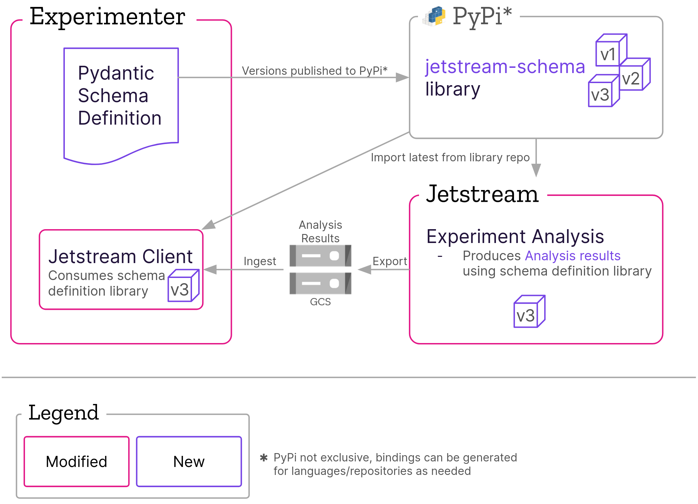

# Jetstream/Nimbus Shared Schema Architecture

* Status: proposed
* Deciders: Mike Williams
* Date: 2023-04-21

Technical Story: https://mozilla-hub.atlassian.net/browse/EXP-2265

## Context and Problem Statement

Experiment analysis for the Nimbus experimentation platform occurs in a separate project called Jetstream. Jetstream delivers results to Experimenter, which must parse these results based on the expected format of Jetstream’s output. However, Experimenter is forced to make assumptions about what it expects in the results, increasing the potential for buggy behavior during both ingestion and on the Results UI for Experimenter. Currently, various schemas are defined in a few different places for different purposes, but one schema definition shared between Experimenter and Jetstream would allow for validation of outputs from Jetstream while removing the need for Experimenter to make assumptions about the data it is receiving from Jetstream. This document describes the decisions around how and where that schema will be defined.

## Decision Drivers

* Single schema definition shared by Experimenter and Jetstream
* No functional changes to Jetstream workflow
  * Jetstream can (and should) use the schema definition in forming/validating outputs
* Process for making schema changes
* Simplify Experimenter ingestion of analysis results

## Considered Options

The schema definition and its location were related but independent decisions, so their respective options are enumerated here separately.

### Schema Definition

* [**Option 1**] Pydantic
* [**Option 2**] Typescript

### Schema Location

* [**Option A**] `jetstream` repository
* [**Option B**] `experimenter` (Nimbus) repository
* [**Option C**] `nimbus-shared` repository

## Decision Outcome

Chosen option: **Option 1B**: define the schema using Pydantic, and put this definition in the `experimenter` repository. **Option 1** Pydantic was chosen because it meets the needs of the solution, and fits best with the language and approaches in use by the relevant systems. **Option B** `experimenter` repo was chosen as the location for the schema because it represents the closest thing to a monorepo (or at least somewhat consolidated location for shared content), and any schemas shared among Nimbus systems will likely be used in the `experimenter` repo.

### Overview of Solution Integration

See below for more info on the options and their pros/cons.

### Positive Consequences

* Ability to generate and ingest analysis results in a structured way
* Nimbus repository as central source of truth
  * Nimbus repository may become home to Jetstream in the future
  * Other Nimbus schemas can live in the same place
* Aligns with FastAPI approach used for ongoing Cirrus work
* Easily generate schema definitions for different scenarios
  * Pydantic allows us to automatically generate bindings and publish new versions to external repositories (e.g., PyPi for use by Jetstream)
  * Django, Typescript, JSON
* Publishing the schema as a library handles concerns about schema changes and synchronization
  * Schema versioning is basically free via the published library
  * Ability to reference older versions of the schema and tag results with the relevant version

### Negative Consequences

* Could be confusing to have the schema definition not live where the data it defines is generated
  * And the definition does not live with the data
* Need to consume a new dependency in order to use the schema

### Prior Art

This solution is similar in practice to how [Protocol Buffers](https://protobuf.dev/overview/) (also known as Protobuf) are used to document schemas. For example, Google uses them extensively as a data format that provides typed schemas and serialization for structured data. Our solution could be used in a similarly broad fashion, and Protobufs would be applicable for our use-case, but Pydantic provides more familiarity to a team and organization with much greater usage of Python (in particular, both Experimenter and Jetstream).

## Pros and Cons of the Schema Definition Options
Chosen option is marked in **bold**.

### **[Option 1] Pydantic**

* Create schema definitions using Pydantic
* Autogenerate bindings and publish to, e.g., pypi/npm/cargo for various use-cases

#### Pros

* Aligns with FastAPI approach used for ongoing Cirrus work
* Easily generate schema definitions for different scenarios
  * Django, Typescript, JSON

#### Cons

* Setup and maintenance required to publish bindings to, e.g., PyPi
* Refactor needed to truly make use of advantages
  * Refactor ingest using schema for serialization/deserialization
  * Refactor test cases using serializers
* Adding versioning to schema definition adds complexity
  * Sync schema versions between consuming applications

### [Option 2] Typescript

* Create schema definitions in Typescript
* Generate schema in JSON from Typescript definitions
* Validate JSON schema from Jetstream using generated JSON schema

#### Pros

* Typescript is a well-known language for defining types and schemas
* Frontend of Experimenter uses Typescript
* Jetstream analysis results are JSON

#### Cons

* Not as straightforward to convert for use with Python
  * Jetstream is Python
  * Jetstream client in Experimenter is Python
  * Experimenter backend is Django / Python
* Verbose
* Harder to read (subjective)

## Pros and Cons of the Schema Location Options
Chosen option is marked in **bold**.

### [Option A] `jetstream` repository

Create schema in [jetstream](https://www.github.com/mozilla/jetstream) repository.

#### Pros
* Schema defined in the place where the data originates

#### Cons
* No single source of truth for Nimbus schemas
* Not a replicable process for future Nimbus work

### **[Option B] `experimenter` (Nimbus) repository**

Create schema in [experimenter](https://www.github.com/mozilla/experimenter) repository, under a new `schemas/` top level directory.

#### Pros
* Single source of truth for Nimbus schemas
  * Can re-use the process for generating bindings/libraries from schema definitions for future schemas
* Fits with desired approach to consolidate repositories where applicable
  * Including the likelihood of Experimenter repo being renamed Nimbus as its scope expands (with, e.g., Cirrus)

#### Cons
* Schema changes need to be made separately from analysis results data changes
  * Meaning two PRs -- one in Jetstream, one in Experimenter
    * However, this would be true even if the schema were defined in Jetstream

### [Option C] `nimbus-shared` repository

Create schema in [nimbus-shared](https://www.github.com/mozilla/nimbus-shared) repository.

#### Pros
* Single source of truth for Nimbus schemas
* This repo has been used in the past for content (like schemas) shared between nimbus repositories

#### Cons
* Not really used for much now
* Helps perpetuate fragmentation in Nimbus ecosystem
* Schema changes would require 3 coordinated PRs in Experimenter, Jetstream, and Nimbus Shared repos

