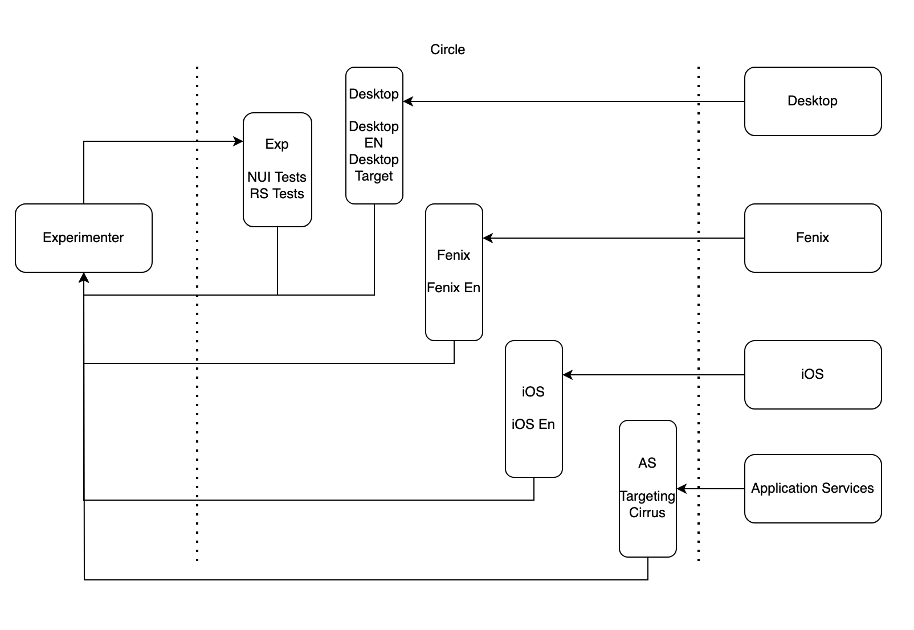

# RFC: Adjust Nimbus’ CI workflow to account for external changes

## Benjamin Forehand Jr

# OVERVIEW

The Nimbus project is extensively integrated with Firefox across all platforms, including Desktop and Mobile (iOS, Android). It is a fundamental component of Firefox, embedded within these applications throughout their development lifecycle. The experimentation team has dedicated significant effort to ensure comprehensive support and rigorous testing for these clients.

To enhance our current processes, I propose revising the workflow of our Continuous Integration (CI) tests to trigger test runs when there are changes in external integrations. This adjustment aims to preserve our high standards of code coverage and reliability while minimizing the execution of redundant tests in the CI pipeline.

# GOALS

1. Reduce Pull Request testing times.
2. Directly test external integrations whenever significant changes occur in the integrating clients.

# Current Workflow

With each Pull Request (PR), a set of CircleCI jobs are triggered. These jobs assess various aspects of the code, such as code quality and coverage, and execute a series of unit and integration tests to ensure the new changes are compatible with the existing workflow. Integration tests are conducted on live Firefox Desktop versions (Release, Beta, Nightly) as well as Firefox Mobile (iOS, Android).

The average test duration is approximately 15-20 minutes, which involves building the entire Experimenter project. For mobile testing, the Android app is built whenever a new beta build is detected on Treeherder. On iOS, a fresh app is built each time based on the current main branch.

This workflow has proven effective in catching errors introduced by new code and verifying external dependencies, such as Application Services changes and Feature manifest updates.

# Proposed Changes

I propose that we switch to a [Just-In-Time (JIT) testing strategy](https://www.google.com/url?q=https://docs.google.com/document/d/1fQAC0grtV9M3rZ3oc6bEldEf7IUPnvPbUkhfdKGIfNI/edit&sa=D&source=docs&ust=1722453510825467&usg=AOvVaw31bQjS1z0gh8MDEqhyT2Hz). This approach will help us maintain our current coverage while reducing the time required for a PR to complete, thereby enhancing developer efficiency. Additionally, it will allow us to pinpoint specific changes that cause errors more accurately.

Under this new system, we will run Desktop, iOS, and Android tests whenever changes to their respective states are detected. Since these components are external to the Experimenter project, we will monitor their status using CircleCI. Upon detecting a change, we will trigger a PR to update a key that we maintain. This key points to a specific version of Firefox, and updating it will trigger the appropriate tests.

Each Nimbus scoped PR will primarily include unit tests, linting, and a limited set of integration tests, mainly conducted on Firefox Nightly. When a change in an external dependency is detected, a specialized PR will be created to run a corresponding test suite.

For example, when a new Beta version of Firefox Android is built on Taskcluster, we will create a PR that updates our tracked key (Taskcluster Task ID), builds an Android application based on that key, and runs the relevant Android Experimenter tests against the built application. This method ensures that each external dependency change is thoroughly tested, maintaining the robustness and reliability of our integrations.

I estimate that we can reduce our PR Test cycle time by 40-50% (10-12 minutes).

# SPECIFICATIONS

* Flow Diagram

* Firefox for Android (Fenix), Firefox Desktop (Release, Beta)
    * Firefox for Android and Firefox for Desktop are both integrated within Mozilla Central and built using Taskcluster. Taskcluster assigns a unique Task ID to each job, which allows us to monitor build activities. The Firefox Beta builds are typically conducted once a week. By tracking these builds using their Task IDs, we can automatically trigger a pull request (PR) to update the stored Task ID within the Experimenter repository.

        This PR will include a specific set of tests designed to either build the Firefox for Android APK and run tests against it, or for Firefox Desktop, to pull the build that corresponds to the detected change (Release or Beta) and run the appropriate tests. Once all tests pass, we can merge the PR, thereby updating the Task ID to the latest successful build version.

* Firefox for iOS (Fennec)
    * Firefox for iOS is currently hosted on GitHub. Although there are no beta builds for this repository, we can leverage Mozilla's broader release cycle to build incrementally over time. By using the Mozilla Firefox Beta Task IDs on Taskcluster, we can pull and trigger Firefox for iOS builds from the main branch of the GitHub project. We can track the commit hash of the latest commit within Experimenter. This process will be managed through a PR, which will handle the build and run a specific set of tests against the built iOS app. Once all tests pass, we can merge the PR, updating the tracked GitHub commit to the latest successful build version.
* Experimenter Pull Request Test Flow
    * Each PR will run a set of unit tests, as well as a reduced set of Experimenter UI Tests that are run on nightly. The UI Tests will be a randomly selected set of tests that are limited in the interests of time. This will help us to not lose too much coverage per PR.
