# Remote Settings (Kinto) Integration

## Table of Contents

- [Remote Settings (Kinto) Integration](#remote-settings--kinto--integration)
  - [Overview](#overview)
  - [Remote Settings](#remote-settings)
    - [Buckets](#buckets)
    - [Collections](#collections)
  - [Experiment States](#experiment-states)
    - [Lifecycle States](#lifecycle-states)
      - [States](#states)
      - [Parameters](#parameters)
    - [Publish States](#publish-states)
      - [States](#states-1)
      - [Parameters](#parameters-1)
  - [Workflows](#workflows)
    - [Draft (Create)](#draft-create)
    - [Preview](#preview)
    - [Publish (Approve/Approve)](#publish-approveapprove)
    - [Publish (Reject/------)](#publish-reject------)
    - [Publish (Approve/Reject)](#publish-approvereject)
    - [Publish (Approve/Reject+Rollback)](#publish-approvereject--manual-rollback)
    - [Publish (Approve/Timeout)](#publish-approvetimeout)
    - [Publish (Cancel ------/------)](#publish-cancel-------------)
    - [Update (Approve/Approve)](#update-approveapprove)
    - [Update (Reject/------)](#update-reject------)
    - [Update (Approve/Reject)](#update-approvereject)
    - [Update (Approve/Reject+Rollback)](#update-approvereject--manual-rollback)
    - [Update (Approve/Timeout)](#update-approvetimeout)
    - [Update (Cancel ------/------)](#update-cancel-------------)
    - [End Enrollment (Approve/Approve)](#end-enrollment-approveapprove)
    - [End Enrollment (Reject/------)](#end-enrollment-reject------)
    - [End Enrollment (Approve/Reject)](#end-enrollment-approvereject)
    - [End Enrollment (Approve/Reject+Rollback)](#end-enrollment-approverejectmanual-rollback)
    - [End Enrollment (Approve/Timeout)](#end-enrollment-approvetimeout)
    - [End Enrollment (Cancel ------/------)](#end-enrollment-cancel-------------)
    - [End (Approve/Approve)](#end-approveapprove)
    - [End (Reject/------)](#end-reject------)
    - [End (Approve/Reject)](#end-approvereject)
    - [End (Approve/Reject+Rollback)](#end-approverejectmanual-rollback)
    - [End (Approve/Timeout)](#end-approvetimeout)
    - [End (Cancel ------/------)](#end-cancel-------------)
  - [Maintaining These Docs](#maintaining-these-docs)

## Overview

Experimenter uses [Remote Settings](https://remote-settings.readthedocs.io/en/latest/) to publish [Experiment Data Transfer Objects (DTOs)](https://github.com/mozilla/nimbus-shared/blob/main/types/experiments.ts) to clients. Interactions with Remote Settings are managed using [Celery Workers](https://docs.celeryproject.org/en/stable/getting-started/introduction.html). The Celery tasks are scheduled on a timer, and when invoked, check for pending changes in Experimenter to synchronize for new experiments/rollouts to publish, live experiments/rollouts to update, and ending experiments to delete. The following documentation and diagrams describe those interactions.

## Remote Settings

Remote Settings organizes data into buckets, which contain collections, which contain records.

### Buckets

For our purposes there are two buckets to consider:

- `main-workspace`: a staging area where all incoming changes are written
- `main`: the currently published set of data that clients read from

All collections appear in both `main` and `main-workspace`. When changes are written to a collection in `main-workspace`, the collection may be marked for review. If the change is approved, the contents of that collection in `main-workspace` will be promoted to `main` where they can be read by clients. If the change is rejected, `main-workspace` will be reverted to its previous state before the change was made. Changes can only be reviewed, approved, rejected, or promoted for an entire collection.

### Collections

Experimenter interacts with three collections:

- `nimbus-desktop-experiments`
  - The collection that Firefox Desktop is configured to read from by default.
- `nimbus-mobile-experiments`
  - The collection that Firefox for Android (Fenix) is configured to read from by default.
- `nimbus-preview`
  - Any client can be manually configured to read from the `nimbus-preview` collection for local testing, QA, and validation before an experiment launches.

A collection may or may not be configured to require reviews for changes.

- `nimbus-desktop-experiments` and `nimbus-mobile-experiments` require reviews for all changes
- `nimbus-preview` does not require reviews for any changes and can be modified directly by Experimenter as a single operation

Reviews in Remote Settings serve multiple functions:

- To ensure that erroneous data is not sent to clients which may adversely affect those clients
- To provide an additional security boundary from preventing experiments from being deployed without being approved by multiple parties

For a collection that requires reviews where multiple records are modified, there is no way to promote a change to one record from `main-workspace` to `main` without also promoting all the others. For this reason, the workflows diagrammed below enforce that only a single change can ever be made to a collection within a single review cycle.

## Experiment States

Historically, we have tracked only a single state for an experiment/rollout which incorporated stages from both its overall lifecycle and its publish state, however by adding the requirement of reviewing an experiment/rollout in both Experimenter as well as Remote Settings, it is necessary to track additional states. In addition, where previously an experiment was only reviewed once at launch time, experiments and rollouts can now be reviewed at three stages of its lifecycle: at launch, while live (for rollouts), and while ending. The experiment/rollout moves through the same set of "publish"-specific states during each of these three stages and so it is possible to extract them into their own "publish workflow"-specific state.

An experiment/rollout now has two distinct states:

- Its lifecycle state
- Its publish state

### Lifecycle States

#### States

- **Draft**: An experiment/rollout in draft has been created, and can be edited.
- **Preview**: An experiment/rollout in preview can not be edited and is automatically published to the `nimbus-preview` collection
- **Live**: An experiment in live can not be edited and is published to the collection corresponding to its target application after it has been reviewed in Experimenter and in Remote Settings. A rollout in the live state has certain editable fields (i.e. population size). Like experiments, a rollout is published to the collection corresponding to its target application after being reviewed in Experimenter and in Remote Settings. The same review cycle is adhered to when updates to a live rollout are made.
- **Complete**: An experiment in complete can not be edited and is no longer published in Remote Settings. Rollouts do not have a complete state.

### Publish States

#### States

- **Idle**: An experiment/rollout has no changes that require review or modification in Remote Settings.
- **Review**: An experiment/rollout has changes that require review in Experimenter before they can be published to Remote Settings.
- **Approved**: An experiment/rollout has changes that have been approved in Experimenter and must be published to Remote Settings.
- **Waiting**: An experiment/rollout has changes that have been published to Remote Settings and are awaiting further review in Remote Settings.

#### Parameters

- **Next**: A lifecycle status which the experiment/rollout will move to if it is successfully approved and updated in Remote Settings

In theory an experiment/rollout can occupy any combination of these two states, but in practice an experiment will only have a publish state other than Idle when the experiment is in the Draft or Live lifecycle state. Rollouts can become "dirty" (`is_dirty`: True) when in the Live state to allow updates to the rollout; this moves the rollout through the review flow and back to the Idle publish state (`is_dirty`: False). Preview experiments can be modified in Remote Settings without any review, and Complete experiments will never be published to Remote Settings.

## Workflows

The following diagrams describe every interaction between Experimenter and Remote Settings. Any change which requires creating a changelog includes `+changelog`.

The following actors are involved:

- Experiment Owner: The user in Experimenter that creates and edits an experiment
- Experiment Reviewer: The user in Experimenter that is not the owner that has permission to review the experiment in both Experimenter and Remote Settings
- Experimenter UI: The frontend application surface that Experimenter users interact with
- Experimenter Backend: The backend server that hosts the Experimenter API and database
- Experimenter Worker: The celery worker that can interact with the Experimenter database and make API calls to Remote Settings
- Remote Settings UI: The frontend application surface that Remote Settings users interact with and is only accessible via allow listed VPN access
- Remote Settings Backend: The backend server that hosts the Remote Settings API and database and is only accessible via allow listed VPN access

### Draft (Create)

A new experiment or rollout which has yet to be sent for review or put into preview is marked for Draft.

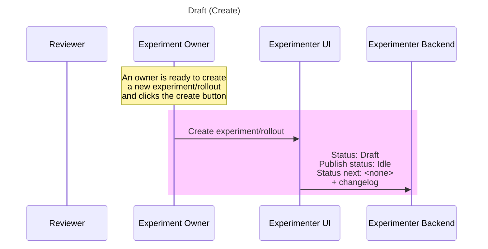
```mermaid
  sequenceDiagram
    participant Reviewer
    participant Experiment Owner
    participant Experimenter UI
    participant Experimenter Backend
    title Draft (Create)
    Note over Experiment Owner: An owner is ready to create <br/>  a new experiment/rollout <br/> and clicks the create button
    
    rect rgb(255,204,255) 
        Experiment Owner->>Experimenter UI: Create experiment/rollout
        Experimenter UI->>Experimenter Backend: Status: Draft <br/> Publish status: Idle <br/> Status next: <none> <br/> + changelog
    end
%%{init:{'themeCSS':'g:nth-of-type(1) .note { stroke: purple ;fill: white; };'}}%%
```

### Preview

A draft experiment/rollout that has been validly completed is marked for Preview, is published to the preview collection in Remote Settings, and is then accessible to specially configured clients.

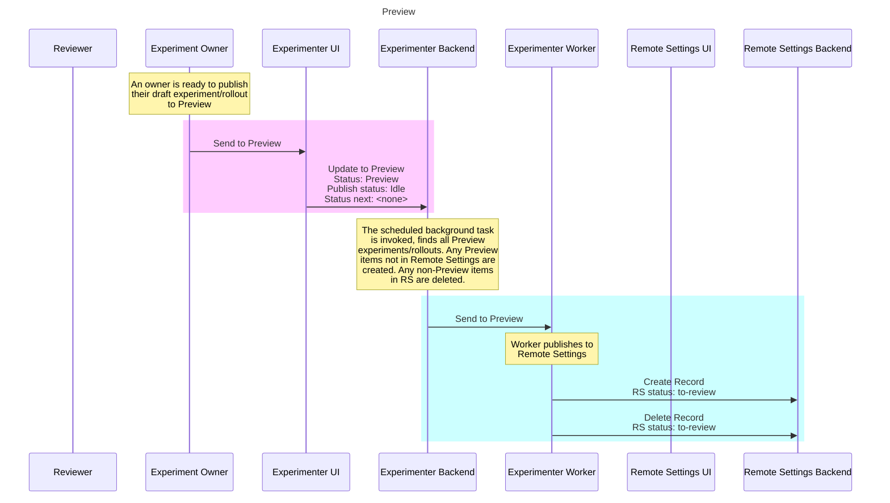
```mermaid
  sequenceDiagram
    participant Reviewer
    participant Experiment Owner
    participant Experimenter UI
    participant Experimenter Backend
    participant Experimenter Worker
    participant Remote Settings UI
    participant Remote Settings Backend
    title Preview
    Note over Experiment Owner: An owner is ready to publish <br/> their draft experiment/rollout <br/> to Preview
    
    rect rgb(255,204,255) 
        Experiment Owner->>Experimenter UI: Send to Preview
        Experimenter UI->>Experimenter Backend: Update to Preview <br/> Status: Preview <br/> Publish status: Idle <br/> Status next: <none>
    end 
 
    Note over Experimenter Backend: The scheduled background task <br/> is invoked, finds all Preview  <br/> experiments/rollouts. Any Preview  <br/> items not in Remote Settings are <br/> created. Any non-Preview items <br/> in RS are deleted.
    
    rect rgb(204,255,255) 
        Experimenter Backend->>Experimenter Worker: Send to Preview
        Note over Experimenter Worker: Worker publishes to <br/>Remote Settings
        Experimenter Worker->>Remote Settings Backend: Create Record <br/> RS status: to-review
        Experimenter Worker->>Remote Settings Backend: Delete Record <br/> RS status: to-review
    end 
%%{init:{'themeCSS':'g:nth-of-type(1) .note { stroke: purple ;fill: white; };'}}%%
```

### Publish (Approve/Approve)

A draft experiment/rollout that has been validly completed is reviewed and approved in Experimenter, is reviewed and approved in Remote Settings, and is then accessible to clients.

```mermaid
  sequenceDiagram
    participant Reviewer
    participant Experiment Owner
    participant Experimenter UI
    participant Experimenter Backend
    participant Experimenter Worker
    participant Remote Settings UI
    participant Remote Settings Backend
    title Publish (Approve/Approve)
    Note over Experiment Owner: An owner is ready to launch <br/> their draft experiment/rollout <br/> from draft and clicks the <br/> Review button
    
    rect rgb(255,204,255) 
        Note right of Experiment Owner: Owner launches in Experimenter
        Experiment Owner->>Experimenter UI: Send to Review
        Experimenter UI->>Experimenter Backend: Status: Draft <br/> Publish status: Review <br/> Status next: Live <br/> + changelog
    end 
    
    Experimenter Backend-->>Reviewer: To review
    Note over Reviewer: The reviewer reviews the <br/> experiment/rollout's details on the <br/> summary page and clicks the <br/> approve button
    

    rect rgb(255,255,204) 
        Note over Experiment Owner: Reviewer approves in Experimenter
        Reviewer->>Experimenter UI: Approve
        Experimenter UI->>Experimenter Backend: Status: Draft <br/> Publish status: Approved <br/> Status next: Live <br/> + changelog
    end 
 
    Note over Experimenter Backend: The scheduled background task <br/> is invoked, finds an approved experiment/rollout <br/> to publish, and creates the new published <br/> record with the serialized DTO
    
    rect rgb(204,255,255) 
        Experimenter Backend->>Experimenter Worker: Find experiments/rollouts: <br/> Status: Draft <br/> Publish status: Approved <br/> Status next: Live
        Note over Experimenter Worker: Worker publishes to <br/>Remote Settings
        Experimenter Worker->>Remote Settings Backend: Create Record <br/> RS status: to-review
        Experimenter Worker->>Experimenter Backend: Status: Draft <br/> Publish status: Waiting <br/> Status next: Live <br/> + changelog
    end 

    Experimenter Backend-->>Reviewer: To review in Remote Settings
    
    Note over Reviewer: The reviewer opens Remote <br/> Settings and approves <br/> the change in the collection.

    rect rgb(255,255,204) 
        Note right of Reviewer: Reviewer approves in <br/>Remote Settings
        Reviewer->>Remote Settings UI: Approve
        Remote Settings UI->>Remote Settings Backend: Approve
        Remote Settings Backend->>Remote Settings UI: RS status: to-sign
    end 

    Note over Experimenter Backend: The scheduled background task <br/> is invoked and finds the <br/> experiment/rollout approved <br/> in the RS collection

    rect rgb(204,255,255) 
        Note over Experimenter Worker: Worker updates <br/> experiment/rollout
        Experimenter Worker->>Remote Settings Backend: Check collection (timeout)
        Experimenter Worker->>Experimenter Backend:  Status: Live <br/> Publish status: Idle <br/> Status next: <none> <br/> + changelog
    end
%%{init:{'themeCSS':'g:nth-of-type(1) .note { stroke: purple ;fill: white; };'}}%%
```

### Publish (Reject/------)

A draft experiment/rollout that has been validly completed (no errors) is rejected by a reviewer in Experimenter. A rejection reason is captured in Experimenter and is displayed to the owner in Experimenter.

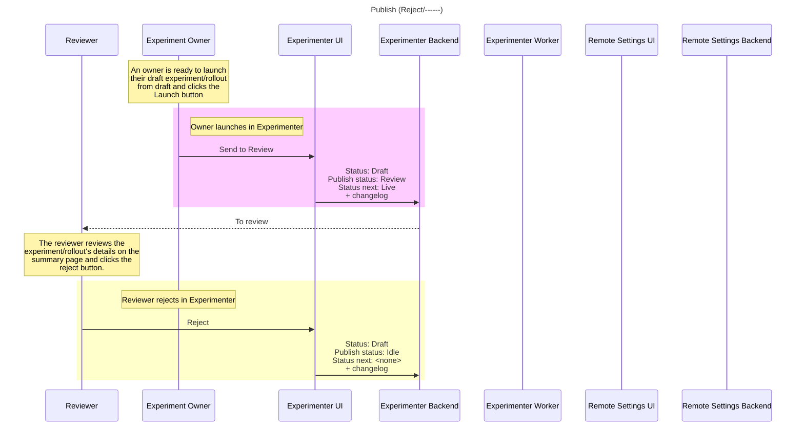
```mermaid
  sequenceDiagram
    participant Reviewer
    participant Experiment Owner
    participant Experimenter UI
    participant Experimenter Backend
    participant Experimenter Worker
    participant Remote Settings UI
    participant Remote Settings Backend
    title Publish (Reject/------)
    Note over Experiment Owner: An owner is ready to launch <br/> their draft experiment/rollout <br/> from draft and clicks the <br/> Launch button
    
    rect rgb(255,204,255) 
        Note right of Experiment Owner: Owner launches in Experimenter
        Experiment Owner->>Experimenter UI: Send to Review
        Experimenter UI->>Experimenter Backend: Status: Draft <br/> Publish status: Review <br/> Status next: Live <br/> + changelog
    end 
    
    Experimenter Backend-->>Reviewer: To review
    Note over Reviewer: The reviewer reviews the <br/> experiment/rollout's details on the <br/> summary page and clicks the <br/> reject button.
    

    rect rgb(255,255,204) 
        Note over Experiment Owner: Reviewer rejects in Experimenter
        Reviewer->>Experimenter UI: Reject
        Experimenter UI->>Experimenter Backend: Status: Draft <br/> Publish status: Idle <br/> Status next: <none> <br/> + changelog
    end 
%%{init:{'themeCSS':'g:nth-of-type(1) .note { stroke: purple ;fill: white; };'}}%%
```

### Publish (Approve/Reject)

A draft experiment/rollout that has been validly completed is reviewed and approved in Experimenter, and is then reviewed and rejected in Remote Settings. A rejection reason is captured in Remote Settings and is displayed to the owner in Experimenter.

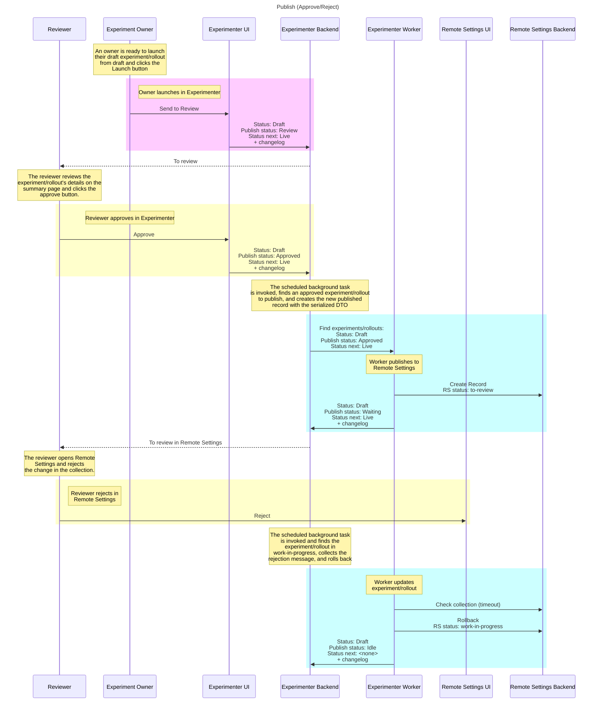
```mermaid
  sequenceDiagram
    participant Reviewer
    participant Experiment Owner
    participant Experimenter UI
    participant Experimenter Backend
    participant Experimenter Worker
    participant Remote Settings UI
    participant Remote Settings Backend
    title Publish (Approve/Reject)
    Note over Experiment Owner: An owner is ready to launch <br/> their draft experiment/rollout <br/> from draft and clicks the <br/> Launch button
    
    rect rgb(255,204,255) 
        Note right of Experiment Owner: Owner launches in Experimenter
        Experiment Owner->>Experimenter UI: Send to Review
        Experimenter UI->>Experimenter Backend: Status: Draft <br/> Publish status: Review <br/> Status next: Live <br/> + changelog
    end 
    
    Experimenter Backend-->>Reviewer: To review
    Note over Reviewer: The reviewer reviews the <br/> experiment/rollout's details on the <br/> summary page and clicks the <br/> approve button.
    

    rect rgb(255,255,204) 
        Note over Experiment Owner: Reviewer approves in Experimenter
        Reviewer->>Experimenter UI: Approve
        Experimenter UI->>Experimenter Backend: Status: Draft <br/> Publish status: Approved <br/> Status next: Live <br/> + changelog
    end 
 
    Note over Experimenter Backend: The scheduled background task <br/> is invoked, finds an approved experiment/rollout <br/> to publish, and creates the new published <br/> record with the serialized DTO
    
    rect rgb(204,255,255) 
        Experimenter Backend->>Experimenter Worker: Find experiments/rollouts: <br/> Status: Draft <br/> Publish status: Approved <br/> Status next: Live
        Note over Experimenter Worker: Worker publishes to <br/>Remote Settings
        Experimenter Worker->>Remote Settings Backend: Create Record <br/> RS status: to-review
        Experimenter Worker->>Experimenter Backend: Status: Draft <br/> Publish status: Waiting <br/> Status next: Live <br/> + changelog
    end 

    Experimenter Backend-->>Reviewer: To review in Remote Settings
    
    Note over Reviewer: The reviewer opens Remote <br/> Settings and rejects <br/> the change in the collection.

    rect rgb(255,255,204) 
        Note right of Reviewer: Reviewer rejects in <br/>Remote Settings
        Reviewer->>Remote Settings UI: Reject
    end 

    Note over Experimenter Backend: The scheduled background task <br/> is invoked and finds the <br/> experiment/rollout in <br/> work-in-progress, collects the <br/> rejection message, and rolls back

    rect rgb(204,255,255) 
        Note over Experimenter Worker: Worker updates <br/> experiment/rollout
        Experimenter Worker->>Remote Settings Backend: Check collection (timeout)
        Experimenter Worker->>Remote Settings Backend: Rollback <br/> RS status: work-in-progress
        Experimenter Worker->>Experimenter Backend:  Status: Draft <br/> Publish status: Idle <br/> Status next: <none> <br/> + changelog
    end 
%%{init:{'themeCSS':'g:nth-of-type(1) .note { stroke: purple ;fill: white; };'}}%%
```

### Publish (Approve/Reject + Manual Rollback)

A draft experiment/rollout that has been validly completed is reviewed and approved in Experimenter, and is then reviewed and rejected in Remote Settings. The reviewer **manually rolls back** the Remote Settings collection. A rejection reason is captured in Remote Settings and but **unable to be recovered by Experimenter** because the collection as manually rolled back **before Experimenter could query its status**, and so Experimenter shows a generic rejection reason.

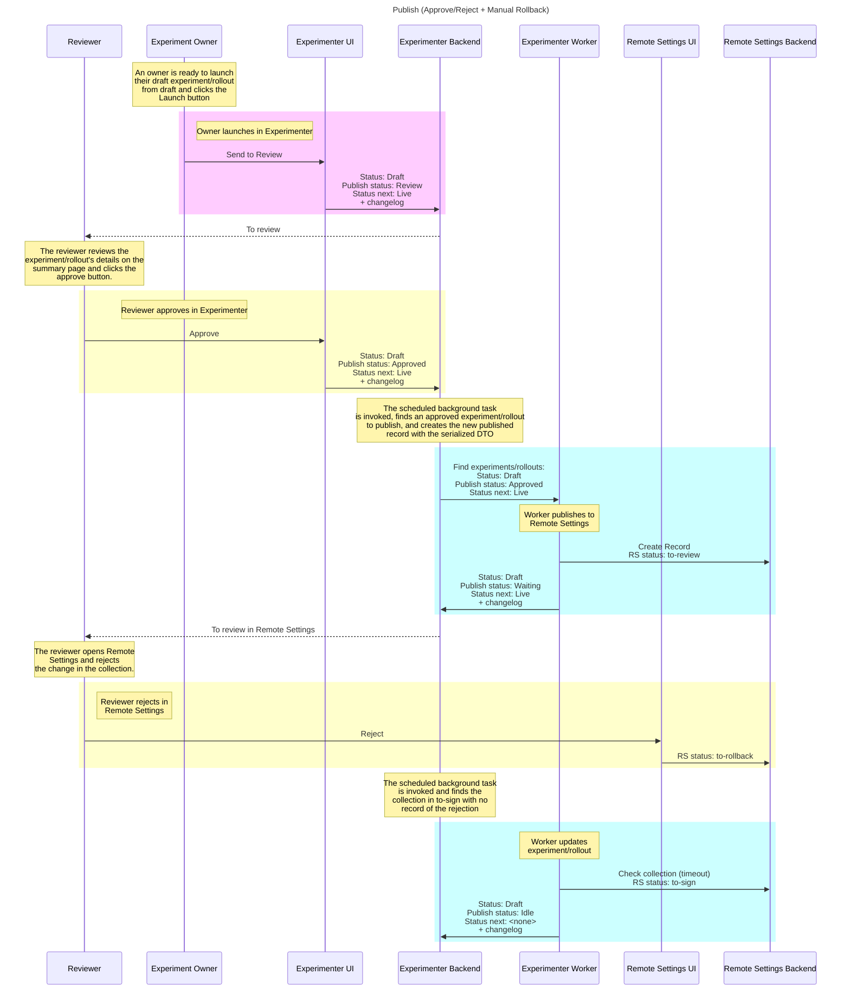
```mermaid
  sequenceDiagram
    participant Reviewer
    participant Experiment Owner
    participant Experimenter UI
    participant Experimenter Backend
    participant Experimenter Worker
    participant Remote Settings UI
    participant Remote Settings Backend
    title Publish (Approve/Reject + Manual Rollback)
    Note over Experiment Owner: An owner is ready to launch <br/> their draft experiment/rollout <br/> from draft and clicks the <br/> Launch button
    
    rect rgb(255,204,255) 
        Note right of Experiment Owner: Owner launches in Experimenter
        Experiment Owner->>Experimenter UI: Send to Review
        Experimenter UI->>Experimenter Backend: Status: Draft <br/> Publish status: Review <br/> Status next: Live <br/> + changelog
    end 
    
    Experimenter Backend-->>Reviewer: To review
    Note over Reviewer: The reviewer reviews the <br/> experiment/rollout's details on the <br/> summary page and clicks the <br/> approve button.
    

    rect rgb(255,255,204) 
        Note over Experiment Owner: Reviewer approves in Experimenter
        Reviewer->>Experimenter UI: Approve
        Experimenter UI->>Experimenter Backend: Status: Draft <br/> Publish status: Approved <br/> Status next: Live <br/> + changelog
    end 
 
    Note over Experimenter Backend: The scheduled background task <br/> is invoked, finds an approved experiment/rollout <br/> to publish, and creates the new published <br/> record with the serialized DTO
    
    rect rgb(204,255,255) 
        Experimenter Backend->>Experimenter Worker: Find experiments/rollouts: <br/> Status: Draft <br/> Publish status: Approved <br/> Status next: Live
        Note over Experimenter Worker: Worker publishes to <br/>Remote Settings
        Experimenter Worker->>Remote Settings Backend: Create Record <br/> RS status: to-review
        Experimenter Worker->>Experimenter Backend: Status: Draft <br/> Publish status: Waiting <br/> Status next: Live <br/> + changelog
    end 

    Experimenter Backend-->>Reviewer: To review in Remote Settings
    
    Note over Reviewer: The reviewer opens Remote <br/> Settings and rejects <br/> the change in the collection.

    rect rgb(255,255,204) 
        Note right of Reviewer: Reviewer rejects in <br/>Remote Settings
        Reviewer->>Remote Settings UI: Reject
        Remote Settings UI->>Remote Settings Backend: RS status: to-rollback
    end 

    Note over Experimenter Backend: The scheduled background task <br/> is invoked and finds the <br/> collection in to-sign with no <br/> record of the rejection

    rect rgb(204,255,255) 
        Note over Experimenter Worker: Worker updates <br/> experiment/rollout
        Experimenter Worker->>Remote Settings Backend: Check collection (timeout) <br/> RS status: to-sign
        Experimenter Worker->>Experimenter Backend:  Status: Draft <br/> Publish status: Idle <br/> Status next: <none> <br/> + changelog
    end 
%%{init:{'themeCSS':'g:nth-of-type(1) .note { stroke: purple ;fill: white; };'}}%%
```

### Publish (Approve/Timeout)

A draft experiment/rollout that has been validly completed is reviewed and approved in Experimenter, is published to Remote Settings, and the collection is marked for review. Before the reviewer is able to review it in Remote Settings, the scheduled celery task is invoked and finds that the collection is blocked from further changes by having an unattended review pending. It rolls back the pending review to allow other queued changes to be made. This prevents unattended reviews in a collection from blocking other queued changes.

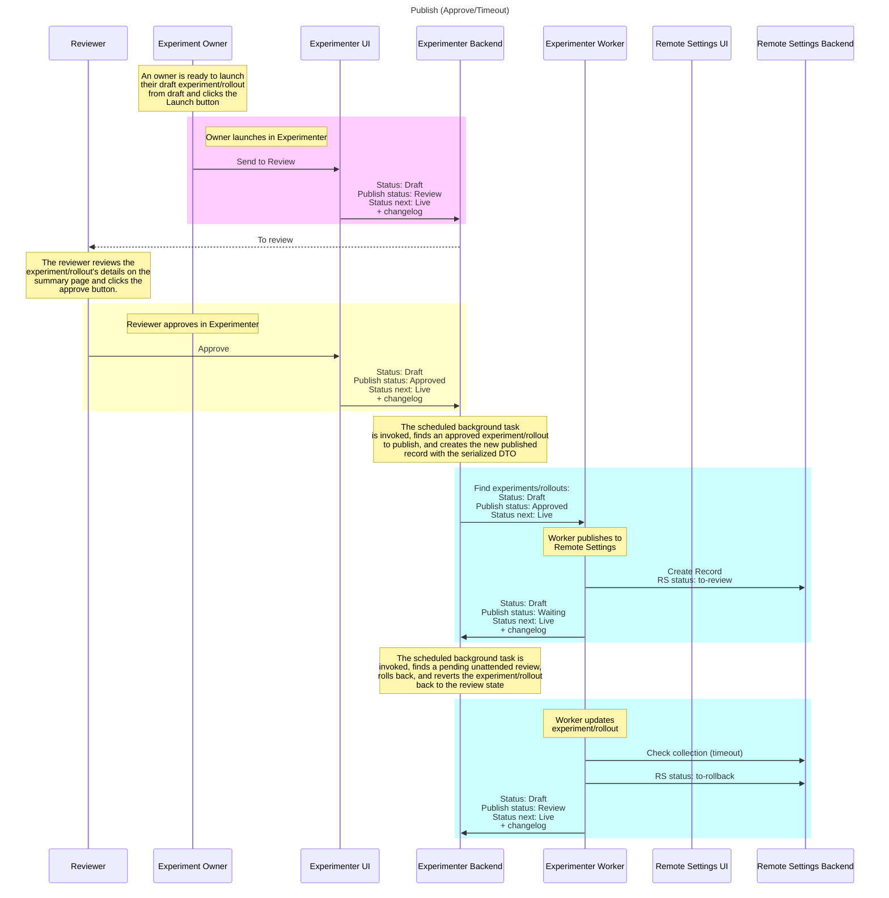
```mermaid
  sequenceDiagram
    participant Reviewer
    participant Experiment Owner
    participant Experimenter UI
    participant Experimenter Backend
    participant Experimenter Worker
    participant Remote Settings UI
    participant Remote Settings Backend
    title Publish (Approve/Timeout)
    Note over Experiment Owner: An owner is ready to launch <br/> their draft experiment/rollout <br/> from draft and clicks the <br/> Launch button
    
    rect rgb(255,204,255) 
        Note right of Experiment Owner: Owner launches in Experimenter
        Experiment Owner->>Experimenter UI: Send to Review
        Experimenter UI->>Experimenter Backend: Status: Draft <br/> Publish status: Review <br/> Status next: Live <br/> + changelog
    end 
    
    Experimenter Backend-->>Reviewer: To review
    Note over Reviewer: The reviewer reviews the <br/> experiment/rollout's details on the <br/> summary page and clicks the <br/> approve button.
    

    rect rgb(255,255,204) 
        Note over Experiment Owner: Reviewer approves in Experimenter
        Reviewer->>Experimenter UI: Approve
        Experimenter UI->>Experimenter Backend: Status: Draft <br/> Publish status: Approved <br/> Status next: Live <br/> + changelog
    end 
 
    Note over Experimenter Backend: The scheduled background task <br/> is invoked, finds an approved experiment/rollout <br/> to publish, and creates the new published <br/> record with the serialized DTO
    
    rect rgb(204,255,255) 
        Experimenter Backend->>Experimenter Worker: Find experiments/rollouts: <br/> Status: Draft <br/> Publish status: Approved <br/> Status next: Live
        Note over Experimenter Worker: Worker publishes to <br/>Remote Settings
        Experimenter Worker->>Remote Settings Backend: Create Record <br/> RS status: to-review
        Experimenter Worker->>Experimenter Backend: Status: Draft <br/> Publish status: Waiting <br/> Status next: Live <br/> + changelog
    end 

    Note over Experimenter Backend: The scheduled background task is <br/> invoked, finds a pending unattended review, <br/> rolls back, and reverts the experiment/rollout <br/> back to the review state
   
    rect rgb(204,255,255) 
        Note over Experimenter Worker: Worker updates <br/> experiment/rollout
        Experimenter Worker->>Remote Settings Backend: Check collection (timeout)
        Experimenter Worker->>Remote Settings Backend: RS status: to-rollback
        Experimenter Worker->>Experimenter Backend:  Status: Draft <br/> Publish status: Review <br/> Status next: Live <br/> + changelog
    end
%%{init:{'themeCSS':'g:nth-of-type(1) .note { stroke: purple ;fill: white; };'}}%%
```

### Publish (Cancel ------/------)

When a draft experiment/rollout has requested review in Experimenter, the review can also be canceled in Experimenter. The review can only be canceled before it has been reviewed in Experimenter.

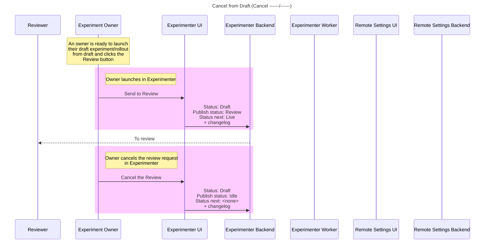
```mermaid
    sequenceDiagram
        participant Reviewer
        participant Experiment Owner
        participant Experimenter UI
        participant Experimenter Backend
        participant Experimenter Worker
        participant Remote Settings UI
        participant Remote Settings Backend
        title Cancel from Draft (Cancel ------/------)
        Note over Experiment Owner: An owner is ready to launch <br/> their draft experiment/rollout <br/> from draft and clicks the <br/> Review button

        rect rgb(255,204,255)
            Note right of Experiment Owner: Owner launches in Experimenter
            Experiment Owner->>Experimenter UI: Send to Review
            Experimenter UI->>Experimenter Backend: Status: Draft <br/> Publish status: Review <br/> Status next: Live <br/> + changelog
        end

        Experimenter Backend-->>Reviewer: To review
        
        rect rgb(255,204,255)
            Note right of Experiment Owner: Owner cancels the review request <br/> in Experimenter
            Experiment Owner->>Experimenter UI: Cancel the Review
            Experimenter UI->>Experimenter Backend: Status: Draft <br/> Publish status: Idle <br/> Status next: <none> <br/> + changelog
        end
```

This can also be canceled when an experiment/rollout is in the Preview state and requests to be Launched. When the review is canceled, the Preview experiment is sent back to Draft.

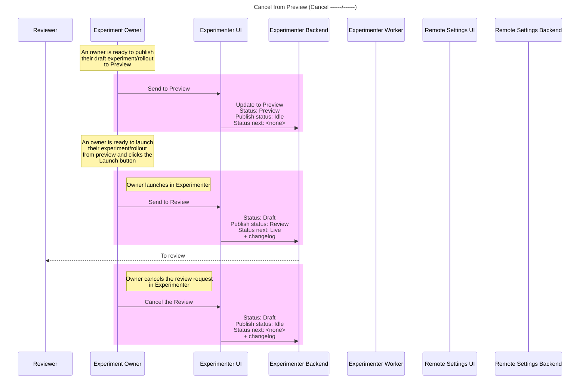
```mermaid
    sequenceDiagram
        participant Reviewer
        participant Experiment Owner
        participant Experimenter UI
        participant Experimenter Backend
        participant Experimenter Worker
        participant Remote Settings UI
        participant Remote Settings Backend
        title Cancel from Preview (Cancel ------/------)
        
        Note over Experiment Owner: An owner is ready to publish <br/> their draft experiment/rollout <br/> to Preview
    
        rect rgb(255,204,255) 
            Experiment Owner->>Experimenter UI: Send to Preview
            Experimenter UI->>Experimenter Backend: Update to Preview <br/> Status: Preview <br/> Publish status: Idle <br/> Status next: <none>
        end 
        
        Note over Experiment Owner: An owner is ready to launch <br/> their experiment/rollout <br/> from preview and clicks the <br/> Launch button

        rect rgb(255,204,255)
            Note right of Experiment Owner: Owner launches in Experimenter
            Experiment Owner->>Experimenter UI: Send to Review
            Experimenter UI->>Experimenter Backend: Status: Draft <br/> Publish status: Review <br/> Status next: Live <br/> + changelog
        end

        Experimenter Backend-->>Reviewer: To review
        
        rect rgb(255,204,255)
            Note right of Experiment Owner: Owner cancels the review request <br/> in Experimenter
            Experiment Owner->>Experimenter UI: Cancel the Review
            Experimenter UI->>Experimenter Backend: Status: Draft <br/> Publish status: Idle <br/> Status next: <none> <br/> + changelog
        end
```

### Update (Approve/Approve)

A live rollout can have updates pushed to its state while remaining Live. These updated changes must be reviewed in order to be published to the user, following the same flow to be approved in both Experimenter and Remote Settings.

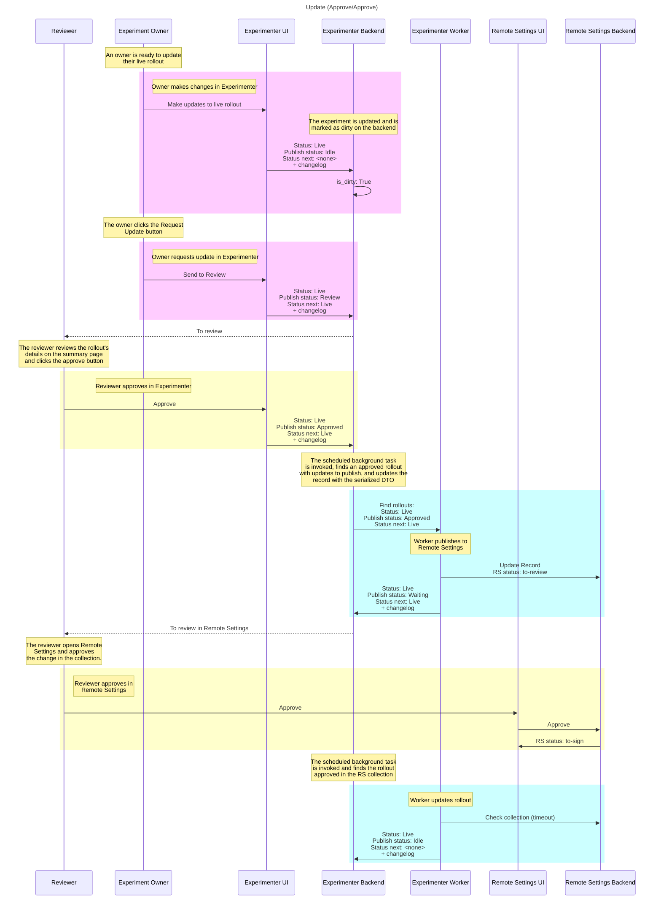
```mermaid
  sequenceDiagram
    participant Reviewer
    participant Experiment Owner
    participant Experimenter UI
    participant Experimenter Backend
    participant Experimenter Worker
    participant Remote Settings UI
    participant Remote Settings Backend
    title Update (Approve/Approve)
    
    Note over Experiment Owner: An owner is ready to update <br/> their live rollout
    
    rect rgb(255,204,255) 
        Note right of Experiment Owner: Owner makes changes in Experimenter
        Experiment Owner->>Experimenter UI: Make updates to live rollout
        Note over Experimenter Backend: The experiment is updated and is <br/> marked as dirty on the backend
        Experimenter UI->>Experimenter Backend: Status: Live <br/> Publish status: Idle <br/> Status next: <none>  <br/> + changelog
        Experimenter Backend->>Experimenter Backend: is_dirty: True 
    end 

    Note over Experiment Owner: The owner clicks the Request <br/> Update button
    
    rect rgb(255,204,255) 
        Note right of Experiment Owner: Owner requests update in Experimenter
        Experiment Owner->>Experimenter UI: Send to Review
        Experimenter UI->>Experimenter Backend: Status: Live <br/> Publish status: Review <br/> Status next: Live <br/> + changelog
    end 
    
    Experimenter Backend-->>Reviewer: To review
    Note over Reviewer: The reviewer reviews the rollout's <br/> details on the summary page <br/> and clicks the approve button
    

    rect rgb(255,255,204) 
        Note over Experiment Owner: Reviewer approves in Experimenter
        Reviewer->>Experimenter UI: Approve
        Experimenter UI->>Experimenter Backend: Status: Live <br/> Publish status: Approved <br/> Status next: Live <br/> + changelog
    end 
 
    Note over Experimenter Backend: The scheduled background task <br/> is invoked, finds an approved rollout <br/> with updates to publish, and updates the <br/> record with the serialized DTO
    
    rect rgb(204,255,255) 
        Experimenter Backend->>Experimenter Worker: Find rollouts: <br/> Status: Live <br/> Publish status: Approved <br/> Status next: Live
        Note over Experimenter Worker: Worker publishes to <br/>Remote Settings
        Experimenter Worker->>Remote Settings Backend: Update Record <br/> RS status: to-review
        Experimenter Worker->>Experimenter Backend: Status: Live <br/> Publish status: Waiting <br/> Status next: Live <br/> + changelog
    end 

    Experimenter Backend-->>Reviewer: To review in Remote Settings
    
    Note over Reviewer: The reviewer opens Remote <br/> Settings and approves <br/> the change in the collection.

    rect rgb(255,255,204) 
        Note right of Reviewer: Reviewer approves in <br/>Remote Settings
        Reviewer->>Remote Settings UI: Approve
        Remote Settings UI->>Remote Settings Backend: Approve
        Remote Settings Backend->>Remote Settings UI: RS status: to-sign
    end 

    Note over Experimenter Backend: The scheduled background task <br/> is invoked and finds the rollout <br/>approved in the RS collection

    rect rgb(204,255,255) 
        Note over Experimenter Worker: Worker updates rollout
        Experimenter Worker->>Remote Settings Backend: Check collection (timeout)
        Experimenter Worker->>Experimenter Backend:  Status: Live <br/> Publish status: Idle <br/> Status next: <none> <br/> + changelog
    end 
```

### Update (Reject/------)

A live rollout that has valid changes (making it "dirty") is reviewed and rejected in Experimenter. A rejection reason is captured in Experimenter and is displayed to the owner in Experimenter. The rollout remains dirty after the rejection.

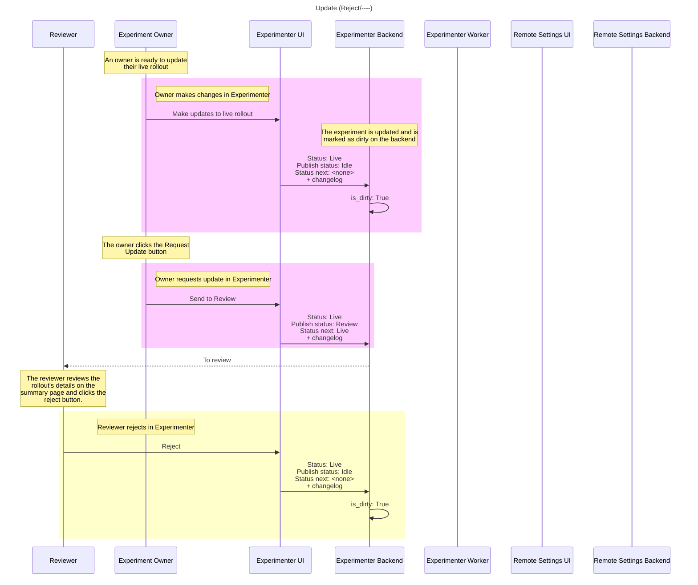
```mermaid
  sequenceDiagram
    participant Reviewer
    participant Experiment Owner
    participant Experimenter UI
    participant Experimenter Backend
    participant Experimenter Worker
    participant Remote Settings UI
    participant Remote Settings Backend
    title Update (Reject/----)
    Note over Experiment Owner: An owner is ready to update <br/> their live rollout
    
    rect rgb(255,204,255) 
        Note right of Experiment Owner: Owner makes changes in Experimenter
        Experiment Owner->>Experimenter UI: Make updates to live rollout
        Note over Experimenter Backend: The experiment is updated and is <br/> marked as dirty on the backend
        Experimenter UI->>Experimenter Backend: Status: Live <br/> Publish status: Idle <br/> Status next: <none>  <br/> + changelog
        Experimenter Backend->>Experimenter Backend: is_dirty: True 
    end 
    
    Note over Experiment Owner: The owner clicks the Request <br/> Update button
    
    rect rgb(255,204,255) 
        Note right of Experiment Owner: Owner requests update in Experimenter
        Experiment Owner->>Experimenter UI: Send to Review
        Experimenter UI->>Experimenter Backend: Status: Live <br/> Publish status: Review <br/> Status next: Live <br/> + changelog
    end 
    
    Experimenter Backend-->>Reviewer: To review
    Note over Reviewer: The reviewer reviews the <br/> rollout's details on the <br/> summary page and clicks the <br/> reject button.
    

    rect rgb(255,255,204) 
        Note over Experiment Owner: Reviewer rejects in Experimenter
        Reviewer->>Experimenter UI: Reject
        Experimenter UI->>Experimenter Backend: Status: Live <br/> Publish status: Idle <br/> Status next: <none> <br/> + changelog
        Experimenter Backend->>Experimenter Backend: is_dirty: True 
    end 
```

### Update (Approve/Reject)

A live rollout that has valid changes (making it "dirty") is reviewed and approved in Experimenter, and is then reviewed and rejected in Remote Settings. A rejection reason is captured in Remote Settings and is displayed to the owner in Experimenter. The rollout remains dirty after the rejection.

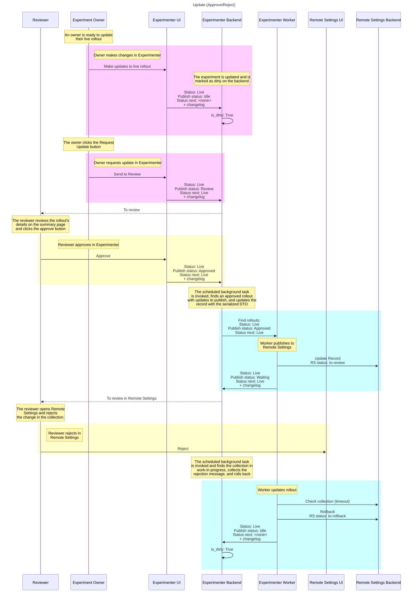
```mermaid
  sequenceDiagram
    participant Reviewer
    participant Experiment Owner
    participant Experimenter UI
    participant Experimenter Backend
    participant Experimenter Worker
    participant Remote Settings UI
    participant Remote Settings Backend
    title Update (Approve/Reject)
    
    Note over Experiment Owner: An owner is ready to update <br/> their live rollout
    
    rect rgb(255,204,255) 
        Note right of Experiment Owner: Owner makes changes in Experimenter
        Experiment Owner->>Experimenter UI: Make updates to live rollout
        Note over Experimenter Backend: The experiment is updated and is <br/> marked as dirty on the backend
        Experimenter UI->>Experimenter Backend: Status: Live <br/> Publish status: Idle <br/> Status next: <none>  <br/> + changelog
        Experimenter Backend->>Experimenter Backend: is_dirty: True 
    end 

    Note over Experiment Owner: The owner clicks the Request <br/> Update button
    
    rect rgb(255,204,255) 
        Note right of Experiment Owner: Owner requests update in Experimenter
        Experiment Owner->>Experimenter UI: Send to Review
        Experimenter UI->>Experimenter Backend: Status: Live <br/> Publish status: Review <br/> Status next: Live <br/> + changelog
    end 
    
    Experimenter Backend-->>Reviewer: To review
    Note over Reviewer: The reviewer reviews the rollout's <br/> details on the summary page <br/> and clicks the approve button
    

    rect rgb(255,255,204) 
        Note over Experiment Owner: Reviewer approves in Experimenter
        Reviewer->>Experimenter UI: Approve
        Experimenter UI->>Experimenter Backend: Status: Live <br/> Publish status: Approved <br/> Status next: Live <br/> + changelog
    end 
 
    Note over Experimenter Backend: The scheduled background task <br/> is invoked, finds an approved rollout <br/> with updates to publish, and updates the <br/> record with the serialized DTO
    
    rect rgb(204,255,255) 
        Experimenter Backend->>Experimenter Worker: Find rollouts: <br/> Status: Live <br/> Publish status: Approved <br/> Status next: Live
        Note over Experimenter Worker: Worker publishes to <br/>Remote Settings
        Experimenter Worker->>Remote Settings Backend: Update Record <br/> RS status: to-review
        Experimenter Worker->>Experimenter Backend: Status: Live <br/> Publish status: Waiting <br/> Status next: Live <br/> + changelog
    end 

    Experimenter Backend-->>Reviewer: To review in Remote Settings
    
    Note over Reviewer: The reviewer opens Remote <br/> Settings and rejects <br/> the change in the collection.

    rect rgb(255,255,204) 
        Note right of Reviewer: Reviewer rejects in <br/>Remote Settings
        Reviewer->>Remote Settings UI: Reject
    end 

    Note over Experimenter Backend: The scheduled background task <br/> is invoked and finds the collection in <br/> work-in-progress, collects the <br/> rejection message, and rolls back


    rect rgb(204,255,255) 
        Note over Experimenter Worker: Worker updates rollout
        Experimenter Worker->>Remote Settings Backend: Check collection (timeout)
        Experimenter Worker->>Remote Settings Backend: Rollback <br/> RS status: to-rollback
        Experimenter Worker->>Experimenter Backend:  Status: Live <br/> Publish status: Idle <br/> Status next: <none> <br/> + changelog
        Experimenter Backend->>Experimenter Backend: is_dirty: True 
    end 
```

### Update (Approve/Reject + Manual Rollback)

A live rollout that has valid changes (making it "dirty") is reviewed and approved in Experimenter, and is then reviewed and rejected in Remote Settings. The reviewer **manually rolls back** the Remote Settings collection. A rejection reason is captured in Remote Settings and but **unable to be recovered by Experimenter** because the collection as manually rolled back **before Experimenter could query its status**, and so Experimenter shows a generic rejection reason. The rollout remains dirty after the rejection.

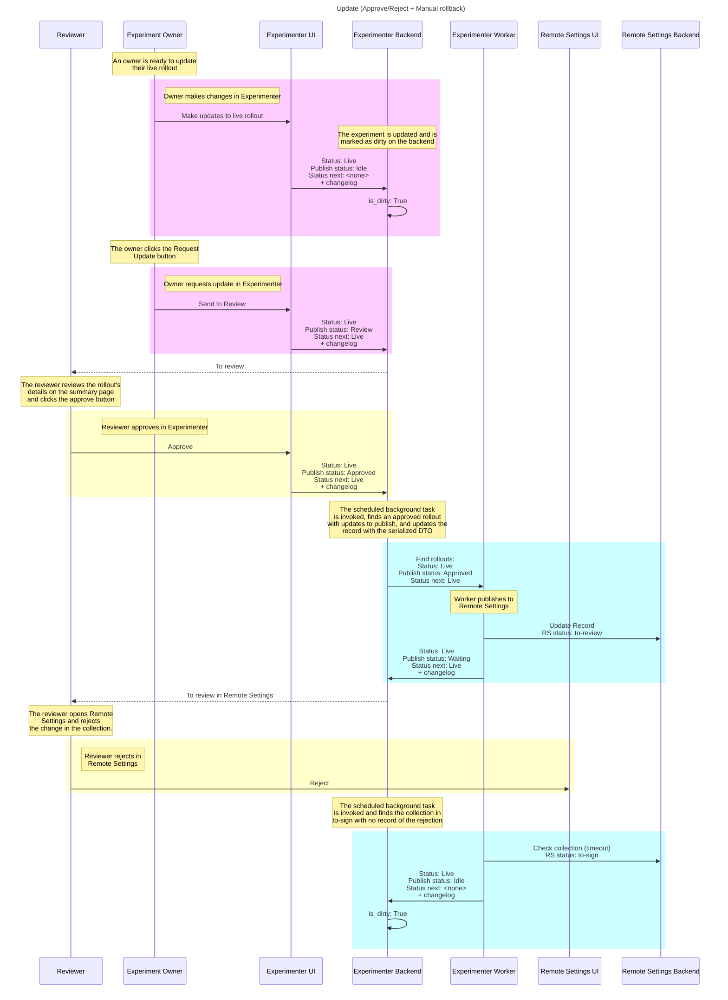
```mermaid
  sequenceDiagram
    participant Reviewer
    participant Experiment Owner
    participant Experimenter UI
    participant Experimenter Backend
    participant Experimenter Worker
    participant Remote Settings UI
    participant Remote Settings Backend
    title Update (Approve/Reject + Manual rollback)
    
    Note over Experiment Owner: An owner is ready to update <br/> their live rollout
    
    rect rgb(255,204,255) 
        Note right of Experiment Owner: Owner makes changes in Experimenter
        Experiment Owner->>Experimenter UI: Make updates to live rollout
        Note over Experimenter Backend: The experiment is updated and is <br/> marked as dirty on the backend
        Experimenter UI->>Experimenter Backend: Status: Live <br/> Publish status: Idle <br/> Status next: <none>  <br/> + changelog
        Experimenter Backend->>Experimenter Backend: is_dirty: True 
    end 

    Note over Experiment Owner: The owner clicks the Request <br/> Update button
    
    rect rgb(255,204,255) 
        Note right of Experiment Owner: Owner requests update in Experimenter
        Experiment Owner->>Experimenter UI: Send to Review
        Experimenter UI->>Experimenter Backend: Status: Live <br/> Publish status: Review <br/> Status next: Live <br/> + changelog
    end 
    
    Experimenter Backend-->>Reviewer: To review
    Note over Reviewer: The reviewer reviews the rollout's <br/> details on the summary page <br/> and clicks the approve button
    

    rect rgb(255,255,204) 
        Note over Experiment Owner: Reviewer approves in Experimenter
        Reviewer->>Experimenter UI: Approve
        Experimenter UI->>Experimenter Backend: Status: Live <br/> Publish status: Approved <br/> Status next: Live <br/> + changelog
    end 
 
    Note over Experimenter Backend: The scheduled background task <br/> is invoked, finds an approved rollout <br/> with updates to publish, and updates the <br/> record with the serialized DTO
    
    rect rgb(204,255,255) 
        Experimenter Backend->>Experimenter Worker: Find rollouts: <br/> Status: Live <br/> Publish status: Approved <br/> Status next: Live
        Note over Experimenter Worker: Worker publishes to <br/>Remote Settings
        Experimenter Worker->>Remote Settings Backend: Update Record <br/> RS status: to-review
        Experimenter Worker->>Experimenter Backend: Status: Live <br/> Publish status: Waiting <br/> Status next: Live <br/> + changelog
    end 

    Experimenter Backend-->>Reviewer: To review in Remote Settings
    
    Note over Reviewer: The reviewer opens Remote <br/> Settings and rejects <br/> the change in the collection.

    rect rgb(255,255,204) 
        Note right of Reviewer: Reviewer rejects in <br/>Remote Settings
        Reviewer->>Remote Settings UI: Reject
    end 

    Note over Experimenter Backend: The scheduled background task <br/> is invoked and finds the collection in <br/> to-sign with no record of the rejection


    rect rgb(204,255,255) 
        Experimenter Worker->>Remote Settings Backend: Check collection (timeout) <br/> RS status: to-sign
        Experimenter Worker->>Experimenter Backend:  Status: Live <br/> Publish status: Idle <br/> Status next: <none> <br/> + changelog
        Experimenter Backend->>Experimenter Backend: is_dirty: True
    end 
```

### Update (Approve/Timeout)

A live rollout that has valid changes (making it "dirty") is reviewed and approved in Experimenter, is published to Remote Settings, and the collection is marked for review. Before the reviewer is able to review it in Remote Settings, the scheduled celery task is invoked and finds that the collection is blocked from further changes by having an unattended review pending. It rolls back the pending review to allow other queued changes to be made. This prevents unattended reviews in a collection from blocking other queued changes. The rollout remains dirty after the timeout.

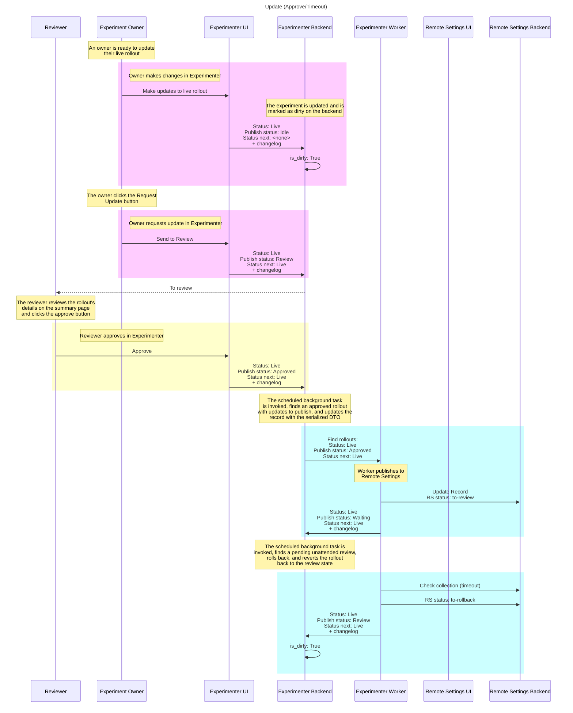
```mermaid
  sequenceDiagram
    participant Reviewer
    participant Experiment Owner
    participant Experimenter UI
    participant Experimenter Backend
    participant Experimenter Worker
    participant Remote Settings UI
    participant Remote Settings Backend
    title Update (Approve/Timeout)
    
    Note over Experiment Owner: An owner is ready to update <br/> their live rollout
    
    rect rgb(255,204,255) 
        Note right of Experiment Owner: Owner makes changes in Experimenter
        Experiment Owner->>Experimenter UI: Make updates to live rollout
        Note over Experimenter Backend: The experiment is updated and is <br/> marked as dirty on the backend
        Experimenter UI->>Experimenter Backend: Status: Live <br/> Publish status: Idle <br/> Status next: <none>  <br/> + changelog
        Experimenter Backend->>Experimenter Backend: is_dirty: True 
    end 

    Note over Experiment Owner: The owner clicks the Request <br/> Update button
    
    rect rgb(255,204,255) 
        Note right of Experiment Owner: Owner requests update in Experimenter
        Experiment Owner->>Experimenter UI: Send to Review
        Experimenter UI->>Experimenter Backend: Status: Live <br/> Publish status: Review <br/> Status next: Live <br/> + changelog
    end 
    
    Experimenter Backend-->>Reviewer: To review
    Note over Reviewer: The reviewer reviews the rollout's <br/> details on the summary page <br/> and clicks the approve button
    

    rect rgb(255,255,204) 
        Note over Experiment Owner: Reviewer approves in Experimenter
        Reviewer->>Experimenter UI: Approve
        Experimenter UI->>Experimenter Backend: Status: Live <br/> Publish status: Approved <br/> Status next: Live <br/> + changelog
    end 
 
    Note over Experimenter Backend: The scheduled background task <br/> is invoked, finds an approved rollout <br/> with updates to publish, and updates the <br/> record with the serialized DTO
    
    rect rgb(204,255,255) 
        Experimenter Backend->>Experimenter Worker: Find rollouts: <br/> Status: Live <br/> Publish status: Approved <br/> Status next: Live
        Note over Experimenter Worker: Worker publishes to <br/>Remote Settings
        Experimenter Worker->>Remote Settings Backend: Update Record <br/> RS status: to-review
        Experimenter Worker->>Experimenter Backend: Status: Live <br/> Publish status: Waiting <br/> Status next: Live <br/> + changelog
    end 

    Note over Experimenter Backend: The scheduled background task is <br/> invoked, finds a pending unattended review, <br/> rolls back, and reverts the rollout <br/> back to the review state

    rect rgb(204,255,255) 
        Experimenter Worker->>Remote Settings Backend: Check collection (timeout) 
        Experimenter Worker->>Remote Settings Backend: RS status: to-rollback
        Experimenter Worker->>Experimenter Backend:  Status: Live <br/> Publish status: Review <br/> Status next: Live <br/> + changelog
        Experimenter Backend->>Experimenter Backend: is_dirty: True 
    end 
```

### Update (Cancel ------/------)

A live rollout can have updates pushed to its state while remaining Live. These updated changes must be reviewed in order to be published to the user, following the same flow to be approved in both Experimenter and Remote Settings. Like the publish flow, these reviews can be canceled from Experimenter.

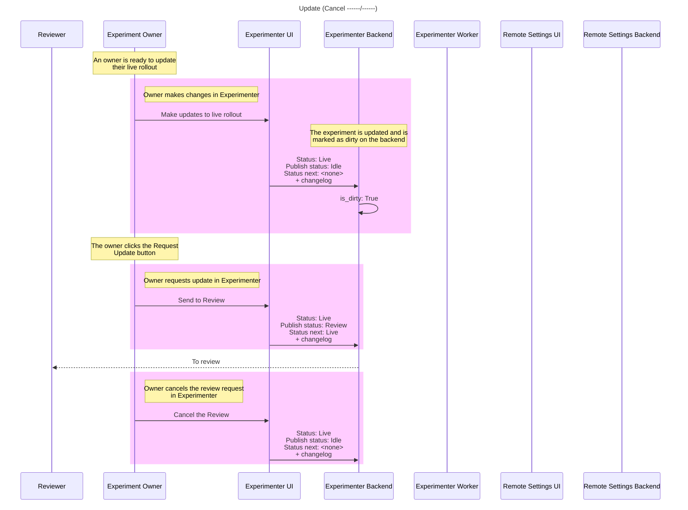
```mermaid
  sequenceDiagram
    participant Reviewer
    participant Experiment Owner
    participant Experimenter UI
    participant Experimenter Backend
    participant Experimenter Worker
    participant Remote Settings UI
    participant Remote Settings Backend
    title Update (Cancel ------/------)
    
    Note over Experiment Owner: An owner is ready to update <br/> their live rollout
    
    rect rgb(255,204,255) 
        Note right of Experiment Owner: Owner makes changes in Experimenter
        Experiment Owner->>Experimenter UI: Make updates to live rollout
        Note over Experimenter Backend: The experiment is updated and is <br/> marked as dirty on the backend
        Experimenter UI->>Experimenter Backend: Status: Live <br/> Publish status: Idle <br/> Status next: <none>  <br/> + changelog
        Experimenter Backend->>Experimenter Backend: is_dirty: True 
    end 

    Note over Experiment Owner: The owner clicks the Request <br/> Update button
    
    rect rgb(255,204,255) 
        Note right of Experiment Owner: Owner requests update in Experimenter
        Experiment Owner->>Experimenter UI: Send to Review
        Experimenter UI->>Experimenter Backend: Status: Live <br/> Publish status: Review <br/> Status next: Live <br/> + changelog
    end 
    
    Experimenter Backend-->>Reviewer: To review

    rect rgb(255,204,255)
        Note right of Experiment Owner: Owner cancels the review request <br/> in Experimenter
        Experiment Owner->>Experimenter UI: Cancel the Review
        Experimenter UI->>Experimenter Backend: Status: Live <br/> Publish status: Idle <br/> Status next: <none> <br/> + changelog
    end
    
```

### End Enrollment (Approve/Approve)

A live experiment that is published in Remote Settings has passed its planned end enrollment date and the owner requests that enrollment ends. The request is reviewed and approved in Experimenter and then Remote Settings, the record is updated, and no new clients will be enrolled in the experiment.

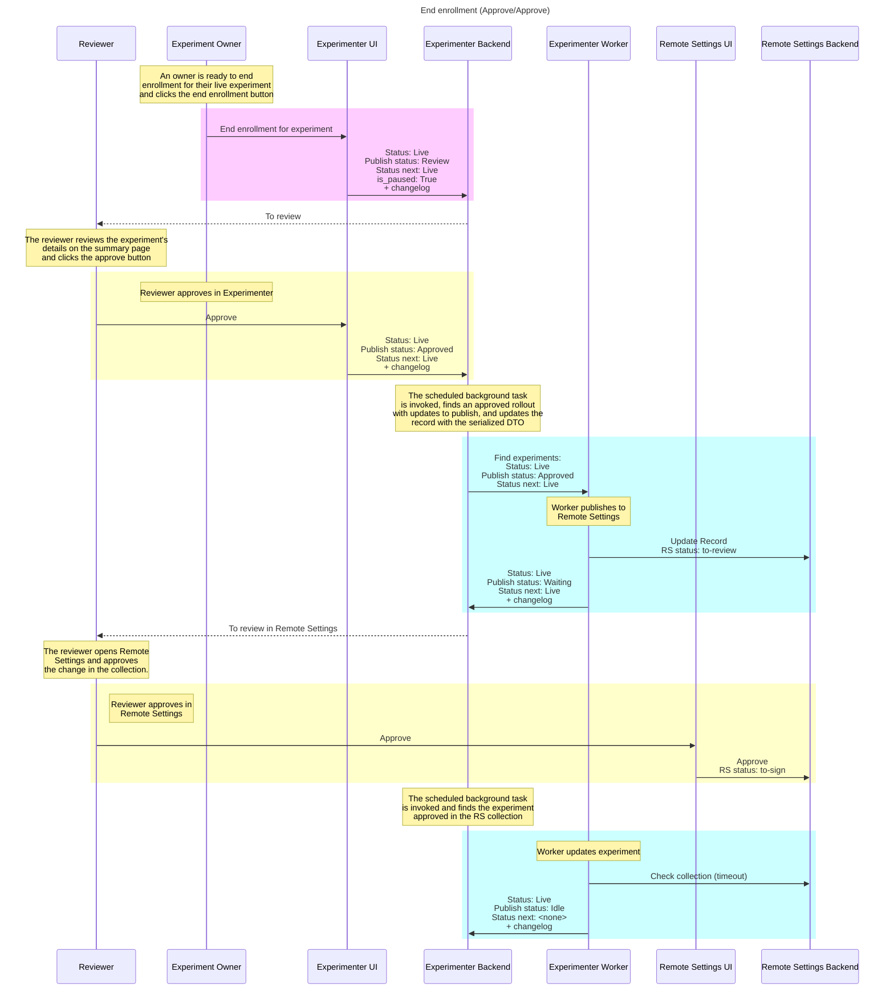
```mermaid
  sequenceDiagram
    participant Reviewer
    participant Experiment Owner
    participant Experimenter UI
    participant Experimenter Backend
    participant Experimenter Worker
    participant Remote Settings UI
    participant Remote Settings Backend
    title End enrollment (Approve/Approve)
    
    Note over Experiment Owner: An owner is ready to end <br/> enrollment for their live experiment <br/> and clicks the end enrollment button
    
    rect rgb(255,204,255) 
        Experiment Owner->>Experimenter UI: End enrollment for experiment
        Experimenter UI->>Experimenter Backend: Status: Live <br/> Publish status: Review <br/> Status next: Live <br/> is_paused: True <br/> + changelog
    end 

    Experimenter Backend-->>Reviewer: To review
    Note over Reviewer: The reviewer reviews the experiment's <br/> details on the summary page <br/> and clicks the approve button
    

    rect rgb(255,255,204) 
        Note over Experiment Owner: Reviewer approves in Experimenter
        Reviewer->>Experimenter UI: Approve
        Experimenter UI->>Experimenter Backend: Status: Live <br/> Publish status: Approved <br/> Status next: Live <br/> + changelog
    end 
 
    Note over Experimenter Backend: The scheduled background task <br/> is invoked, finds an approved rollout <br/> with updates to publish, and updates the <br/> record with the serialized DTO
    
    rect rgb(204,255,255) 
        Experimenter Backend->>Experimenter Worker: Find experiments: <br/> Status: Live <br/> Publish status: Approved <br/> Status next: Live
        Note over Experimenter Worker: Worker publishes to <br/>Remote Settings
        Experimenter Worker->>Remote Settings Backend: Update Record <br/> RS status: to-review
        Experimenter Worker->>Experimenter Backend: Status: Live <br/> Publish status: Waiting <br/> Status next: Live <br/> + changelog
    end 

    Experimenter Backend-->>Reviewer: To review in Remote Settings
    
    Note over Reviewer: The reviewer opens Remote <br/> Settings and approves <br/> the change in the collection.

    rect rgb(255,255,204) 
        Note right of Reviewer: Reviewer approves in <br/>Remote Settings
        Reviewer->>Remote Settings UI: Approve
        Remote Settings UI->>Remote Settings Backend: Approve <br/> RS status: to-sign
    end 

    Note over Experimenter Backend: The scheduled background task <br/> is invoked and finds the experiment <br/>approved in the RS collection

    rect rgb(204,255,255) 
        Note over Experimenter Worker: Worker updates experiment
        Experimenter Worker->>Remote Settings Backend: Check collection (timeout)
        Experimenter Worker->>Experimenter Backend:  Status: Live <br/> Publish status: Idle <br/> Status next: <none> <br/> + changelog
    end 
```

### End Enrollment (Reject/------)

A live experiment that is published in Remote Settings has passed its planned end enrollment date and the owner requests that enrollment ends. The request is reviewed and rejected in Experimenter. No change is made to Remote Settings and clients will continue to enroll. A rejection reason is captured in Experimenter and is displayed to the experiment owner in Experimenter.

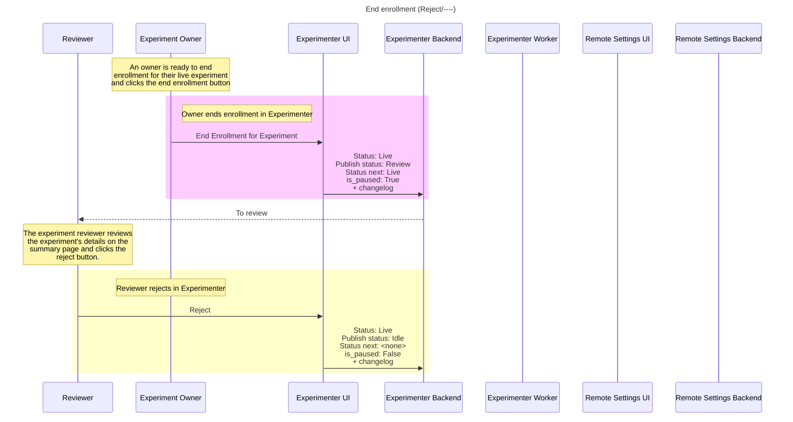
```mermaid
  sequenceDiagram
    participant Reviewer
    participant Experiment Owner
    participant Experimenter UI
    participant Experimenter Backend
    participant Experimenter Worker
    participant Remote Settings UI
    participant Remote Settings Backend
    title End enrollment (Reject/----)
    
    Note over Experiment Owner: An owner is ready to end <br/> enrollment for their live experiment <br/> and clicks the end enrollment button
        
    rect rgb(255,204,255) 
        Note right of Experiment Owner: Owner ends enrollment in Experimenter
        Experiment Owner->>Experimenter UI: End Enrollment for Experiment
        Experimenter UI->>Experimenter Backend: Status: Live <br/> Publish status: Review <br/> Status next: Live <br/> is_paused: True <br/> + changelog
    end 
    
    Experimenter Backend-->>Reviewer: To review
    Note over Reviewer: The experiment reviewer reviews <br/> the experiment's details on the <br/> summary page and clicks the <br/> reject button.
    

    rect rgb(255,255,204) 
        Note over Experiment Owner: Reviewer rejects in Experimenter
        Reviewer->>Experimenter UI: Reject
        Experimenter UI->>Experimenter Backend: Status: Live <br/> Publish status: Idle <br/> Status next: <none> <br/> is_paused: False <br/> + changelog
    end
```

### End Enrollment (Approve/Reject)

A live experiment that is published in Remote Settings has passed its planned end enrollment date and the owner requests that enrollment ends. The request is reviewed and approved in Experimenter, and then rejected in Remote Settings. No change is made to Remote Settings and clients will continue to enroll. A rejection reason is captured in Experimenter and is displayed to the experiment owner in Experimenter.

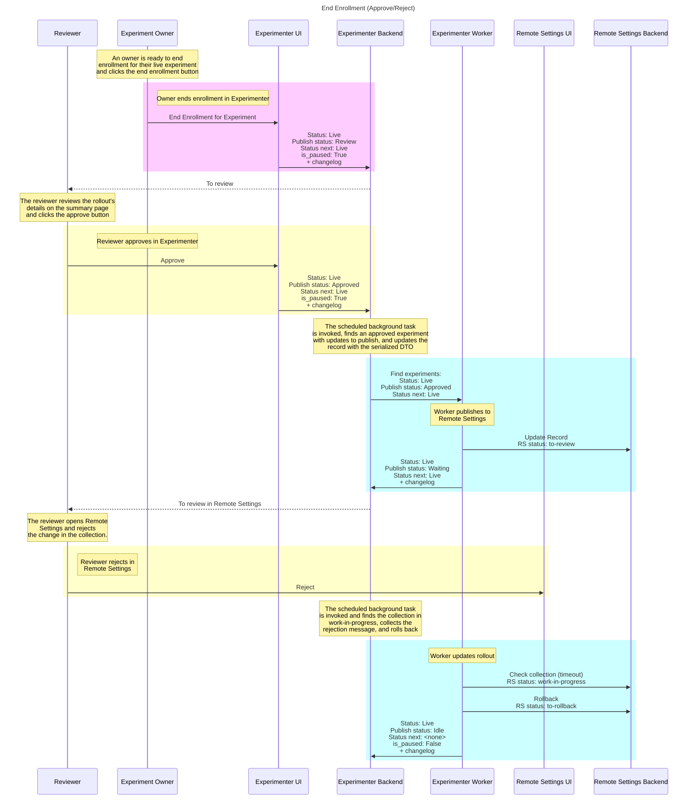
```mermaid
  sequenceDiagram
    participant Reviewer
    participant Experiment Owner
    participant Experimenter UI
    participant Experimenter Backend
    participant Experimenter Worker
    participant Remote Settings UI
    participant Remote Settings Backend
    title End Enrollment (Approve/Reject)
    
    Note over Experiment Owner: An owner is ready to end <br/> enrollment for their live experiment <br/> and clicks the end enrollment button
    
    rect rgb(255,204,255) 
        Note right of Experiment Owner: Owner ends enrollment in Experimenter
        Experiment Owner->>Experimenter UI: End Enrollment for Experiment
        Experimenter UI->>Experimenter Backend: Status: Live <br/> Publish status: Review <br/> Status next: Live <br/> is_paused: True <br/> + changelog
    end 
    
    Experimenter Backend-->>Reviewer: To review
    Note over Reviewer: The reviewer reviews the rollout's <br/> details on the summary page <br/> and clicks the approve button
    

    rect rgb(255,255,204) 
        Note over Experiment Owner: Reviewer approves in Experimenter
        Reviewer->>Experimenter UI: Approve
        Experimenter UI->>Experimenter Backend: Status: Live <br/> Publish status: Approved <br/> Status next: Live <br/> is_paused: True <br/> + changelog
    end 
 
    Note over Experimenter Backend: The scheduled background task <br/> is invoked, finds an approved experiment <br/> with updates to publish, and updates the <br/> record with the serialized DTO
    
    rect rgb(204,255,255) 
        Experimenter Backend->>Experimenter Worker: Find experiments: <br/> Status: Live <br/> Publish status: Approved <br/> Status next: Live
        Note over Experimenter Worker: Worker publishes to <br/>Remote Settings
        Experimenter Worker->>Remote Settings Backend: Update Record <br/> RS status: to-review
        Experimenter Worker->>Experimenter Backend: Status: Live <br/> Publish status: Waiting <br/> Status next: Live <br/> + changelog
    end 

    Experimenter Backend-->>Reviewer: To review in Remote Settings
    
    Note over Reviewer: The reviewer opens Remote <br/> Settings and rejects <br/> the change in the collection.

    rect rgb(255,255,204) 
        Note right of Reviewer: Reviewer rejects in <br/>Remote Settings
        Reviewer->>Remote Settings UI: Reject
    end 

    Note over Experimenter Backend: The scheduled background task <br/> is invoked and finds the collection in <br/> work-in-progress, collects the <br/> rejection message, and rolls back


    rect rgb(204,255,255) 
        Note over Experimenter Worker: Worker updates rollout
        Experimenter Worker->>Remote Settings Backend: Check collection (timeout) <br/> RS status: work-in-progress
        Experimenter Worker->>Remote Settings Backend: Rollback <br/> RS status: to-rollback
        Experimenter Worker->>Experimenter Backend: Status: Live <br/> Publish status: Idle <br/> Status next: <none> <br/> is_paused: False <br/> + changelog
    end 
```

### End Enrollment (Approve/Reject+Manual Rollback)

A live experiment that is published in Remote Settings has passed its planned end enrollment date and the owner requests that enrollment ends. The request is reviewed and approved in Experimenter, and then rejected in Remote Settings. No change is made to Remote Settings and clients will continue to enroll. A rejection reason is captured in Remote Settings and but is **unable to be recovered** by Experimenter because the collection as manually rolled back before Experimenter could query its status, and so Experimenter shows a generic rejection reason.

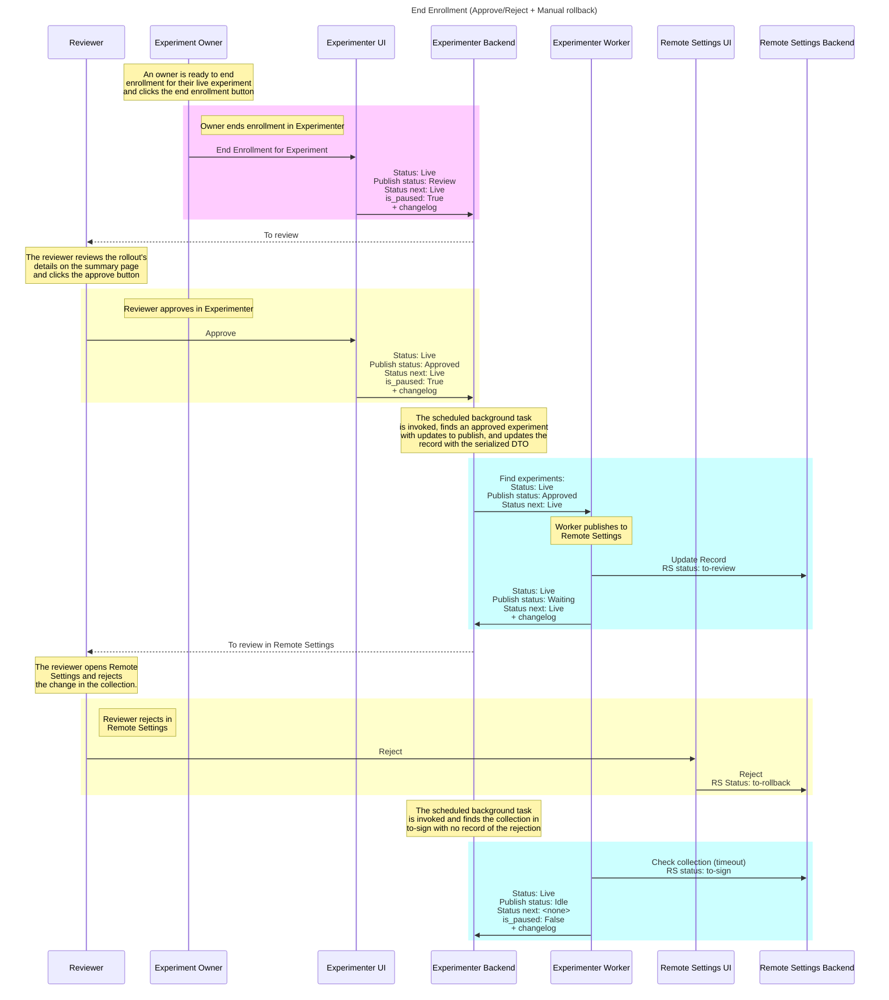
```mermaid
  sequenceDiagram
    participant Reviewer
    participant Experiment Owner
    participant Experimenter UI
    participant Experimenter Backend
    participant Experimenter Worker
    participant Remote Settings UI
    participant Remote Settings Backend
    title End Enrollment (Approve/Reject + Manual rollback)
    
    Note over Experiment Owner: An owner is ready to end <br/> enrollment for their live experiment <br/> and clicks the end enrollment button
    
    rect rgb(255,204,255) 
        Note right of Experiment Owner: Owner ends enrollment in Experimenter
        Experiment Owner->>Experimenter UI: End Enrollment for Experiment
        Experimenter UI->>Experimenter Backend: Status: Live <br/> Publish status: Review <br/> Status next: Live <br/> is_paused: True <br/> + changelog
    end 
    
    Experimenter Backend-->>Reviewer: To review
    Note over Reviewer: The reviewer reviews the rollout's <br/> details on the summary page <br/> and clicks the approve button
    

    rect rgb(255,255,204) 
        Note over Experiment Owner: Reviewer approves in Experimenter
        Reviewer->>Experimenter UI: Approve
        Experimenter UI->>Experimenter Backend: Status: Live <br/> Publish status: Approved <br/> Status next: Live <br/> is_paused: True <br/> + changelog
    end 
 
    Note over Experimenter Backend: The scheduled background task <br/> is invoked, finds an approved experiment <br/> with updates to publish, and updates the <br/> record with the serialized DTO
    
    rect rgb(204,255,255) 
        Experimenter Backend->>Experimenter Worker: Find experiments: <br/> Status: Live <br/> Publish status: Approved <br/> Status next: Live
        Note over Experimenter Worker: Worker publishes to <br/>Remote Settings
        Experimenter Worker->>Remote Settings Backend: Update Record <br/> RS status: to-review
        Experimenter Worker->>Experimenter Backend: Status: Live <br/> Publish status: Waiting <br/> Status next: Live <br/> + changelog
    end 

    Experimenter Backend-->>Reviewer: To review in Remote Settings
    
    Note over Reviewer: The reviewer opens Remote <br/> Settings and rejects <br/> the change in the collection.

    rect rgb(255,255,204) 
        Note right of Reviewer: Reviewer rejects in <br/>Remote Settings
        Reviewer->>Remote Settings UI: Reject
        Remote Settings UI->>Remote Settings Backend: Reject <br/> RS Status: to-rollback
    end 

    Note over Experimenter Backend: The scheduled background task <br/> is invoked and finds the collection in <br/> to-sign with no record of the rejection


    rect rgb(204,255,255) 
        Experimenter Worker->>Remote Settings Backend: Check collection (timeout) <br/> RS status: to-sign
        Experimenter Worker->>Experimenter Backend:  Status: Live <br/> Publish status: Idle <br/> Status next: <none> <br/> is_paused: False <br/> + changelog
    end 
```

### End Enrollment (Approve/Timeout)

A live experiment that is published in Remote Settings has passed its planned end enrollment date and the owner requests that enrollment ends. The request is reviewed and approved in Experimenter, and the change is pushed to Remote Settings. Before the reviewer is able to review it in Remote Settings, the scheduled celery task is invoked and finds that the collection is blocked from further changes by having an unattended review pending. It rolls back the pending review to allow other queued changes to be made. This prevents unattended reviews in a collection from blocking other queued changes.

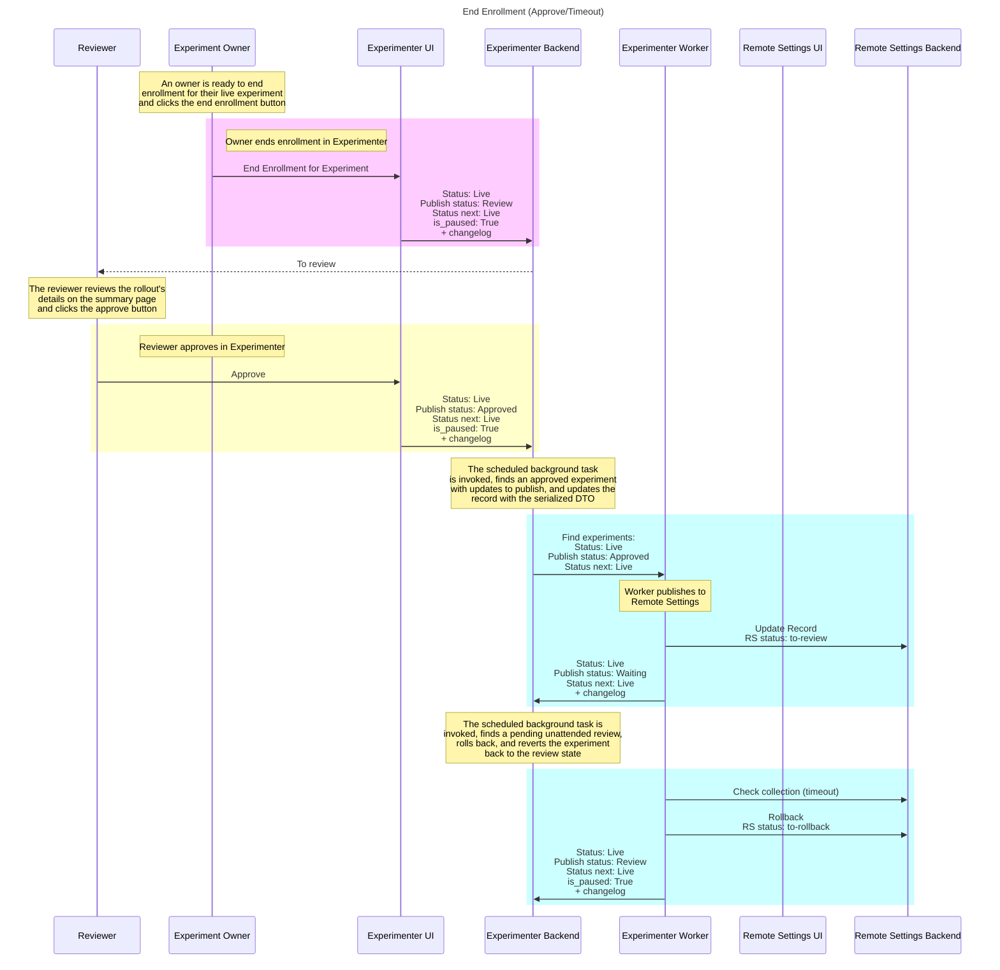
```mermaid
  sequenceDiagram
    participant Reviewer
    participant Experiment Owner
    participant Experimenter UI
    participant Experimenter Backend
    participant Experimenter Worker
    participant Remote Settings UI
    participant Remote Settings Backend
    title End Enrollment (Approve/Timeout)
    
    Note over Experiment Owner: An owner is ready to end <br/> enrollment for their live experiment <br/> and clicks the end enrollment button
    
    rect rgb(255,204,255) 
        Note right of Experiment Owner: Owner ends enrollment in Experimenter
        Experiment Owner->>Experimenter UI: End Enrollment for Experiment
        Experimenter UI->>Experimenter Backend: Status: Live <br/> Publish status: Review <br/> Status next: Live <br/> is_paused: True <br/> + changelog
    end 
    
    Experimenter Backend-->>Reviewer: To review
    Note over Reviewer: The reviewer reviews the rollout's <br/> details on the summary page <br/> and clicks the approve button
    

    rect rgb(255,255,204) 
        Note over Experiment Owner: Reviewer approves in Experimenter
        Reviewer->>Experimenter UI: Approve
        Experimenter UI->>Experimenter Backend: Status: Live <br/> Publish status: Approved <br/> Status next: Live <br/> is_paused: True <br/> + changelog
    end 
 
    Note over Experimenter Backend: The scheduled background task <br/> is invoked, finds an approved experiment <br/> with updates to publish, and updates the <br/> record with the serialized DTO
    
    rect rgb(204,255,255) 
        Experimenter Backend->>Experimenter Worker: Find experiments: <br/> Status: Live <br/> Publish status: Approved <br/> Status next: Live
        Note over Experimenter Worker: Worker publishes to <br/>Remote Settings
        Experimenter Worker->>Remote Settings Backend: Update Record <br/> RS status: to-review
        Experimenter Worker->>Experimenter Backend: Status: Live <br/> Publish status: Waiting <br/> Status next: Live <br/> + changelog
    end 

    Note over Experimenter Backend: The scheduled background task is <br/> invoked, finds a pending unattended review, <br/> rolls back, and reverts the experiment <br/> back to the review state

    rect rgb(204,255,255) 
        Experimenter Worker->>Remote Settings Backend: Check collection (timeout) 
        Experimenter Worker->>Remote Settings Backend: Rollback <br/> RS status: to-rollback
        Experimenter Worker->>Experimenter Backend:  Status: Live <br/> Publish status: Review <br/> Status next: Live<br/> is_paused: True <br/> + changelog
    end 
```

### End Enrollment (Cancel ------/------)

A live experiment that is published in Remote Settings has passed its planned end enrollment date and the owner requests to end the enrollment. The end enrollment request can be canceled before it is approved in Experimenter.

```mermaid
    sequenceDiagram
        participant Reviewer
        participant Experiment Owner
        participant Experimenter UI
        participant Experimenter Backend
        participant Experimenter Worker
        participant Remote Settings UI
        participant Remote Settings Backend
        title End enrollment (Cancel ------/------)
        
        Note over Experiment Owner: An owner is ready to end <br/> enrollment for their live experiment <br/> and clicks the end enrollment button
        
        rect rgb(255,204,255) 
            Experiment Owner->>Experimenter UI: End enrollment for experiment
            Experimenter UI->>Experimenter Backend: Status: Live <br/> Publish status: Review <br/> Status next: Live <br/> is_paused: True <br/> + changelog
        end 

        Experimenter Backend-->>Reviewer: To review

        rect rgb(255,204,255)
                Note right of Experiment Owner: Owner cancels the review request <br/> in Experimenter
                Experiment Owner->>Experimenter UI: Cancel the Review
                Experimenter UI->>Experimenter Backend: Status: Live <br/> Publish status: Idle <br/> Status next: <none> <br/> is_paused: False <br/> + changelog
        end
```

### End (Approve/Approve)

A live experiment that is published in Remote Settings is requested to end by the owner, reviewed and approved in Experimenter, reviewed and approved in Remote Settings, is deleted from the collection, and is then no longer accessible by clients.

```mermaid
  sequenceDiagram
    participant Reviewer
    participant Experiment Owner
    participant Experimenter UI
    participant Experimenter Backend
    participant Experimenter Worker
    participant Remote Settings UI
    participant Remote Settings Backend
    title End experiment (Approve/Approve)
    
    Note over Experiment Owner: An owner is ready to end <br/> their live experiment/rollout and <br/> clicks the end experiment button
    
    rect rgb(255,204,255) 
        Experiment Owner->>Experimenter UI: End experiment/rollout
        Experimenter UI->>Experimenter Backend: Status: Live <br/> Publish status: Review <br/> Status next: Complete <br/> + changelog
    end 

    Experimenter Backend-->>Reviewer: To review
    Note over Reviewer: The reviewer reviews the <br/> end request and clicks the <br/> approve button
    

    rect rgb(255,255,204) 
        Note over Experiment Owner: Reviewer approves in Experimenter
        Reviewer->>Experimenter UI: Approve
        Experimenter UI->>Experimenter Backend: Status: Live <br/> Publish status: Approved <br/> Status next: Complete <br/> + changelog
    end 
 
    Note over Experimenter Backend: The scheduled background task is <br/> invoked, finds an approved <br/> experiment/rollout to end, <br/> and deletes the record in  <br/> Remote Settings
    
    rect rgb(204,255,255) 
        Experimenter Backend->>Experimenter Worker: Find experiments/rollouts: <br/> Status: Live <br/> Publish status: Approved <br/> Status next: Complete
        Experimenter Worker->>Remote Settings Backend: Delete Record <br/> RS status: to-review
        Experimenter Worker->>Experimenter Backend: Status: Live <br/> Publish status: Waiting <br/> Status next: Complete <br/> + changelog
    end 

    Experimenter Backend-->>Reviewer: To review in Remote Settings
    
    Note over Reviewer: The reviewer opens Remote <br/> Settings and approves <br/> the change in the collection.

    rect rgb(255,255,204) 
        Note right of Reviewer: Reviewer approves in <br/>Remote Settings
        Reviewer->>Remote Settings UI: Approve
        Remote Settings UI->>Remote Settings Backend: Approve <br/> RS status: to-sign
    end 

    Note over Experimenter Backend: The scheduled background task <br/> is invoked and finds the experiment <br/>deleted from the RS collection

    rect rgb(204,255,255) 
        Experimenter Worker->>Remote Settings Backend: Check collection (timeout)
        Experimenter Worker->>Experimenter Backend:  Status: Complete <br/> Publish status: Idle <br/> Status next: <none> <br/> + changelog
    end 
```

### End (Reject/------)

A live experiment that is published in Remote Settings is requested to end by the owner, and is then reviewed and rejected in Experimenter. A rejection reason is captured in Experimenter and is displayed to the experiment owner in Experimenter.

```mermaid
  sequenceDiagram
    participant Reviewer
    participant Experiment Owner
    participant Experimenter UI
    participant Experimenter Backend
    participant Experimenter Worker
    participant Remote Settings UI
    participant Remote Settings Backend
    title End experiment (Reject/----)
    
    Note over Experiment Owner: An owner is ready to end <br/> their live experiment/rollout and <br/> clicks the end experiment button
        
    rect rgb(255,204,255) 
        Note right of Experiment Owner: Owner ends in Experimenter
        Experiment Owner->>Experimenter UI: End experiment/rollout
        Experimenter UI->>Experimenter Backend: Status: Live <br/> Publish status: Review <br/> Status next: Complete <br/> + changelog
    end 
    
    Experimenter Backend-->>Reviewer: To review
    Note over Reviewer: The reviewer reviews <br/> the end request and clicks the <br/> reject button.
    

    rect rgb(255,255,204) 
        Note over Experiment Owner: Reviewer rejects in Experimenter
        Reviewer->>Experimenter UI: Reject
        Experimenter UI->>Experimenter Backend: Status: Live <br/> Publish status: Idle <br/> Status next: <none> <br/> + changelog
    end 
```

### End (Approve/Reject)

A live experiment that is published in Remote Settings is requested to end by the owner, is reviewed and approved in Experimenter, and is then reviewed and rejected in Remote Settings. A rejection reason is captured in Remote Settings and is displayed to the experiment owner in Experimenter.

```mermaid
  sequenceDiagram
    participant Reviewer
    participant Experiment Owner
    participant Experimenter UI
    participant Experimenter Backend
    participant Experimenter Worker
    participant Remote Settings UI
    participant Remote Settings Backend
    title End Experiment (Approve/Reject)
    
    Note over Experiment Owner: An owner is ready to end <br/> their live experiment/rollout and <br/> clicks the end experiment button
    
    rect rgb(255,204,255) 
        Note right of Experiment Owner: Owner ends in Experimenter
        Experiment Owner->>Experimenter UI: End experiment/rollout
        Experimenter UI->>Experimenter Backend: Status: Live <br/> Publish status: Review <br/> Status next: Complete <br/> + changelog
    end 
    
    Experimenter Backend-->>Reviewer: To review
    Note over Reviewer: The reviewer reviews the <br/> end request and clicks the <br/> approve button
    

    rect rgb(255,255,204) 
        Note over Experiment Owner: Reviewer approves in Experimenter
        Reviewer->>Experimenter UI: Approve
        Experimenter UI->>Experimenter Backend: Status: Live <br/> Publish status: Approved <br/> Status next: Complete <br/> + changelog
    end 
 
    Note over Experimenter Backend: The scheduled background task <br/> is invoked, finds an approved <br/> experiment/rollout to end, and deletes <br/> the record in Remote Settings
    
    rect rgb(204,255,255) 
        Experimenter Backend->>Experimenter Worker: Find experiments/rollouts: <br/> Status: Live <br/> Publish status: Approved <br/> Status next: Complete
        Experimenter Worker->>Remote Settings Backend: Delete Record <br/> RS status: to-review
        Experimenter Worker->>Experimenter Backend: Status: Live <br/> Publish status: Waiting <br/> Status next: Complete <br/> + changelog
    end 

    Experimenter Backend-->>Reviewer: To review in Remote Settings
    
    Note over Reviewer: The reviewer opens Remote <br/> Settings and rejects <br/> the change in the collection.

    rect rgb(255,255,204) 
        Note right of Reviewer: Reviewer rejects in <br/>Remote Settings
        Reviewer->>Remote Settings UI: Reject
    end 

    Note over Experimenter Backend: The scheduled background task <br/> is invoked and finds the collection in <br/> work-in-progress, collects the <br/> rejection message, and rolls back


    rect rgb(204,255,255) 
        Note over Experimenter Worker: Worker updates experiment/rollout
        Experimenter Worker->>Remote Settings Backend: Check collection (timeout) <br/> RS status: work-in-progress
        Experimenter Worker->>Remote Settings Backend: Rollback <br/> RS status: to-rollback
        Experimenter Worker->>Experimenter Backend: Status: Live <br/> Publish status: Idle <br/> Status next: <none> <br/> + changelog
    end 
```

### End (Approve/Reject+Manual Rollback)

A live experiment that is published in Remote Settings is requested to end by the owner, is reviewed and approved in Experimenter, and is then reviewed and rejected in Remote Settings. A rejection reason is captured in Remote Settings and but unable to be recovered by Experimenter because the collection as manually rolled back before Experimenter could query its status, and so Experimenter shows a generic rejection reason.

```mermaid
  sequenceDiagram
    participant Reviewer
    participant Experiment Owner
    participant Experimenter UI
    participant Experimenter Backend
    participant Experimenter Worker
    participant Remote Settings UI
    participant Remote Settings Backend
    title End Experiment (Approve/Reject + Manual rollback)
    
Note over Experiment Owner: An owner is ready to end <br/> their live experiment/rollout and <br/> clicks the end experiment button
    
    rect rgb(255,204,255) 
        Note right of Experiment Owner: Owner ends in Experimenter
        Experiment Owner->>Experimenter UI: End experiment/rollout
        Experimenter UI->>Experimenter Backend: Status: Live <br/> Publish status: Review <br/> Status next: Complete <br/> + changelog
    end 
    
    Experimenter Backend-->>Reviewer: To review
    Note over Reviewer: The reviewer reviews the <br/> end request and clicks the <br/> approve button
    

    rect rgb(255,255,204) 
        Note over Experiment Owner: Reviewer approves in Experimenter
        Reviewer->>Experimenter UI: Approve
        Experimenter UI->>Experimenter Backend: Status: Live <br/> Publish status: Approved <br/> Status next: Complete <br/> + changelog
    end 
 
    Note over Experimenter Backend: The scheduled background task <br/> is invoked, finds an approved <br/> experiment/rollout to end, and deletes <br/> the record in Remote Settings
    
    rect rgb(204,255,255) 
        Experimenter Backend->>Experimenter Worker: Find experiments/rollouts: <br/> Status: Live <br/> Publish status: Approved <br/> Status next: Complete
        Experimenter Worker->>Remote Settings Backend: Delete Record <br/> RS status: to-review
        Experimenter Worker->>Experimenter Backend: Status: Live <br/> Publish status: Waiting <br/> Status next: Complete <br/> + changelog
    end 

    Experimenter Backend-->>Reviewer: To review in Remote Settings
    
    Note over Reviewer: The reviewer opens Remote <br/> Settings and rejects <br/> the change in the collection.

    rect rgb(255,255,204) 
        Note right of Reviewer: Reviewer rejects in <br/>Remote Settings
        Reviewer->>Remote Settings UI: Reject
        Remote Settings UI->>Remote Settings Backend: Reject <br/> RS Status: to-rollback
    end 

    Note over Experimenter Backend: The scheduled background task <br/> is invoked and finds the collection in <br/> to-sign with no record of the rejection


    rect rgb(204,255,255) 
        Experimenter Worker->>Remote Settings Backend: Check collection (timeout) <br/> RS status: to-sign
        Experimenter Worker->>Experimenter Backend:  Status: Live <br/> Publish status: Idle <br/> Status next: <none> <br/> + changelog
    end
```

### End (Approve/Timeout)

A live experiment that is published in Remote Settings is requested to end by the owner, is reviewed and approved in Experimenter, is deleted from the collection, and the collection is marked for review. Before the reviewer is able to review it in Remote Settings, the scheduled celery task is invoked and finds that the collection is blocked from further changes by having an unattended review pending. It rolls back the pending review to allow other queued changes to be made. This prevents unattended reviews in a collection from blocking other queued changes.

```mermaid
  sequenceDiagram
    participant Reviewer
    participant Experiment Owner
    participant Experimenter UI
    participant Experimenter Backend
    participant Experimenter Worker
    participant Remote Settings UI
    participant Remote Settings Backend
    title End Experiment (Approve/Timeout)
    
Note over Experiment Owner: An owner is ready to end <br/> their live experiment/rollout and <br/> clicks the end experiment button
    
    rect rgb(255,204,255) 
        Note right of Experiment Owner: Owner ends in Experimenter
        Experiment Owner->>Experimenter UI: End experiment/rollout
        Experimenter UI->>Experimenter Backend: Status: Live <br/> Publish status: Review <br/> Status next: Complete <br/> + changelog
    end 
    
    Experimenter Backend-->>Reviewer: To review
    Note over Reviewer: The reviewer reviews the <br/> end request and clicks the <br/> approve button
    

    rect rgb(255,255,204) 
        Note over Experiment Owner: Reviewer approves in Experimenter
        Reviewer->>Experimenter UI: Approve
        Experimenter UI->>Experimenter Backend: Status: Live <br/> Publish status: Approved <br/> Status next: Complete <br/> + changelog
    end 
 
    Note over Experimenter Backend: The scheduled background task <br/> is invoked, finds an approved <br/> experiment/rollout to end, and deletes <br/> the record in Remote Settings
    
    rect rgb(204,255,255) 
        Experimenter Backend->>Experimenter Worker: Find experiments/rollouts: <br/> Status: Live <br/> Publish status: Approved <br/> Status next: Complete
        Experimenter Worker->>Remote Settings Backend: Delete Record <br/> RS status: to-review
        Experimenter Worker->>Experimenter Backend: Status: Live <br/> Publish status: Waiting <br/> Status next: Complete <br/> + changelog
    end 

    Note over Experimenter Backend: The scheduled background task is <br/> invoked, finds a pending unattended review, <br/> rolls back, and reverts the experiment <br/> back to the review state

    rect rgb(204,255,255) 
        Experimenter Worker->>Remote Settings Backend: Check collection (timeout) <br/> RS status: to-rollback
        Experimenter Worker->>Experimenter Backend:  Status: Live <br/> Publish status: Review <br/> Status next: Complete <br/> + changelog
    end 
```

### End (Cancel ------/------)

A live experiment/rollout that is published in Remote Settings is requested to end by the owner. This end request must be reviewed in similar fashion to launching, end enrollment, and updating, and thus can be canceled before approval on the Experimenter side.

```mermaid
  sequenceDiagram
    participant Reviewer
    participant Experiment Owner
    participant Experimenter UI
    participant Experimenter Backend
    participant Experimenter Worker
    participant Remote Settings UI
    participant Remote Settings Backend
    title End experiment (Cancel ------/------)
    
    Note over Experiment Owner: An owner is ready to end <br/> their live experiment/rollout and <br/> clicks the end experiment button
    
    rect rgb(255,204,255) 
        Experiment Owner->>Experimenter UI: End experiment/rollout
        Experimenter UI->>Experimenter Backend: Status: Live <br/> Publish status: Review <br/> Status next: Complete <br/> + changelog
    end 

    Experimenter Backend-->>Reviewer: To review
    
    rect rgb(255,204,255)
        Note right of Experiment Owner: Owner cancels the review request <br/> in Experimenter
        Experiment Owner->>Experimenter UI: Cancel the Review
        Experimenter UI->>Experimenter Backend: Status: Live <br/> Publish status: Idle <br/> Status next: <none> <br/> + changelog
    end
```

## Maintaining These Docs

As we make changes to the integration and workflow we'll need to keep these docs up to date. The diagrams are generated using [Mermaid sequence diagrams](https://mermaid.js.org/syntax/sequenceDiagram.html) and their source can be found in the `diagrams/` folder.
