## Create

A new Labs rollout which has yet to be sent for review or put into preview is marked for Draft.

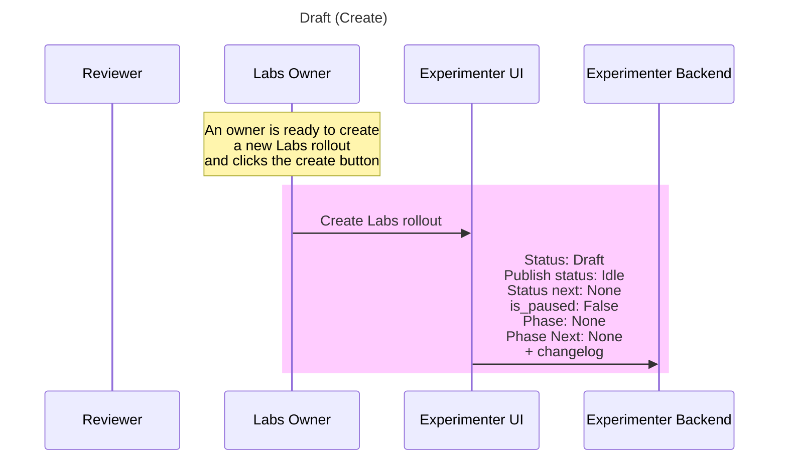
```mermaid
  sequenceDiagram
    participant Reviewer
    participant Labs Owner
    participant Experimenter UI
    participant Experimenter Backend
    title Draft (Create)
    Note over Labs Owner: An owner is ready to create <br/>  a new Labs rollout <br/> and clicks the create button
    
    rect rgb(255,204,255) 
        Labs Owner->>Experimenter UI: Create Labs rollout
        Experimenter UI->>Experimenter Backend: Status: Draft <br/> Publish status: Idle <br/> Status next: None <br/> is_paused: False <br/> Phase: None <br/> Phase Next: None <br/> + changelog
    end
%%{init:{'themeCSS':'g:nth-of-type(1) .note { stroke: purple ;fill: white; };'}}%%
```

## Preview

A draft Labs rollout that has been validly completed is marked for Preview, is published to the preview collection in Remote Settings, and is then accessible to specially configured clients.

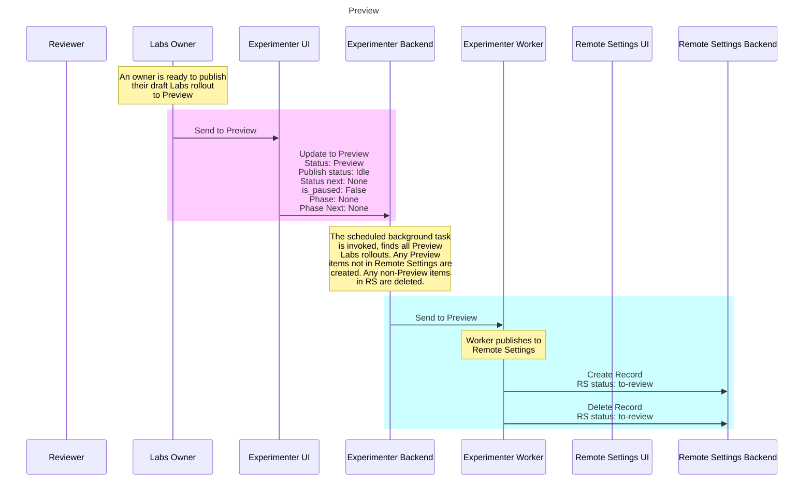
```mermaid
  sequenceDiagram
    participant Reviewer
    participant Labs Owner
    participant Experimenter UI
    participant Experimenter Backend
    participant Experimenter Worker
    participant Remote Settings UI
    participant Remote Settings Backend
    title Preview
    Note over Labs Owner: An owner is ready to publish <br/> their draft Labs rollout <br/> to Preview
    
    rect rgb(255,204,255) 
        Labs Owner->>Experimenter UI: Send to Preview
        Experimenter UI->>Experimenter Backend: Update to Preview <br/> Status: Preview <br/> Publish status: Idle <br/> Status next: None <br/> is_paused: False <br/> Phase: None <br/> Phase Next: None
    end 
 
    Note over Experimenter Backend: The scheduled background task <br/> is invoked, finds all Preview  <br/> Labs rollouts. Any Preview  <br/> items not in Remote Settings are <br/> created. Any non-Preview items <br/> in RS are deleted.
    
    rect rgb(204,255,255) 
        Experimenter Backend->>Experimenter Worker: Send to Preview
        Note over Experimenter Worker: Worker publishes to <br/>Remote Settings
        Experimenter Worker->>Remote Settings Backend: Create Record <br/> RS status: to-review
        Experimenter Worker->>Remote Settings Backend: Delete Record <br/> RS status: to-review
    end 
%%{init:{'themeCSS':'g:nth-of-type(1) .note { stroke: purple ;fill: white; };'}}%%
```

## Launch (approve/approve)

A draft Labs rollout that has been validly completed is reviewed and approved in Experimenter, is reviewed and approved in Remote Settings, and is then accessible to clients.

```mermaid
  sequenceDiagram
    participant Reviewer
    participant Labs Owner
    participant Experimenter UI
    participant Experimenter Backend
    participant Experimenter Worker
    participant Remote Settings UI
    participant Remote Settings Backend
    title Publish (Approve/Approve)
    Note over Labs Owner: An owner is ready to launch <br/> their draft Labs rollout <br/> from draft and clicks the <br/> Review button
    
    rect rgb(255,204,255) 
        Note right of Labs Owner: Owner launches in Experimenter
        Labs Owner->>Experimenter UI: Send to Review
        Experimenter UI->>Experimenter Backend: Status: Draft <br/> Publish status: Review <br/> Status next: Live <br/> is_paused: False <br/> Phase: None <br/> Phase Next: Phase 1 <br/> + changelog
    end 
    
    Experimenter Backend-->>Reviewer: To review
    Note over Reviewer: The reviewer reviews the <br/> Labs rollout's details on the <br/> summary page and clicks the <br/> approve button
    

    rect rgb(255,255,204) 
        Note over Labs Owner: Reviewer approves in Experimenter
        Reviewer->>Experimenter UI: Approve
        Experimenter UI->>Experimenter Backend: Status: Draft <br/> Publish status: Approved <br/> Status next: Live <br/> is_paused: False <br/> Phase: None <br/> Phase Next: Phase 1 <br/> + changelog
    end 
 
    Note over Experimenter Backend: The scheduled background task <br/> is invoked, finds an approved Labs rollout <br/> to publish, and creates the new published <br/> record with the serialized DTO
    
    rect rgb(204,255,255) 
        Experimenter Backend->>Experimenter Worker: Find Labs rollouts: <br/> Status: Draft <br/> Publish status: Approved <br/> Status next: Live <br/> is_paused: False
        Note over Experimenter Worker: Worker publishes to <br/>Remote Settings
        Experimenter Worker->>Remote Settings Backend: Create Record <br/> RS status: to-review
        Experimenter Worker->>Experimenter Backend: Status: Draft <br/> Publish status: Waiting <br/> Status next: Live <br/> is_paused: False <br/> Phase: None <br/> Phase Next: Phase 1 <br/> + changelog
    end 

    Experimenter Backend-->>Reviewer: To review in Remote Settings
    
    Note over Reviewer: The reviewer opens Remote <br/> Settings and approves <br/> the change in the collection.

    rect rgb(255,255,204) 
        Note right of Reviewer: Reviewer approves in <br/>Remote Settings
        Reviewer->>Remote Settings UI: Approve
        Remote Settings UI->>Remote Settings Backend: Approve
        Remote Settings Backend->>Remote Settings UI: RS status: to-sign
    end 

    Note over Experimenter Backend: The scheduled background task <br/> is invoked and finds the <br/> Labs rollout approved <br/> in the RS collection

    rect rgb(204,255,255) 
        Note over Experimenter Worker: Worker updates <br/> Labs rollout
        Experimenter Worker->>Remote Settings Backend: Check collection (timeout)
        Experimenter Worker->>Experimenter Backend:  Status: Live <br/> Publish status: Idle <br/> Status next: None <br/> is_paused: False <br/> Phase: Phase 1 <br/> Phase Next: None <br/> + changelog
    end
%%{init:{'themeCSS':'g:nth-of-type(1) .note { stroke: purple ;fill: white; };'}}%%
```

## Launch (reject/----)

A draft Labs rollout that has been validly completed is rejected by a reviewer in Experimenter. A rejection reason is captured in Experimenter and is displayed to the owner in Experimenter.

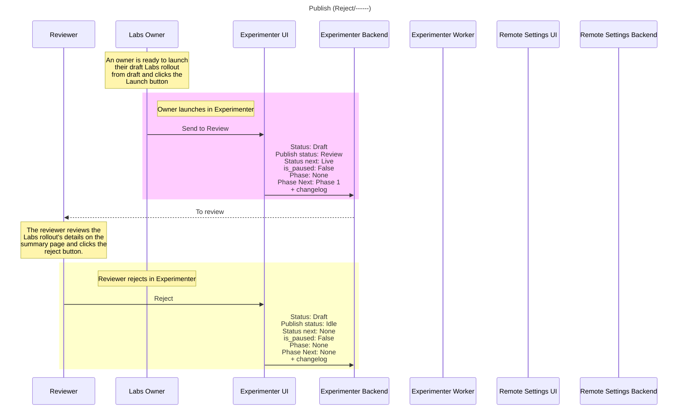
```mermaid
  sequenceDiagram
    participant Reviewer
    participant Labs Owner
    participant Experimenter UI
    participant Experimenter Backend
    participant Experimenter Worker
    participant Remote Settings UI
    participant Remote Settings Backend
    title Publish (Reject/------)
    Note over Labs Owner: An owner is ready to launch <br/> their draft Labs rollout <br/> from draft and clicks the <br/> Launch button
    
    rect rgb(255,204,255) 
        Note right of Labs Owner: Owner launches in Experimenter
        Labs Owner->>Experimenter UI: Send to Review
        Experimenter UI->>Experimenter Backend: Status: Draft <br/> Publish status: Review <br/> Status next: Live <br/> is_paused: False <br/> Phase: None <br/> Phase Next: Phase 1 <br/> + changelog
    end 
    
    Experimenter Backend-->>Reviewer: To review
    Note over Reviewer: The reviewer reviews the <br/> Labs rollout's details on the <br/> summary page and clicks the <br/> reject button.
    

    rect rgb(255,255,204) 
        Note over Labs Owner: Reviewer rejects in Experimenter
        Reviewer->>Experimenter UI: Reject
        Experimenter UI->>Experimenter Backend: Status: Draft <br/> Publish status: Idle <br/> Status next: None <br/> is_paused: False <br/> Phase: None <br/> Phase Next: None <br/> + changelog
    end 
%%{init:{'themeCSS':'g:nth-of-type(1) .note { stroke: purple ;fill: white; };'}}%%
```

## Launch (approve/reject)

A draft Labs rollout that has been validly completed is reviewed and approved in Experimenter, and is then reviewed and rejected in Remote Settings. A rejection reason is captured in Remote Settings and is displayed to the owner in Experimenter.

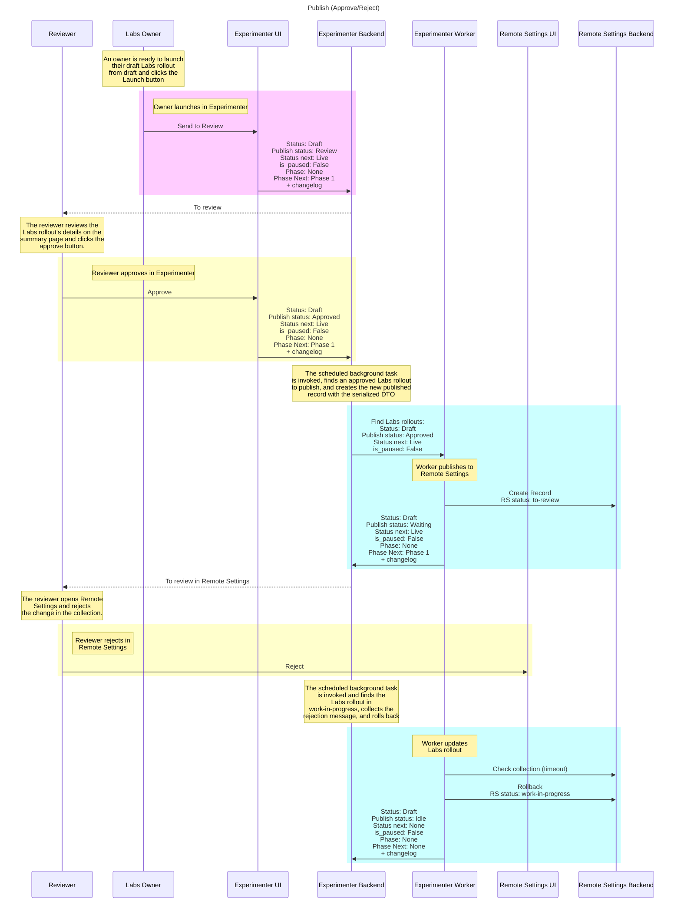
```mermaid
  sequenceDiagram
    participant Reviewer
    participant Labs Owner
    participant Experimenter UI
    participant Experimenter Backend
    participant Experimenter Worker
    participant Remote Settings UI
    participant Remote Settings Backend
    title Publish (Approve/Reject)
    Note over Labs Owner: An owner is ready to launch <br/> their draft Labs rollout <br/> from draft and clicks the <br/> Launch button
    
    rect rgb(255,204,255) 
        Note right of Labs Owner: Owner launches in Experimenter
        Labs Owner->>Experimenter UI: Send to Review
        Experimenter UI->>Experimenter Backend: Status: Draft <br/> Publish status: Review <br/> Status next: Live <br/> is_paused: False <br/> Phase: None <br/> Phase Next: Phase 1 <br/> + changelog
    end 
    
    Experimenter Backend-->>Reviewer: To review
    Note over Reviewer: The reviewer reviews the <br/> Labs rollout's details on the <br/> summary page and clicks the <br/> approve button.
    

    rect rgb(255,255,204) 
        Note over Labs Owner: Reviewer approves in Experimenter
        Reviewer->>Experimenter UI: Approve
        Experimenter UI->>Experimenter Backend: Status: Draft <br/> Publish status: Approved <br/> Status next: Live <br/> is_paused: False <br/> Phase: None <br/> Phase Next: Phase 1 <br/> + changelog
    end 
 
    Note over Experimenter Backend: The scheduled background task <br/> is invoked, finds an approved Labs rollout <br/> to publish, and creates the new published <br/> record with the serialized DTO
    
    rect rgb(204,255,255) 
        Experimenter Backend->>Experimenter Worker: Find Labs rollouts: <br/> Status: Draft <br/> Publish status: Approved <br/> Status next: Live <br/> is_paused: False
        Note over Experimenter Worker: Worker publishes to <br/>Remote Settings
        Experimenter Worker->>Remote Settings Backend: Create Record <br/> RS status: to-review
        Experimenter Worker->>Experimenter Backend: Status: Draft <br/> Publish status: Waiting <br/> Status next: Live <br/> is_paused: False <br/> Phase: None <br/> Phase Next: Phase 1 <br/> + changelog
    end 

    Experimenter Backend-->>Reviewer: To review in Remote Settings
    
    Note over Reviewer: The reviewer opens Remote <br/> Settings and rejects <br/> the change in the collection.

    rect rgb(255,255,204) 
        Note right of Reviewer: Reviewer rejects in <br/>Remote Settings
        Reviewer->>Remote Settings UI: Reject
    end 

    Note over Experimenter Backend: The scheduled background task <br/> is invoked and finds the <br/> Labs rollout in <br/> work-in-progress, collects the <br/> rejection message, and rolls back

    rect rgb(204,255,255) 
        Note over Experimenter Worker: Worker updates <br/> Labs rollout
        Experimenter Worker->>Remote Settings Backend: Check collection (timeout)
        Experimenter Worker->>Remote Settings Backend: Rollback <br/> RS status: work-in-progress
        Experimenter Worker->>Experimenter Backend:  Status: Draft <br/> Publish status: Idle <br/> Status next: None <br/> is_paused: False <br/> Phase: None <br/> Phase Next: None <br/> + changelog
    end 
%%{init:{'themeCSS':'g:nth-of-type(1) .note { stroke: purple ;fill: white; };'}}%%
```

## Launch (approve/reject) + manual rollback

A draft Labs rollout that has been validly completed is reviewed and approved in Experimenter, and is then reviewed and rejected in Remote Settings. The reviewer **manually rolls back** the Remote Settings collection. A rejection reason is captured in Remote Settings but is **unable to be recovered by Experimenter** because the collection was manually rolled back **before Experimenter could query its status**, and so Experimenter shows a generic rejection reason.

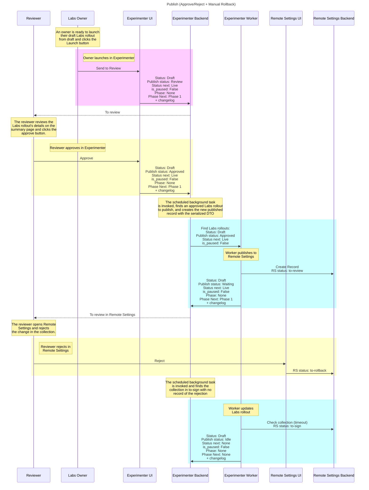
```mermaid
  sequenceDiagram
    participant Reviewer
    participant Labs Owner
    participant Experimenter UI
    participant Experimenter Backend
    participant Experimenter Worker
    participant Remote Settings UI
    participant Remote Settings Backend
    title Publish (Approve/Reject + Manual Rollback)
    Note over Labs Owner: An owner is ready to launch <br/> their draft Labs rollout <br/> from draft and clicks the <br/> Launch button
    
    rect rgb(255,204,255) 
        Note right of Labs Owner: Owner launches in Experimenter
        Labs Owner->>Experimenter UI: Send to Review
        Experimenter UI->>Experimenter Backend: Status: Draft <br/> Publish status: Review <br/> Status next: Live <br/> is_paused: False <br/> Phase: None <br/> Phase Next: Phase 1 <br/> + changelog
    end 
    
    Experimenter Backend-->>Reviewer: To review
    Note over Reviewer: The reviewer reviews the <br/> Labs rollout's details on the <br/> summary page and clicks the <br/> approve button.
    

    rect rgb(255,255,204) 
        Note over Labs Owner: Reviewer approves in Experimenter
        Reviewer->>Experimenter UI: Approve
        Experimenter UI->>Experimenter Backend: Status: Draft <br/> Publish status: Approved <br/> Status next: Live <br/> is_paused: False <br/> Phase: None <br/> Phase Next: Phase 1 <br/> + changelog
    end 
 
    Note over Experimenter Backend: The scheduled background task <br/> is invoked, finds an approved Labs rollout <br/> to publish, and creates the new published <br/> record with the serialized DTO
    
    rect rgb(204,255,255) 
        Experimenter Backend->>Experimenter Worker: Find Labs rollouts: <br/> Status: Draft <br/> Publish status: Approved <br/> Status next: Live <br/> is_paused: False
        Note over Experimenter Worker: Worker publishes to <br/>Remote Settings
        Experimenter Worker->>Remote Settings Backend: Create Record <br/> RS status: to-review
        Experimenter Worker->>Experimenter Backend: Status: Draft <br/> Publish status: Waiting <br/> Status next: Live <br/> is_paused: False <br/> Phase: None <br/> Phase Next: Phase 1 <br/> + changelog
    end 

    Experimenter Backend-->>Reviewer: To review in Remote Settings
    
    Note over Reviewer: The reviewer opens Remote <br/> Settings and rejects <br/> the change in the collection.

    rect rgb(255,255,204) 
        Note right of Reviewer: Reviewer rejects in <br/>Remote Settings
        Reviewer->>Remote Settings UI: Reject
        Remote Settings UI->>Remote Settings Backend: RS status: to-rollback
    end 

    Note over Experimenter Backend: The scheduled background task <br/> is invoked and finds the <br/> collection in to-sign with no <br/> record of the rejection

    rect rgb(204,255,255) 
        Note over Experimenter Worker: Worker updates <br/> Labs rollout
        Experimenter Worker->>Remote Settings Backend: Check collection (timeout) <br/> RS status: to-sign
        Experimenter Worker->>Experimenter Backend:  Status: Draft <br/> Publish status: Idle <br/> Status next: None <br/> is_paused: False <br/> Phase: None <br/> Phase Next: None <br/> + changelog
    end 
%%{init:{'themeCSS':'g:nth-of-type(1) .note { stroke: purple ;fill: white; };'}}%%
```

## Launch (approve/timed out)

A draft Labs rollout that has been validly completed is reviewed and approved in Experimenter, is published to Remote Settings, and the collection is marked for review. Before the reviewer is able to review it in Remote Settings, the scheduled celery task is invoked and finds that the collection is blocked from further changes by having an unattended review pending. It rolls back the pending review to allow other queued changes to be made. This prevents unattended reviews in a collection from blocking other queued changes. The Labs rollout returns to Review so the reviewer must approve it again.

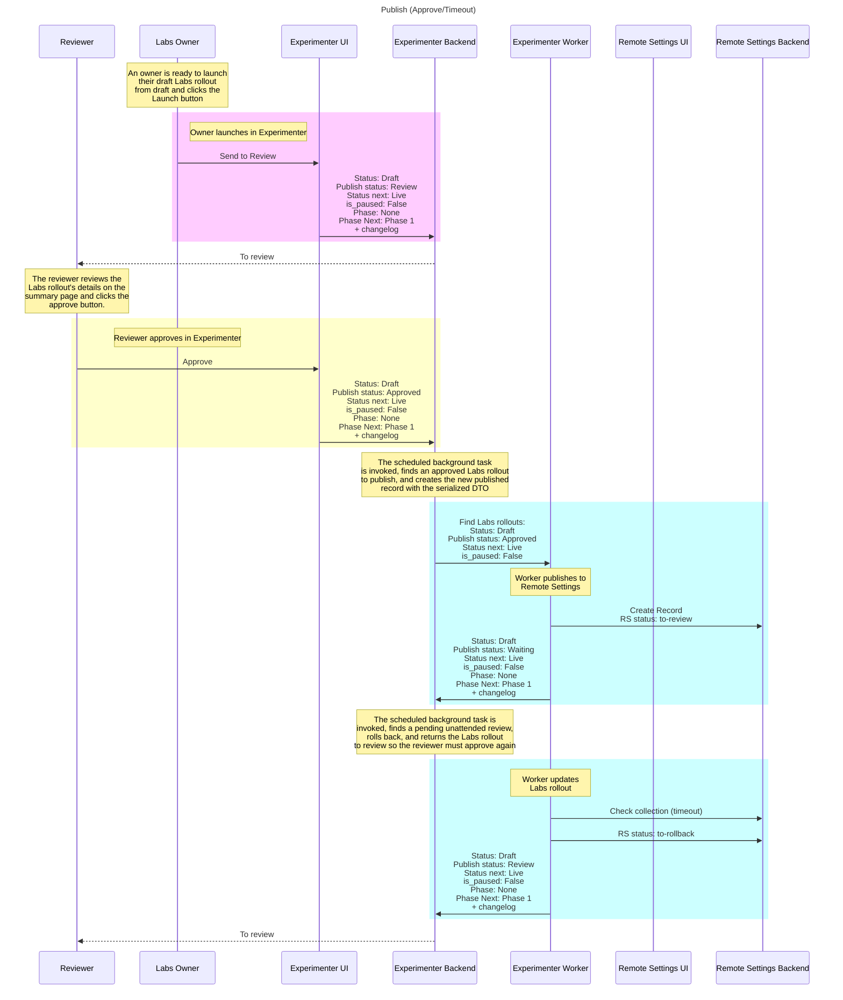
```mermaid
  sequenceDiagram
    participant Reviewer
    participant Labs Owner
    participant Experimenter UI
    participant Experimenter Backend
    participant Experimenter Worker
    participant Remote Settings UI
    participant Remote Settings Backend
    title Publish (Approve/Timeout)
    Note over Labs Owner: An owner is ready to launch <br/> their draft Labs rollout <br/> from draft and clicks the <br/> Launch button
    
    rect rgb(255,204,255) 
        Note right of Labs Owner: Owner launches in Experimenter
        Labs Owner->>Experimenter UI: Send to Review
        Experimenter UI->>Experimenter Backend: Status: Draft <br/> Publish status: Review <br/> Status next: Live <br/> is_paused: False <br/> Phase: None <br/> Phase Next: Phase 1 <br/> + changelog
    end 
    
    Experimenter Backend-->>Reviewer: To review
    Note over Reviewer: The reviewer reviews the <br/> Labs rollout's details on the <br/> summary page and clicks the <br/> approve button.
    

    rect rgb(255,255,204) 
        Note over Labs Owner: Reviewer approves in Experimenter
        Reviewer->>Experimenter UI: Approve
        Experimenter UI->>Experimenter Backend: Status: Draft <br/> Publish status: Approved <br/> Status next: Live <br/> is_paused: False <br/> Phase: None <br/> Phase Next: Phase 1 <br/> + changelog
    end 
 
    Note over Experimenter Backend: The scheduled background task <br/> is invoked, finds an approved Labs rollout <br/> to publish, and creates the new published <br/> record with the serialized DTO
    
    rect rgb(204,255,255) 
        Experimenter Backend->>Experimenter Worker: Find Labs rollouts: <br/> Status: Draft <br/> Publish status: Approved <br/> Status next: Live <br/> is_paused: False
        Note over Experimenter Worker: Worker publishes to <br/>Remote Settings
        Experimenter Worker->>Remote Settings Backend: Create Record <br/> RS status: to-review
        Experimenter Worker->>Experimenter Backend: Status: Draft <br/> Publish status: Waiting <br/> Status next: Live <br/> is_paused: False <br/> Phase: None <br/> Phase Next: Phase 1 <br/> + changelog
    end 

    Note over Experimenter Backend: The scheduled background task is <br/> invoked, finds a pending unattended review, <br/> rolls back, and returns the Labs rollout <br/> to review so the reviewer must approve again
   
    rect rgb(204,255,255) 
        Note over Experimenter Worker: Worker updates <br/> Labs rollout
        Experimenter Worker->>Remote Settings Backend: Check collection (timeout)
        Experimenter Worker->>Remote Settings Backend: RS status: to-rollback
        Experimenter Worker->>Experimenter Backend:  Status: Draft <br/> Publish status: Review <br/> Status next: Live <br/> is_paused: False <br/> Phase: None <br/> Phase Next: Phase 1 <br/> + changelog
    end

    Experimenter Backend-->>Reviewer: To review
%%{init:{'themeCSS':'g:nth-of-type(1) .note { stroke: purple ;fill: white; };'}}%%
```

## Launch (cancel)

When a draft Labs rollout has requested review in Experimenter, the review can also be canceled in Experimenter. The review can only be canceled before it has been reviewed in Experimenter.

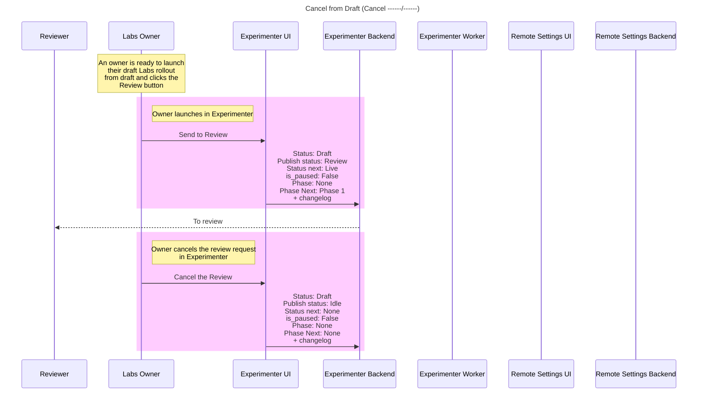
```mermaid
    sequenceDiagram
        participant Reviewer
        participant Labs Owner
        participant Experimenter UI
        participant Experimenter Backend
        participant Experimenter Worker
        participant Remote Settings UI
        participant Remote Settings Backend
        title Cancel from Draft (Cancel ------/------)
        Note over Labs Owner: An owner is ready to launch <br/> their draft Labs rollout <br/> from draft and clicks the <br/> Review button

        rect rgb(255,204,255)
            Note right of Labs Owner: Owner launches in Experimenter
            Labs Owner->>Experimenter UI: Send to Review
            Experimenter UI->>Experimenter Backend: Status: Draft <br/> Publish status: Review <br/> Status next: Live <br/> is_paused: False <br/> Phase: None <br/> Phase Next: Phase 1 <br/> + changelog
        end

        Experimenter Backend-->>Reviewer: To review
        
        rect rgb(255,204,255)
            Note right of Labs Owner: Owner cancels the review request <br/> in Experimenter
            Labs Owner->>Experimenter UI: Cancel the Review
            Experimenter UI->>Experimenter Backend: Status: Draft <br/> Publish status: Idle <br/> Status next: None <br/> is_paused: False <br/> Phase: None <br/> Phase Next: None <br/> + changelog
        end
```

This can also be canceled when a Labs rollout is in the Preview state and requests to be launched. When the review is canceled, the Preview Labs rollout is sent back to Draft.

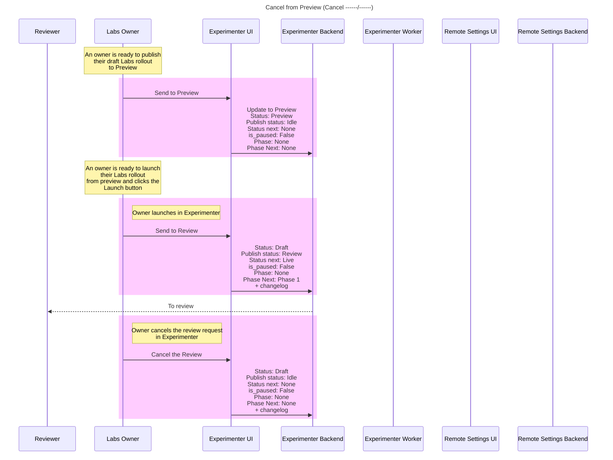
```mermaid
    sequenceDiagram
        participant Reviewer
        participant Labs Owner
        participant Experimenter UI
        participant Experimenter Backend
        participant Experimenter Worker
        participant Remote Settings UI
        participant Remote Settings Backend
        title Cancel from Preview (Cancel ------/------)
        
        Note over Labs Owner: An owner is ready to publish <br/> their draft Labs rollout <br/> to Preview
    
        rect rgb(255,204,255) 
            Labs Owner->>Experimenter UI: Send to Preview
            Experimenter UI->>Experimenter Backend: Update to Preview <br/> Status: Preview <br/> Publish status: Idle <br/> Status next: None <br/> is_paused: False <br/> Phase: None <br/> Phase Next: None
        end 
        
        Note over Labs Owner: An owner is ready to launch <br/> their Labs rollout <br/> from preview and clicks the <br/> Launch button

        rect rgb(255,204,255)
            Note right of Labs Owner: Owner launches in Experimenter
            Labs Owner->>Experimenter UI: Send to Review
            Experimenter UI->>Experimenter Backend: Status: Draft <br/> Publish status: Review <br/> Status next: Live <br/> is_paused: False <br/> Phase: None <br/> Phase Next: Phase 1 <br/> + changelog
        end

        Experimenter Backend-->>Reviewer: To review
        
        rect rgb(255,204,255)
            Note right of Labs Owner: Owner cancels the review request <br/> in Experimenter
            Labs Owner->>Experimenter UI: Cancel the Review
            Experimenter UI->>Experimenter Backend: Status: Draft <br/> Publish status: Idle <br/> Status next: None <br/> is_paused: False <br/> Phase: None <br/> Phase Next: None <br/> + changelog
        end
```

## Change Phase (Approve/Approve)

A live Labs rollout can have its next phase pushed to its state while remaining Live. This phase change must be reviewed in order to be published to the user, following the same flow to be approved in both Experimenter and Remote Settings.

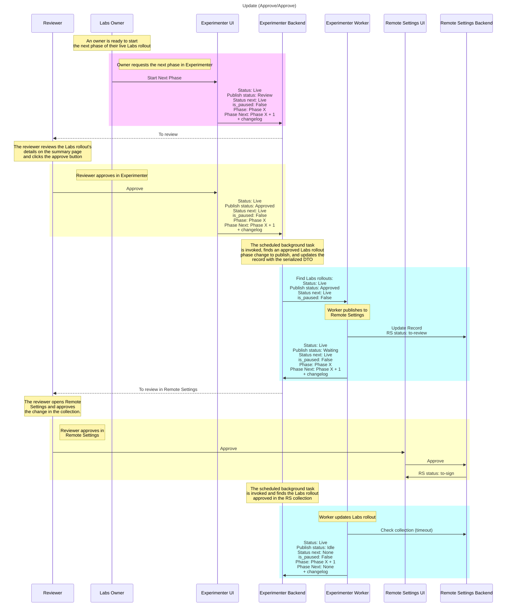
```mermaid
  sequenceDiagram
    participant Reviewer
    participant Labs Owner
    participant Experimenter UI
    participant Experimenter Backend
    participant Experimenter Worker
    participant Remote Settings UI
    participant Remote Settings Backend
    title Update (Approve/Approve)
    
    Note over Labs Owner: An owner is ready to start <br/> the next phase of their live Labs rollout
    
    rect rgb(255,204,255) 
        Note right of Labs Owner: Owner requests the next phase in Experimenter
        Labs Owner->>Experimenter UI: Start Next Phase
        Experimenter UI->>Experimenter Backend: Status: Live <br/> Publish status: Review <br/> Status next: Live <br/> is_paused: False <br/> Phase: Phase X <br/> Phase Next: Phase X + 1 <br/> + changelog
    end 
    
    Experimenter Backend-->>Reviewer: To review
    Note over Reviewer: The reviewer reviews the Labs rollout's <br/> details on the summary page <br/> and clicks the approve button
    
    rect rgb(255,255,204) 
        Note over Labs Owner: Reviewer approves in Experimenter
        Reviewer->>Experimenter UI: Approve
        Experimenter UI->>Experimenter Backend: Status: Live <br/> Publish status: Approved <br/> Status next: Live <br/> is_paused: False <br/> Phase: Phase X <br/> Phase Next: Phase X + 1 <br/> + changelog
    end 
 
    Note over Experimenter Backend: The scheduled background task <br/> is invoked, finds an approved Labs rollout <br/> phase change to publish, and updates the <br/> record with the serialized DTO
    
    rect rgb(204,255,255) 
        Experimenter Backend->>Experimenter Worker: Find Labs rollouts: <br/> Status: Live <br/> Publish status: Approved <br/> Status next: Live <br/> is_paused: False
        Note over Experimenter Worker: Worker publishes to <br/>Remote Settings
        Experimenter Worker->>Remote Settings Backend: Update Record <br/> RS status: to-review
        Experimenter Worker->>Experimenter Backend: Status: Live <br/> Publish status: Waiting <br/> Status next: Live <br/> is_paused: False <br/> Phase: Phase X <br/> Phase Next: Phase X + 1 <br/> + changelog
    end 

    Experimenter Backend-->>Reviewer: To review in Remote Settings
    
    Note over Reviewer: The reviewer opens Remote <br/> Settings and approves <br/> the change in the collection.

    rect rgb(255,255,204) 
        Note right of Reviewer: Reviewer approves in <br/>Remote Settings
        Reviewer->>Remote Settings UI: Approve
        Remote Settings UI->>Remote Settings Backend: Approve
        Remote Settings Backend->>Remote Settings UI: RS status: to-sign
    end 

    Note over Experimenter Backend: The scheduled background task <br/> is invoked and finds the Labs rollout <br/> approved in the RS collection

    rect rgb(204,255,255) 
        Note over Experimenter Worker: Worker updates Labs rollout
        Experimenter Worker->>Remote Settings Backend: Check collection (timeout)
        Experimenter Worker->>Experimenter Backend:  Status: Live <br/> Publish status: Idle <br/> Status next: None <br/> is_paused: False <br/> Phase: Phase X + 1 <br/> Phase Next: None <br/> + changelog
    end 
```

## Change Phase (Reject/------)

A live Labs rollout phase change is reviewed and rejected in Experimenter. A rejection reason is captured in Experimenter and is displayed to the owner in Experimenter. The Labs rollout remains in its current phase after the rejection.

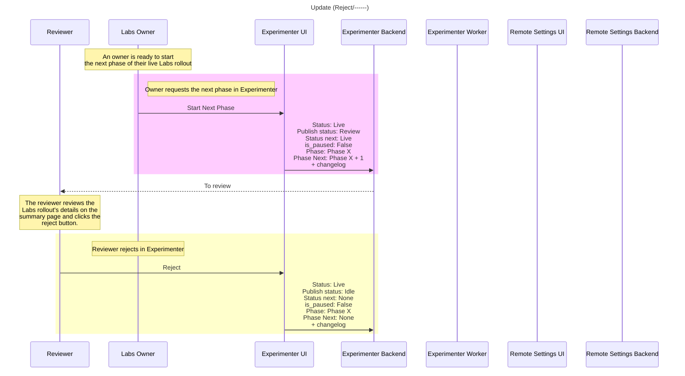
```mermaid
  sequenceDiagram
    participant Reviewer
    participant Labs Owner
    participant Experimenter UI
    participant Experimenter Backend
    participant Experimenter Worker
    participant Remote Settings UI
    participant Remote Settings Backend
    title Update (Reject/------)
    
    Note over Labs Owner: An owner is ready to start <br/> the next phase of their live Labs rollout
    
    rect rgb(255,204,255) 
        Note right of Labs Owner: Owner requests the next phase in Experimenter
        Labs Owner->>Experimenter UI: Start Next Phase
        Experimenter UI->>Experimenter Backend: Status: Live <br/> Publish status: Review <br/> Status next: Live <br/> is_paused: False <br/> Phase: Phase X <br/> Phase Next: Phase X + 1 <br/> + changelog
    end 
    
    Experimenter Backend-->>Reviewer: To review
    Note over Reviewer: The reviewer reviews the <br/> Labs rollout's details on the <br/> summary page and clicks the <br/> reject button.
    

    rect rgb(255,255,204) 
        Note over Labs Owner: Reviewer rejects in Experimenter
        Reviewer->>Experimenter UI: Reject
        Experimenter UI->>Experimenter Backend: Status: Live <br/> Publish status: Idle <br/> Status next: None <br/> is_paused: False <br/> Phase: Phase X <br/> Phase Next: None <br/> + changelog
    end 
```

## Change Phase (Approve/Reject)

A live Labs rollout phase change is reviewed and approved in Experimenter, and is then reviewed and rejected in Remote Settings. A rejection reason is captured in Remote Settings and is displayed to the owner in Experimenter. The Labs rollout remains in its current phase after the rejection.

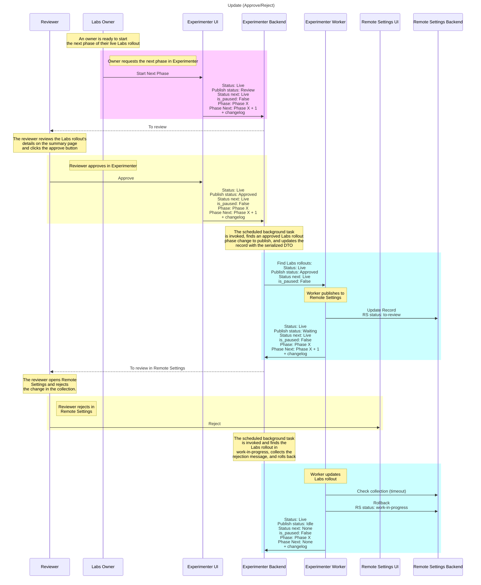
```mermaid
  sequenceDiagram
    participant Reviewer
    participant Labs Owner
    participant Experimenter UI
    participant Experimenter Backend
    participant Experimenter Worker
    participant Remote Settings UI
    participant Remote Settings Backend
    title Update (Approve/Reject)
    
    Note over Labs Owner: An owner is ready to start <br/> the next phase of their live Labs rollout
    
    rect rgb(255,204,255) 
        Note right of Labs Owner: Owner requests the next phase in Experimenter
        Labs Owner->>Experimenter UI: Start Next Phase
        Experimenter UI->>Experimenter Backend: Status: Live <br/> Publish status: Review <br/> Status next: Live <br/> is_paused: False <br/> Phase: Phase X <br/> Phase Next: Phase X + 1 <br/> + changelog
    end 
    
    Experimenter Backend-->>Reviewer: To review
    Note over Reviewer: The reviewer reviews the Labs rollout's <br/> details on the summary page <br/> and clicks the approve button
    
    rect rgb(255,255,204) 
        Note over Labs Owner: Reviewer approves in Experimenter
        Reviewer->>Experimenter UI: Approve
        Experimenter UI->>Experimenter Backend: Status: Live <br/> Publish status: Approved <br/> Status next: Live <br/> is_paused: False <br/> Phase: Phase X <br/> Phase Next: Phase X + 1 <br/> + changelog
    end 
 
    Note over Experimenter Backend: The scheduled background task <br/> is invoked, finds an approved Labs rollout <br/> phase change to publish, and updates the <br/> record with the serialized DTO
    
    rect rgb(204,255,255) 
        Experimenter Backend->>Experimenter Worker: Find Labs rollouts: <br/> Status: Live <br/> Publish status: Approved <br/> Status next: Live <br/> is_paused: False
        Note over Experimenter Worker: Worker publishes to <br/>Remote Settings
        Experimenter Worker->>Remote Settings Backend: Update Record <br/> RS status: to-review
        Experimenter Worker->>Experimenter Backend: Status: Live <br/> Publish status: Waiting <br/> Status next: Live <br/> is_paused: False <br/> Phase: Phase X <br/> Phase Next: Phase X + 1 <br/> + changelog
    end 

    Experimenter Backend-->>Reviewer: To review in Remote Settings
    
    Note over Reviewer: The reviewer opens Remote <br/> Settings and rejects <br/> the change in the collection.

    rect rgb(255,255,204) 
        Note right of Reviewer: Reviewer rejects in <br/>Remote Settings
        Reviewer->>Remote Settings UI: Reject
    end 

    Note over Experimenter Backend: The scheduled background task <br/> is invoked and finds the <br/> Labs rollout in <br/> work-in-progress, collects the <br/> rejection message, and rolls back

    rect rgb(204,255,255) 
        Note over Experimenter Worker: Worker updates <br/> Labs rollout
        Experimenter Worker->>Remote Settings Backend: Check collection (timeout)
        Experimenter Worker->>Remote Settings Backend: Rollback <br/> RS status: work-in-progress
        Experimenter Worker->>Experimenter Backend: Status: Live <br/> Publish status: Idle <br/> Status next: None <br/> is_paused: False <br/> Phase: Phase X <br/> Phase Next: None <br/> + changelog
    end 
```

## Change Phase (Approve/Reject) + manual rollback

A live Labs rollout phase change is reviewed and approved in Experimenter, and is then reviewed and rejected in Remote Settings. The reviewer **manually rolls back** the Remote Settings collection. A rejection reason is captured in Remote Settings but is **unable to be recovered by Experimenter** because the collection was manually rolled back **before Experimenter could query its status**, and so Experimenter shows a generic rejection reason. The Labs rollout remains in its current phase after the rejection.

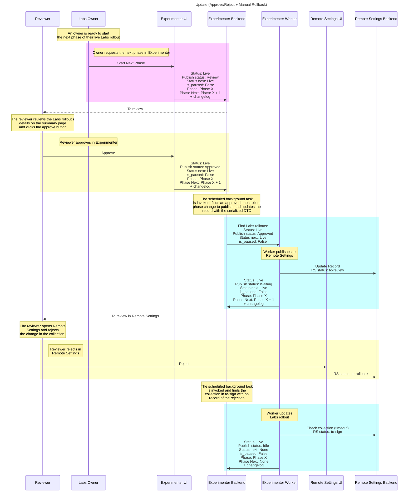
```mermaid
  sequenceDiagram
    participant Reviewer
    participant Labs Owner
    participant Experimenter UI
    participant Experimenter Backend
    participant Experimenter Worker
    participant Remote Settings UI
    participant Remote Settings Backend
    title Update (Approve/Reject + Manual Rollback)
    
    Note over Labs Owner: An owner is ready to start <br/> the next phase of their live Labs rollout
    
    rect rgb(255,204,255) 
        Note right of Labs Owner: Owner requests the next phase in Experimenter
        Labs Owner->>Experimenter UI: Start Next Phase
        Experimenter UI->>Experimenter Backend: Status: Live <br/> Publish status: Review <br/> Status next: Live <br/> is_paused: False <br/> Phase: Phase X <br/> Phase Next: Phase X + 1 <br/> + changelog
    end 
    
    Experimenter Backend-->>Reviewer: To review
    Note over Reviewer: The reviewer reviews the Labs rollout's <br/> details on the summary page <br/> and clicks the approve button
    
    rect rgb(255,255,204) 
        Note over Labs Owner: Reviewer approves in Experimenter
        Reviewer->>Experimenter UI: Approve
        Experimenter UI->>Experimenter Backend: Status: Live <br/> Publish status: Approved <br/> Status next: Live <br/> is_paused: False <br/> Phase: Phase X <br/> Phase Next: Phase X + 1 <br/> + changelog
    end 
 
    Note over Experimenter Backend: The scheduled background task <br/> is invoked, finds an approved Labs rollout <br/> phase change to publish, and updates the <br/> record with the serialized DTO
    
    rect rgb(204,255,255) 
        Experimenter Backend->>Experimenter Worker: Find Labs rollouts: <br/> Status: Live <br/> Publish status: Approved <br/> Status next: Live <br/> is_paused: False
        Note over Experimenter Worker: Worker publishes to <br/>Remote Settings
        Experimenter Worker->>Remote Settings Backend: Update Record <br/> RS status: to-review
        Experimenter Worker->>Experimenter Backend: Status: Live <br/> Publish status: Waiting <br/> Status next: Live <br/> is_paused: False <br/> Phase: Phase X <br/> Phase Next: Phase X + 1 <br/> + changelog
    end 

    Experimenter Backend-->>Reviewer: To review in Remote Settings
    
    Note over Reviewer: The reviewer opens Remote <br/> Settings and rejects <br/> the change in the collection.

    rect rgb(255,255,204) 
        Note right of Reviewer: Reviewer rejects in <br/>Remote Settings
        Reviewer->>Remote Settings UI: Reject
        Remote Settings UI->>Remote Settings Backend: RS status: to-rollback
    end 

    Note over Experimenter Backend: The scheduled background task <br/> is invoked and finds the <br/> collection in to-sign with no <br/> record of the rejection

    rect rgb(204,255,255) 
        Note over Experimenter Worker: Worker updates <br/> Labs rollout
        Experimenter Worker->>Remote Settings Backend: Check collection (timeout) <br/> RS status: to-sign
        Experimenter Worker->>Experimenter Backend: Status: Live <br/> Publish status: Idle <br/> Status next: None <br/> is_paused: False <br/> Phase: Phase X <br/> Phase Next: None <br/> + changelog
    end 
```

## Change Phase (Approve/Timeout)

A live Labs rollout phase change is reviewed and approved in Experimenter, is published to Remote Settings, and the collection is marked for review. Before the reviewer is able to review it in Remote Settings, the scheduled celery task is invoked and finds that the collection is blocked from further changes by having an unattended review pending. It rolls back the pending review to allow other queued changes to be made. This prevents unattended reviews in a collection from blocking other queued changes. The Labs rollout returns to Review, remains in its current phase, and the reviewer must approve it again.

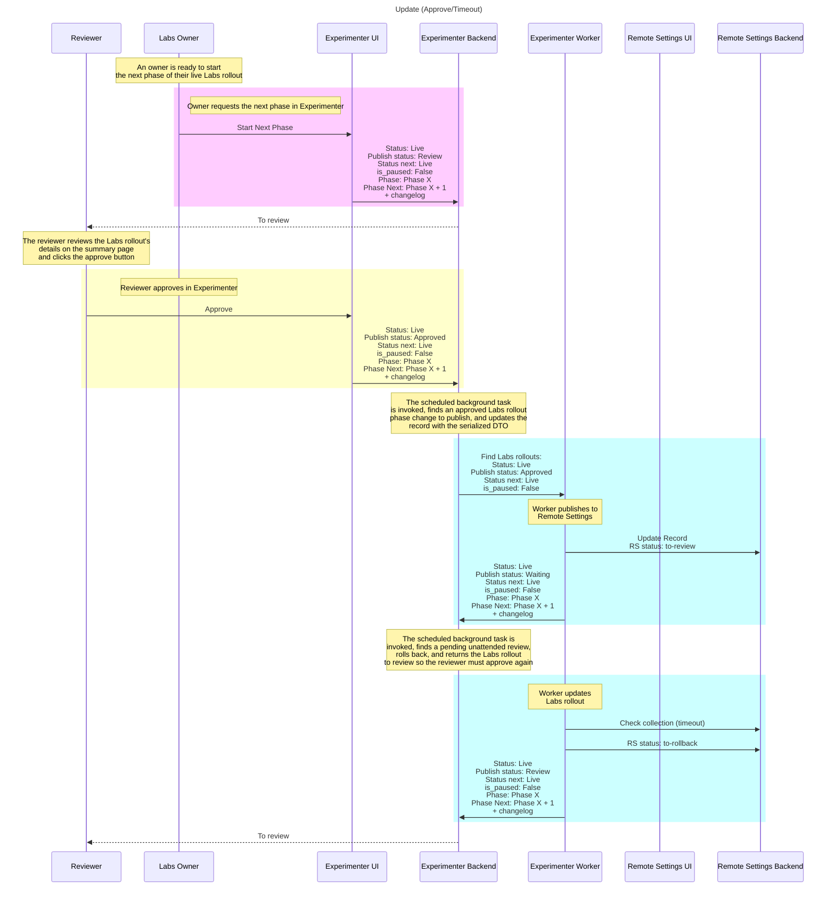
```mermaid
  sequenceDiagram
    participant Reviewer
    participant Labs Owner
    participant Experimenter UI
    participant Experimenter Backend
    participant Experimenter Worker
    participant Remote Settings UI
    participant Remote Settings Backend
    title Update (Approve/Timeout)
    
    Note over Labs Owner: An owner is ready to start <br/> the next phase of their live Labs rollout
    
    rect rgb(255,204,255) 
        Note right of Labs Owner: Owner requests the next phase in Experimenter
        Labs Owner->>Experimenter UI: Start Next Phase
        Experimenter UI->>Experimenter Backend: Status: Live <br/> Publish status: Review <br/> Status next: Live <br/> is_paused: False <br/> Phase: Phase X <br/> Phase Next: Phase X + 1 <br/> + changelog
    end 
    
    Experimenter Backend-->>Reviewer: To review
    Note over Reviewer: The reviewer reviews the Labs rollout's <br/> details on the summary page <br/> and clicks the approve button
    
    rect rgb(255,255,204) 
        Note over Labs Owner: Reviewer approves in Experimenter
        Reviewer->>Experimenter UI: Approve
        Experimenter UI->>Experimenter Backend: Status: Live <br/> Publish status: Approved <br/> Status next: Live <br/> is_paused: False <br/> Phase: Phase X <br/> Phase Next: Phase X + 1 <br/> + changelog
    end 
 
    Note over Experimenter Backend: The scheduled background task <br/> is invoked, finds an approved Labs rollout <br/> phase change to publish, and updates the <br/> record with the serialized DTO
    
    rect rgb(204,255,255) 
        Experimenter Backend->>Experimenter Worker: Find Labs rollouts: <br/> Status: Live <br/> Publish status: Approved <br/> Status next: Live <br/> is_paused: False
        Note over Experimenter Worker: Worker publishes to <br/>Remote Settings
        Experimenter Worker->>Remote Settings Backend: Update Record <br/> RS status: to-review
        Experimenter Worker->>Experimenter Backend: Status: Live <br/> Publish status: Waiting <br/> Status next: Live <br/> is_paused: False <br/> Phase: Phase X <br/> Phase Next: Phase X + 1 <br/> + changelog
    end 

    Note over Experimenter Backend: The scheduled background task is <br/> invoked, finds a pending unattended review, <br/> rolls back, and returns the Labs rollout <br/> to review so the reviewer must approve again
   
    rect rgb(204,255,255) 
        Note over Experimenter Worker: Worker updates <br/> Labs rollout
        Experimenter Worker->>Remote Settings Backend: Check collection (timeout)
        Experimenter Worker->>Remote Settings Backend: RS status: to-rollback
        Experimenter Worker->>Experimenter Backend: Status: Live <br/> Publish status: Review <br/> Status next: Live <br/> is_paused: False <br/> Phase: Phase X <br/> Phase Next: Phase X + 1 <br/> + changelog
    end

    Experimenter Backend-->>Reviewer: To review
```

## Change Phase (Cancel ------/------)

A live Labs rollout phase change can be requested while the Labs rollout remains Live. These phase changes must be reviewed in order to be published to the user, following the same flow to be approved in both Experimenter and Remote Settings. Like the publish flow, these reviews can be canceled from Experimenter.

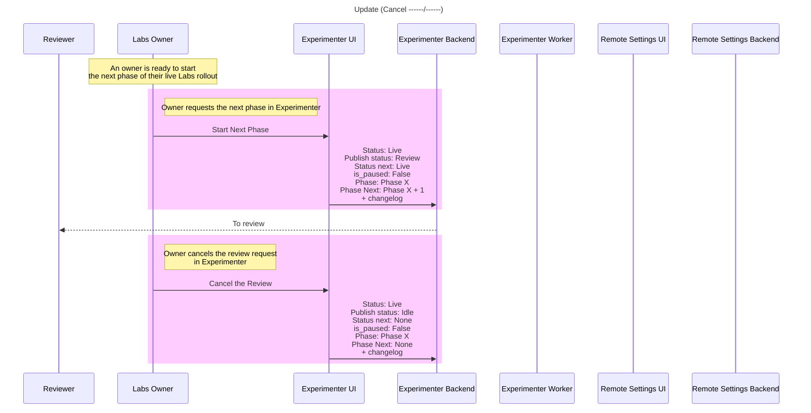
```mermaid
    sequenceDiagram
        participant Reviewer
        participant Labs Owner
        participant Experimenter UI
        participant Experimenter Backend
        participant Experimenter Worker
        participant Remote Settings UI
        participant Remote Settings Backend
        title Update (Cancel ------/------)
        
        Note over Labs Owner: An owner is ready to start <br/> the next phase of their live Labs rollout

        rect rgb(255,204,255)
            Note right of Labs Owner: Owner requests the next phase in Experimenter
            Labs Owner->>Experimenter UI: Start Next Phase
            Experimenter UI->>Experimenter Backend: Status: Live <br/> Publish status: Review <br/> Status next: Live <br/> is_paused: False <br/> Phase: Phase X <br/> Phase Next: Phase X + 1 <br/> + changelog
        end

        Experimenter Backend-->>Reviewer: To review
        
        rect rgb(255,204,255)
            Note right of Labs Owner: Owner cancels the review request <br/> in Experimenter
            Labs Owner->>Experimenter UI: Cancel the Review
            Experimenter UI->>Experimenter Backend: Status: Live <br/> Publish status: Idle <br/> Status next: None <br/> is_paused: False <br/> Phase: Phase X <br/> Phase Next: None <br/> + changelog
        end
```

## Disable (Approve/Approve)

A live Labs rollout that is published in Remote Settings is requested to be disabled by the owner, reviewed and approved in Experimenter, reviewed and approved in Remote Settings, is unpublished from the collection, and is then no longer accessible by clients.

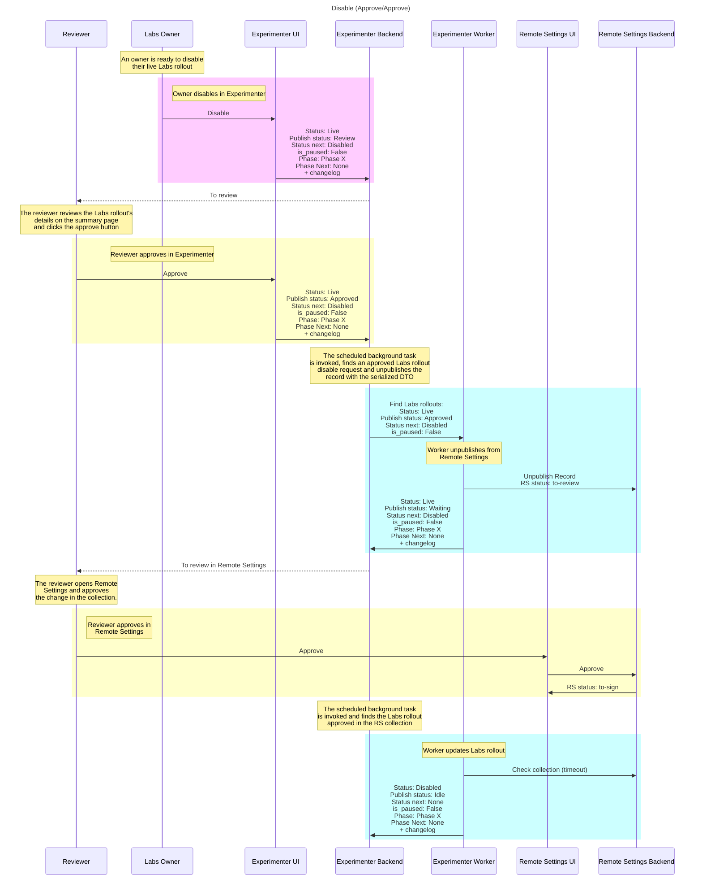
```mermaid
  sequenceDiagram
    participant Reviewer
    participant Labs Owner
    participant Experimenter UI
    participant Experimenter Backend
    participant Experimenter Worker
    participant Remote Settings UI
    participant Remote Settings Backend
    title Disable (Approve/Approve)
    
    Note over Labs Owner: An owner is ready to disable <br/> their live Labs rollout
    
    rect rgb(255,204,255) 
        Note right of Labs Owner: Owner disables in Experimenter
        Labs Owner->>Experimenter UI: Disable
        Experimenter UI->>Experimenter Backend: Status: Live <br/> Publish status: Review <br/> Status next: Disabled <br/> is_paused: False <br/> Phase: Phase X <br/> Phase Next: None <br/> + changelog
    end 
    
    Experimenter Backend-->>Reviewer: To review
    Note over Reviewer: The reviewer reviews the Labs rollout's <br/> details on the summary page <br/> and clicks the approve button
    
    rect rgb(255,255,204) 
        Note over Labs Owner: Reviewer approves in Experimenter
        Reviewer->>Experimenter UI: Approve
        Experimenter UI->>Experimenter Backend: Status: Live <br/> Publish status: Approved <br/> Status next: Disabled <br/> is_paused: False <br/> Phase: Phase X <br/> Phase Next: None <br/> + changelog
    end 
 
    Note over Experimenter Backend: The scheduled background task <br/> is invoked, finds an approved Labs rollout <br/> disable request and unpublishes the <br/> record with the serialized DTO
    
    rect rgb(204,255,255) 
        Experimenter Backend->>Experimenter Worker: Find Labs rollouts: <br/> Status: Live <br/> Publish status: Approved <br/> Status next: Disabled <br/> is_paused: False
        Note over Experimenter Worker: Worker unpublishes from <br/>Remote Settings
        Experimenter Worker->>Remote Settings Backend: Unpublish Record <br/> RS status: to-review
        Experimenter Worker->>Experimenter Backend: Status: Live <br/> Publish status: Waiting <br/> Status next: Disabled <br/> is_paused: False <br/> Phase: Phase X <br/> Phase Next: None <br/> + changelog
    end 

    Experimenter Backend-->>Reviewer: To review in Remote Settings
    
    Note over Reviewer: The reviewer opens Remote <br/> Settings and approves <br/> the change in the collection.

    rect rgb(255,255,204) 
        Note right of Reviewer: Reviewer approves in <br/>Remote Settings
        Reviewer->>Remote Settings UI: Approve
        Remote Settings UI->>Remote Settings Backend: Approve
        Remote Settings Backend->>Remote Settings UI: RS status: to-sign
    end 

    Note over Experimenter Backend: The scheduled background task <br/> is invoked and finds the Labs rollout <br/> approved in the RS collection

    rect rgb(204,255,255) 
        Note over Experimenter Worker: Worker updates Labs rollout
        Experimenter Worker->>Remote Settings Backend: Check collection (timeout)
        Experimenter Worker->>Experimenter Backend:  Status: Disabled <br/> Publish status: Idle <br/> Status next: None <br/> is_paused: False <br/> Phase: Phase X <br/> Phase Next: None <br/> + changelog
    end 
```

## Disable (Reject/------)

A live Labs rollout that is published in Remote Settings is requested to be disabled by the owner, and is then reviewed and rejected in Experimenter. A rejection reason is captured in Experimenter and is displayed to the owner in Experimenter. No change is made to Remote Settings and the Labs rollout remains published.

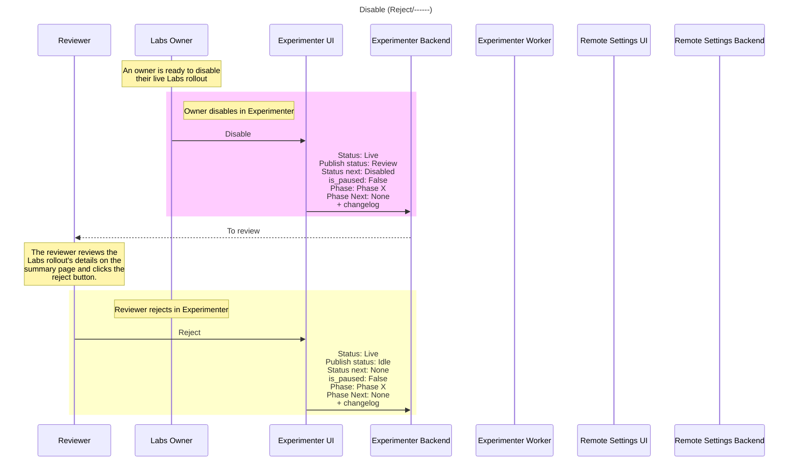
```mermaid
  sequenceDiagram
    participant Reviewer
    participant Labs Owner
    participant Experimenter UI
    participant Experimenter Backend
    participant Experimenter Worker
    participant Remote Settings UI
    participant Remote Settings Backend
    title Disable (Reject/------)
    
    Note over Labs Owner: An owner is ready to disable <br/> their live Labs rollout
    
    rect rgb(255,204,255) 
        Note right of Labs Owner: Owner disables in Experimenter
        Labs Owner->>Experimenter UI: Disable
        Experimenter UI->>Experimenter Backend: Status: Live <br/> Publish status: Review <br/> Status next: Disabled <br/> is_paused: False <br/> Phase: Phase X <br/> Phase Next: None <br/> + changelog
    end 
    
    Experimenter Backend-->>Reviewer: To review
    Note over Reviewer: The reviewer reviews the <br/> Labs rollout's details on the <br/> summary page and clicks the <br/> reject button.
    
    rect rgb(255,255,204) 
        Note over Labs Owner: Reviewer rejects in Experimenter
        Reviewer->>Experimenter UI: Reject
        Experimenter UI->>Experimenter Backend: Status: Live <br/> Publish status: Idle <br/> Status next: None <br/> is_paused: False <br/> Phase: Phase X <br/> Phase Next: None <br/> + changelog
    end 
```

## Disable (Approve/Reject)

A live Labs rollout that is published in Remote Settings is requested to be disabled by the owner, reviewed and approved in Experimenter, and is then reviewed and rejected in Remote Settings. No change is made to Remote Settings and clients will continue to access the published Labs rollout. A rejection reason is captured in Remote Settings and is displayed to the owner in Experimenter.

```mermaid
  sequenceDiagram
    participant Reviewer
    participant Labs Owner
    participant Experimenter UI
    participant Experimenter Backend
    participant Experimenter Worker
    participant Remote Settings UI
    participant Remote Settings Backend
    title Disable (Approve/Reject)
    
    Note over Labs Owner: An owner is ready to disable <br/> their live Labs rollout
    
    rect rgb(255,204,255) 
        Note right of Labs Owner: Owner disables in Experimenter
        Labs Owner->>Experimenter UI: Disable
        Experimenter UI->>Experimenter Backend: Status: Live <br/> Publish status: Review <br/> Status next: Disabled <br/> is_paused: False <br/> Phase: Phase X <br/> Phase Next: None <br/> + changelog
    end 
    
    Experimenter Backend-->>Reviewer: To review
    Note over Reviewer: The reviewer reviews the Labs rollout's <br/> details on the summary page <br/> and clicks the approve button
    
    rect rgb(255,255,204) 
        Note over Labs Owner: Reviewer approves in Experimenter
        Reviewer->>Experimenter UI: Approve
        Experimenter UI->>Experimenter Backend: Status: Live <br/> Publish status: Approved <br/> Status next: Disabled <br/> is_paused: False <br/> Phase: Phase X <br/> Phase Next: None <br/> + changelog
    end 
 
    Note over Experimenter Backend: The scheduled background task <br/> is invoked, finds an approved Labs rollout <br/> disable request and unpublishes the <br/> record with the serialized DTO
    
    rect rgb(204,255,255) 
        Experimenter Backend->>Experimenter Worker: Find Labs rollouts: <br/> Status: Live <br/> Publish status: Approved <br/> Status next: Disabled <br/> is_paused: False
        Note over Experimenter Worker: Worker unpublishes from <br/>Remote Settings
        Experimenter Worker->>Remote Settings Backend: Unpublish Record <br/> RS status: to-review
        Experimenter Worker->>Experimenter Backend: Status: Live <br/> Publish status: Waiting <br/> Status next: Disabled <br/> is_paused: False <br/> Phase: Phase X <br/> Phase Next: None <br/> + changelog
    end 

    Experimenter Backend-->>Reviewer: To review in Remote Settings
    
    Note over Reviewer: The reviewer opens Remote <br/> Settings and rejects <br/> the change in the collection.

    rect rgb(255,255,204) 
        Note right of Reviewer: Reviewer rejects in <br/>Remote Settings
        Reviewer->>Remote Settings UI: Reject
    end 

    Note over Experimenter Backend: The scheduled background task <br/> is invoked and finds the <br/> Labs rollout in <br/> work-in-progress, collects the <br/> rejection message, and rolls back

    rect rgb(204,255,255) 
        Note over Experimenter Worker: Worker updates <br/> Labs rollout
        Experimenter Worker->>Remote Settings Backend: Check collection (timeout)
        Experimenter Worker->>Remote Settings Backend: Rollback <br/> RS status: work-in-progress
        Experimenter Worker->>Experimenter Backend:  Status: Live <br/> Publish status: Idle <br/> Status next: None <br/> is_paused: False <br/> Phase: Phase X <br/> Phase Next: None <br/> + changelog
    end 
```

## Disable (Approve/Reject) + manual rollback

A live Labs rollout that is published in Remote Settings is requested to be disabled by the owner, reviewed and approved in Experimenter, and is then reviewed and rejected in Remote Settings. The reviewer **manually rolls back** the Remote Settings collection. A rejection reason is captured in Remote Settings but is **unable to be recovered by Experimenter** because the collection was manually rolled back **before Experimenter could query its status**, and so Experimenter shows a generic rejection reason. No change is made to Remote Settings and the Labs rollout remains published.

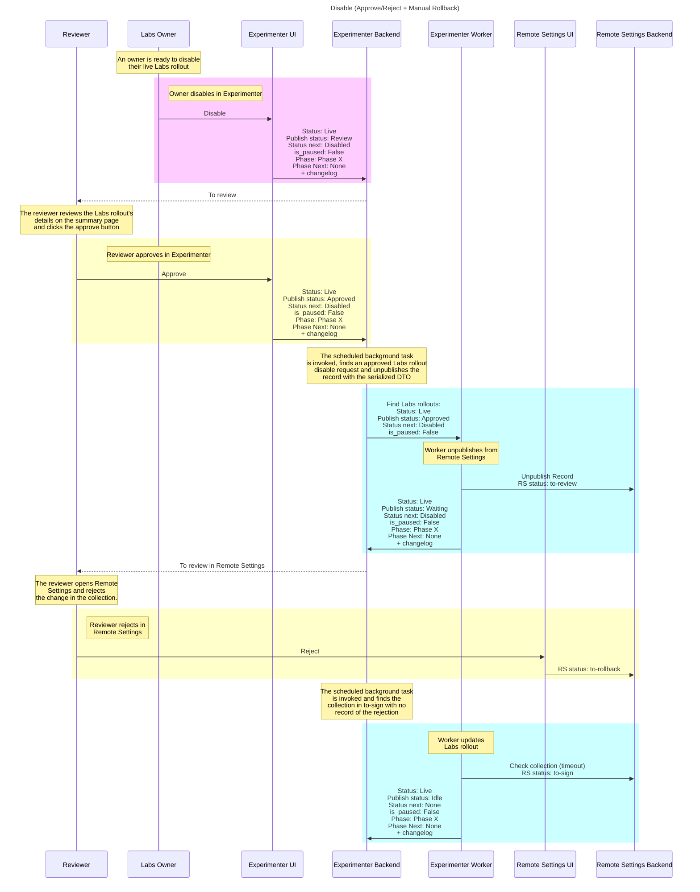
```mermaid
  sequenceDiagram
    participant Reviewer
    participant Labs Owner
    participant Experimenter UI
    participant Experimenter Backend
    participant Experimenter Worker
    participant Remote Settings UI
    participant Remote Settings Backend
    title Disable (Approve/Reject + Manual Rollback)
    
    Note over Labs Owner: An owner is ready to disable <br/> their live Labs rollout
    
    rect rgb(255,204,255) 
        Note right of Labs Owner: Owner disables in Experimenter
        Labs Owner->>Experimenter UI: Disable
        Experimenter UI->>Experimenter Backend: Status: Live <br/> Publish status: Review <br/> Status next: Disabled <br/> is_paused: False <br/> Phase: Phase X <br/> Phase Next: None <br/> + changelog
    end 
    
    Experimenter Backend-->>Reviewer: To review
    Note over Reviewer: The reviewer reviews the Labs rollout's <br/> details on the summary page <br/> and clicks the approve button
    
    rect rgb(255,255,204) 
        Note over Labs Owner: Reviewer approves in Experimenter
        Reviewer->>Experimenter UI: Approve
        Experimenter UI->>Experimenter Backend: Status: Live <br/> Publish status: Approved <br/> Status next: Disabled <br/> is_paused: False <br/> Phase: Phase X <br/> Phase Next: None <br/> + changelog
    end 
 
    Note over Experimenter Backend: The scheduled background task <br/> is invoked, finds an approved Labs rollout <br/> disable request and unpublishes the <br/> record with the serialized DTO
    
    rect rgb(204,255,255) 
        Experimenter Backend->>Experimenter Worker: Find Labs rollouts: <br/> Status: Live <br/> Publish status: Approved <br/> Status next: Disabled <br/> is_paused: False
        Note over Experimenter Worker: Worker unpublishes from <br/>Remote Settings
        Experimenter Worker->>Remote Settings Backend: Unpublish Record <br/> RS status: to-review
        Experimenter Worker->>Experimenter Backend: Status: Live <br/> Publish status: Waiting <br/> Status next: Disabled <br/> is_paused: False <br/> Phase: Phase X <br/> Phase Next: None <br/> + changelog
    end 

    Experimenter Backend-->>Reviewer: To review in Remote Settings
    
    Note over Reviewer: The reviewer opens Remote <br/> Settings and rejects <br/> the change in the collection.

    rect rgb(255,255,204) 
        Note right of Reviewer: Reviewer rejects in <br/>Remote Settings
        Reviewer->>Remote Settings UI: Reject
        Remote Settings UI->>Remote Settings Backend: RS status: to-rollback
    end 

    Note over Experimenter Backend: The scheduled background task <br/> is invoked and finds the <br/> collection in to-sign with no <br/> record of the rejection

    rect rgb(204,255,255) 
        Note over Experimenter Worker: Worker updates <br/> Labs rollout
        Experimenter Worker->>Remote Settings Backend: Check collection (timeout) <br/> RS status: to-sign
        Experimenter Worker->>Experimenter Backend:  Status: Live <br/> Publish status: Idle <br/> Status next: None <br/> is_paused: False <br/> Phase: Phase X <br/> Phase Next: None <br/> + changelog
    end 
```

## Disable (Approve/Timeout)

A live Labs rollout that is published in Remote Settings is requested to be disabled by the owner, reviewed and approved in Experimenter, and the unpublish change is pushed to Remote Settings. Before the reviewer is able to review it in Remote Settings, the scheduled celery task is invoked and finds that the collection is blocked from further changes by having an unattended review pending. It rolls back the pending review to allow other queued changes to be made. This prevents unattended reviews in a collection from blocking other queued changes. The Labs rollout remains published in Remote Settings, returns to Review, and the reviewer must approve it again.

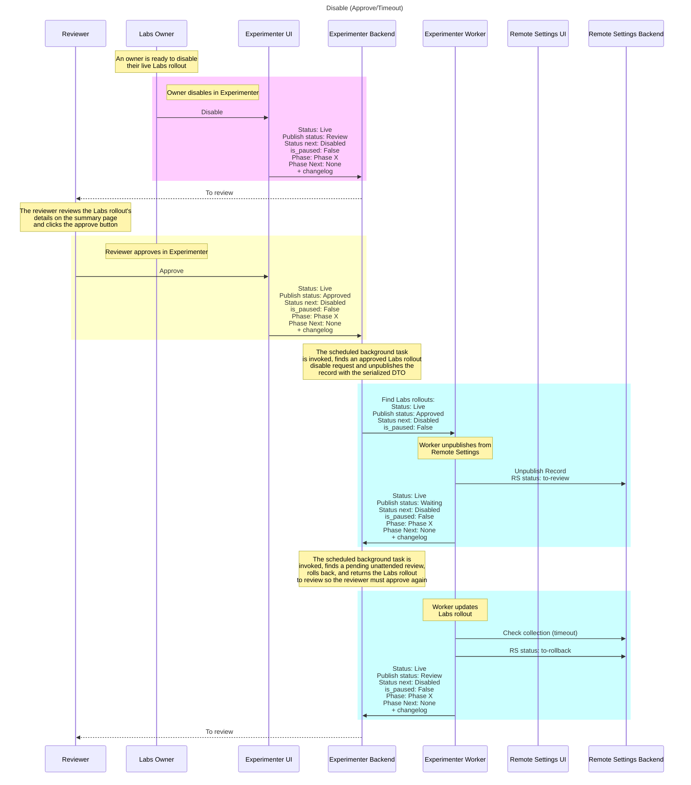
```mermaid
  sequenceDiagram
    participant Reviewer
    participant Labs Owner
    participant Experimenter UI
    participant Experimenter Backend
    participant Experimenter Worker
    participant Remote Settings UI
    participant Remote Settings Backend
    title Disable (Approve/Timeout)
    
    Note over Labs Owner: An owner is ready to disable <br/> their live Labs rollout
    
    rect rgb(255,204,255) 
        Note right of Labs Owner: Owner disables in Experimenter
        Labs Owner->>Experimenter UI: Disable
        Experimenter UI->>Experimenter Backend: Status: Live <br/> Publish status: Review <br/> Status next: Disabled <br/> is_paused: False <br/> Phase: Phase X <br/> Phase Next: None <br/> + changelog
    end 
    
    Experimenter Backend-->>Reviewer: To review
    Note over Reviewer: The reviewer reviews the Labs rollout's <br/> details on the summary page <br/> and clicks the approve button
    
    rect rgb(255,255,204) 
        Note over Labs Owner: Reviewer approves in Experimenter
        Reviewer->>Experimenter UI: Approve
        Experimenter UI->>Experimenter Backend: Status: Live <br/> Publish status: Approved <br/> Status next: Disabled <br/> is_paused: False <br/> Phase: Phase X <br/> Phase Next: None <br/> + changelog
    end 
 
    Note over Experimenter Backend: The scheduled background task <br/> is invoked, finds an approved Labs rollout <br/> disable request and unpublishes the <br/> record with the serialized DTO
    
    rect rgb(204,255,255) 
        Experimenter Backend->>Experimenter Worker: Find Labs rollouts: <br/> Status: Live <br/> Publish status: Approved <br/> Status next: Disabled <br/> is_paused: False
        Note over Experimenter Worker: Worker unpublishes from <br/>Remote Settings
        Experimenter Worker->>Remote Settings Backend: Unpublish Record <br/> RS status: to-review
        Experimenter Worker->>Experimenter Backend: Status: Live <br/> Publish status: Waiting <br/> Status next: Disabled <br/> is_paused: False <br/> Phase: Phase X <br/> Phase Next: None <br/> + changelog
    end 

    Note over Experimenter Backend: The scheduled background task is <br/> invoked, finds a pending unattended review, <br/> rolls back, and returns the Labs rollout <br/> to review so the reviewer must approve again
   
    rect rgb(204,255,255) 
        Note over Experimenter Worker: Worker updates <br/> Labs rollout
        Experimenter Worker->>Remote Settings Backend: Check collection (timeout)
        Experimenter Worker->>Remote Settings Backend: RS status: to-rollback
        Experimenter Worker->>Experimenter Backend:  Status: Live <br/> Publish status: Review <br/> Status next: Disabled <br/> is_paused: False <br/> Phase: Phase X <br/> Phase Next: None <br/> + changelog
    end

    Experimenter Backend-->>Reviewer: To review
```

## Disable (Cancel ------/------)

A live Labs rollout that is published in Remote Settings is requested to be disabled by the owner. The disable request can be canceled before it is approved in Experimenter. No change is made to Remote Settings and the Labs rollout remains published.

```mermaid
    sequenceDiagram
        participant Reviewer
        participant Labs Owner
        participant Experimenter UI
        participant Experimenter Backend
        participant Experimenter Worker
        participant Remote Settings UI
        participant Remote Settings Backend
        title Disable (Cancel ------/------)
        
        Note over Labs Owner: An owner is ready to disable <br/> their live Labs rollout

        rect rgb(255,204,255)
            Note right of Labs Owner: Owner disables in Experimenter
            Labs Owner->>Experimenter UI: Disable
            Experimenter UI->>Experimenter Backend: Status: Live <br/> Publish status: Review <br/> Status next: Disabled <br/> is_paused: False <br/> Phase: Phase X <br/> Phase Next: None <br/> + changelog
        end

        Experimenter Backend-->>Reviewer: To review
        
        rect rgb(255,204,255)
            Note right of Labs Owner: Owner cancels the review request <br/> in Experimenter
            Labs Owner->>Experimenter UI: Cancel the Review
            Experimenter UI->>Experimenter Backend: Status: Live <br/> Publish status: Idle <br/> Status next: None <br/> is_paused: False <br/> Phase: Phase X <br/> Phase Next: None <br/> + changelog
        end
```

## Enable (Approve/Approve)

A disabled Labs rollout that is not published in Remote Settings is requested to be enabled by the owner. Enabling always moves the Labs rollout to its next phase. The request is reviewed and approved in Experimenter, reviewed and approved in Remote Settings, the Labs rollout is published to the collection, moves to Phase X + 1, and is then accessible to clients.

```mermaid
  sequenceDiagram
    participant Reviewer
    participant Labs Owner
    participant Experimenter UI
    participant Experimenter Backend
    participant Experimenter Worker
    participant Remote Settings UI
    participant Remote Settings Backend
    title Enable (Approve/Approve)

    Note over Labs Owner: An owner is ready to enable <br/> their disabled Labs rollout

    rect rgb(255,204,255)
        Note right of Labs Owner: Owner enables in Experimenter
        Labs Owner->>Experimenter UI: Enable
        Experimenter UI->>Experimenter Backend: Status: Disabled <br/> Publish status: Review <br/> Status next: Live <br/> is_paused: False <br/> Phase: Phase X <br/> Phase Next: Phase X + 1 <br/> + changelog
    end

    Experimenter Backend-->>Reviewer: To review
    Note over Reviewer: The reviewer reviews the Labs rollout's <br/> details on the summary page <br/> and clicks the approve button

    rect rgb(255,255,204)
        Note over Labs Owner: Reviewer approves in Experimenter
        Reviewer->>Experimenter UI: Approve
        Experimenter UI->>Experimenter Backend: Status: Disabled <br/> Publish status: Approved <br/> Status next: Live <br/> is_paused: False <br/> Phase: Phase X <br/> Phase Next: Phase X + 1 <br/> + changelog
    end

    Note over Experimenter Backend: The scheduled background task <br/> is invoked, finds an approved Labs rollout <br/> enable request and publishes the <br/> record with the serialized DTO

    rect rgb(204,255,255)
        Experimenter Backend->>Experimenter Worker: Find Labs rollouts: <br/> Status: Disabled <br/> Publish status: Approved <br/> Status next: Live <br/> is_paused: False
        Note over Experimenter Worker: Worker publishes to <br/>Remote Settings
        Experimenter Worker->>Remote Settings Backend: Publish Record <br/> RS status: to-review
        Experimenter Worker->>Experimenter Backend: Status: Disabled <br/> Publish status: Waiting <br/> Status next: Live <br/> is_paused: False <br/> Phase: Phase X <br/> Phase Next: Phase X + 1 <br/> + changelog
    end

    Experimenter Backend-->>Reviewer: To review in Remote Settings

    Note over Reviewer: The reviewer opens Remote <br/> Settings and approves <br/> the change in the collection.

    rect rgb(255,255,204)
        Note right of Reviewer: Reviewer approves in <br/>Remote Settings
        Reviewer->>Remote Settings UI: Approve
        Remote Settings UI->>Remote Settings Backend: Approve
        Remote Settings Backend->>Remote Settings UI: RS status: to-sign
    end

    Note over Experimenter Backend: The scheduled background task <br/> is invoked and finds the Labs rollout <br/> approved in the RS collection

    rect rgb(204,255,255)
        Note over Experimenter Worker: Worker updates Labs rollout
        Experimenter Worker->>Remote Settings Backend: Check collection (timeout)
        Experimenter Worker->>Experimenter Backend:  Status: Live <br/> Publish status: Idle <br/> Status next: None <br/> is_paused: False <br/> Phase: Phase X + 1 <br/> Phase Next: None <br/> + changelog
    end
```

## Enable (Reject/------)

A disabled Labs rollout that is not published in Remote Settings is requested to be enabled by the owner, which would move it to its next phase, and is then reviewed and rejected in Experimenter. A rejection reason is captured in Experimenter and is displayed to the owner in Experimenter. No change is made to Remote Settings and the Labs rollout remains unpublished in its current phase.

```mermaid
  sequenceDiagram
    participant Reviewer
    participant Labs Owner
    participant Experimenter UI
    participant Experimenter Backend
    participant Experimenter Worker
    participant Remote Settings UI
    participant Remote Settings Backend
    title Enable (Reject/------)

    Note over Labs Owner: An owner is ready to enable <br/> their disabled Labs rollout

    rect rgb(255,204,255)
        Note right of Labs Owner: Owner enables in Experimenter
        Labs Owner->>Experimenter UI: Enable
        Experimenter UI->>Experimenter Backend: Status: Disabled <br/> Publish status: Review <br/> Status next: Live <br/> is_paused: False <br/> Phase: Phase X <br/> Phase Next: Phase X + 1 <br/> + changelog
    end

    Experimenter Backend-->>Reviewer: To review
    Note over Reviewer: The reviewer reviews the <br/> Labs rollout's details on the <br/> summary page and clicks the <br/> reject button.

    rect rgb(255,255,204)
        Note over Labs Owner: Reviewer rejects in Experimenter
        Reviewer->>Experimenter UI: Reject
        Experimenter UI->>Experimenter Backend: Status: Disabled <br/> Publish status: Idle <br/> Status next: None <br/> is_paused: False <br/> Phase: Phase X <br/> Phase Next: None <br/> + changelog
    end
```

## Enable (Approve/Reject)

A disabled Labs rollout that is not published in Remote Settings is requested to be enabled by the owner, which would move it to its next phase, reviewed and approved in Experimenter, and is then reviewed and rejected in Remote Settings. No change is made to Remote Settings and the Labs rollout remains unpublished in its current phase. A rejection reason is captured in Remote Settings and is displayed to the owner in Experimenter.

```mermaid
  sequenceDiagram
    participant Reviewer
    participant Labs Owner
    participant Experimenter UI
    participant Experimenter Backend
    participant Experimenter Worker
    participant Remote Settings UI
    participant Remote Settings Backend
    title Enable (Approve/Reject)

    Note over Labs Owner: An owner is ready to enable <br/> their disabled Labs rollout

    rect rgb(255,204,255)
        Note right of Labs Owner: Owner enables in Experimenter
        Labs Owner->>Experimenter UI: Enable
        Experimenter UI->>Experimenter Backend: Status: Disabled <br/> Publish status: Review <br/> Status next: Live <br/> is_paused: False <br/> Phase: Phase X <br/> Phase Next: Phase X + 1 <br/> + changelog
    end

    Experimenter Backend-->>Reviewer: To review
    Note over Reviewer: The reviewer reviews the Labs rollout's <br/> details on the summary page <br/> and clicks the approve button

    rect rgb(255,255,204)
        Note over Labs Owner: Reviewer approves in Experimenter
        Reviewer->>Experimenter UI: Approve
        Experimenter UI->>Experimenter Backend: Status: Disabled <br/> Publish status: Approved <br/> Status next: Live <br/> is_paused: False <br/> Phase: Phase X <br/> Phase Next: Phase X + 1 <br/> + changelog
    end

    Note over Experimenter Backend: The scheduled background task <br/> is invoked, finds an approved Labs rollout <br/> enable request and publishes the <br/> record with the serialized DTO

    rect rgb(204,255,255)
        Experimenter Backend->>Experimenter Worker: Find Labs rollouts: <br/> Status: Disabled <br/> Publish status: Approved <br/> Status next: Live <br/> is_paused: False
        Note over Experimenter Worker: Worker publishes to <br/>Remote Settings
        Experimenter Worker->>Remote Settings Backend: Publish Record <br/> RS status: to-review
        Experimenter Worker->>Experimenter Backend: Status: Disabled <br/> Publish status: Waiting <br/> Status next: Live <br/> is_paused: False <br/> Phase: Phase X <br/> Phase Next: Phase X + 1 <br/> + changelog
    end

    Experimenter Backend-->>Reviewer: To review in Remote Settings

    Note over Reviewer: The reviewer opens Remote <br/> Settings and rejects <br/> the change in the collection.

    rect rgb(255,255,204)
        Note right of Reviewer: Reviewer rejects in <br/>Remote Settings
        Reviewer->>Remote Settings UI: Reject
    end

    Note over Experimenter Backend: The scheduled background task <br/> is invoked and finds the <br/> Labs rollout in <br/> work-in-progress, collects the <br/> rejection message, and rolls back

    rect rgb(204,255,255)
        Note over Experimenter Worker: Worker updates <br/> Labs rollout
        Experimenter Worker->>Remote Settings Backend: Check collection (timeout)
        Experimenter Worker->>Remote Settings Backend: Rollback <br/> RS status: work-in-progress
        Experimenter Worker->>Experimenter Backend:  Status: Disabled <br/> Publish status: Idle <br/> Status next: None <br/> is_paused: False <br/> Phase: Phase X <br/> Phase Next: None <br/> + changelog
    end
```

## Enable (Approve/Reject) + manual rollback

A disabled Labs rollout that is not published in Remote Settings is requested to be enabled by the owner, which would move it to its next phase, reviewed and approved in Experimenter, and is then reviewed and rejected in Remote Settings. The reviewer **manually rolls back** the Remote Settings collection. A rejection reason is captured in Remote Settings but is **unable to be recovered by Experimenter** because the collection was manually rolled back **before Experimenter could query its status**, and so Experimenter shows a generic rejection reason. No change is made to Remote Settings and the Labs rollout remains unpublished in its current phase.

```mermaid
  sequenceDiagram
    participant Reviewer
    participant Labs Owner
    participant Experimenter UI
    participant Experimenter Backend
    participant Experimenter Worker
    participant Remote Settings UI
    participant Remote Settings Backend
    title Enable (Approve/Reject + Manual Rollback)

    Note over Labs Owner: An owner is ready to enable <br/> their disabled Labs rollout

    rect rgb(255,204,255)
        Note right of Labs Owner: Owner enables in Experimenter
        Labs Owner->>Experimenter UI: Enable
        Experimenter UI->>Experimenter Backend: Status: Disabled <br/> Publish status: Review <br/> Status next: Live <br/> is_paused: False <br/> Phase: Phase X <br/> Phase Next: Phase X + 1 <br/> + changelog
    end

    Experimenter Backend-->>Reviewer: To review
    Note over Reviewer: The reviewer reviews the Labs rollout's <br/> details on the summary page <br/> and clicks the approve button

    rect rgb(255,255,204)
        Note over Labs Owner: Reviewer approves in Experimenter
        Reviewer->>Experimenter UI: Approve
        Experimenter UI->>Experimenter Backend: Status: Disabled <br/> Publish status: Approved <br/> Status next: Live <br/> is_paused: False <br/> Phase: Phase X <br/> Phase Next: Phase X + 1 <br/> + changelog
    end

    Note over Experimenter Backend: The scheduled background task <br/> is invoked, finds an approved Labs rollout <br/> enable request and publishes the <br/> record with the serialized DTO

    rect rgb(204,255,255)
        Experimenter Backend->>Experimenter Worker: Find Labs rollouts: <br/> Status: Disabled <br/> Publish status: Approved <br/> Status next: Live <br/> is_paused: False
        Note over Experimenter Worker: Worker publishes to <br/>Remote Settings
        Experimenter Worker->>Remote Settings Backend: Publish Record <br/> RS status: to-review
        Experimenter Worker->>Experimenter Backend: Status: Disabled <br/> Publish status: Waiting <br/> Status next: Live <br/> is_paused: False <br/> Phase: Phase X <br/> Phase Next: Phase X + 1 <br/> + changelog
    end

    Experimenter Backend-->>Reviewer: To review in Remote Settings

    Note over Reviewer: The reviewer opens Remote <br/> Settings and rejects <br/> the change in the collection.

    rect rgb(255,255,204)
        Note right of Reviewer: Reviewer rejects in <br/>Remote Settings
        Reviewer->>Remote Settings UI: Reject
        Remote Settings UI->>Remote Settings Backend: RS status: to-rollback
    end

    Note over Experimenter Backend: The scheduled background task <br/> is invoked and finds the <br/> collection in to-sign with no <br/> record of the rejection

    rect rgb(204,255,255)
        Note over Experimenter Worker: Worker updates <br/> Labs rollout
        Experimenter Worker->>Remote Settings Backend: Check collection (timeout) <br/> RS status: to-sign
        Experimenter Worker->>Experimenter Backend:  Status: Disabled <br/> Publish status: Idle <br/> Status next: None <br/> is_paused: False <br/> Phase: Phase X <br/> Phase Next: None <br/> + changelog
    end
```

## Enable (Approve/Timeout)

A disabled Labs rollout that is not published in Remote Settings is requested to be enabled by the owner, which would move it to its next phase, reviewed and approved in Experimenter, and the publish change is pushed to Remote Settings. Before the reviewer is able to review it in Remote Settings, the scheduled celery task is invoked and finds that the collection is blocked from further changes by having an unattended review pending. It rolls back the pending review to allow other queued changes to be made. This prevents unattended reviews in a collection from blocking other queued changes. The Labs rollout remains unpublished in Remote Settings and in its current phase, returns to Review, and the reviewer must approve it again.

```mermaid
  sequenceDiagram
    participant Reviewer
    participant Labs Owner
    participant Experimenter UI
    participant Experimenter Backend
    participant Experimenter Worker
    participant Remote Settings UI
    participant Remote Settings Backend
    title Enable (Approve/Timeout)

    Note over Labs Owner: An owner is ready to enable <br/> their disabled Labs rollout

    rect rgb(255,204,255)
        Note right of Labs Owner: Owner enables in Experimenter
        Labs Owner->>Experimenter UI: Enable
        Experimenter UI->>Experimenter Backend: Status: Disabled <br/> Publish status: Review <br/> Status next: Live <br/> is_paused: False <br/> Phase: Phase X <br/> Phase Next: Phase X + 1 <br/> + changelog
    end

    Experimenter Backend-->>Reviewer: To review
    Note over Reviewer: The reviewer reviews the Labs rollout's <br/> details on the summary page <br/> and clicks the approve button

    rect rgb(255,255,204)
        Note over Labs Owner: Reviewer approves in Experimenter
        Reviewer->>Experimenter UI: Approve
        Experimenter UI->>Experimenter Backend: Status: Disabled <br/> Publish status: Approved <br/> Status next: Live <br/> is_paused: False <br/> Phase: Phase X <br/> Phase Next: Phase X + 1 <br/> + changelog
    end

    Note over Experimenter Backend: The scheduled background task <br/> is invoked, finds an approved Labs rollout <br/> enable request and publishes the <br/> record with the serialized DTO

    rect rgb(204,255,255)
        Experimenter Backend->>Experimenter Worker: Find Labs rollouts: <br/> Status: Disabled <br/> Publish status: Approved <br/> Status next: Live <br/> is_paused: False
        Note over Experimenter Worker: Worker publishes to <br/>Remote Settings
        Experimenter Worker->>Remote Settings Backend: Publish Record <br/> RS status: to-review
        Experimenter Worker->>Experimenter Backend: Status: Disabled <br/> Publish status: Waiting <br/> Status next: Live <br/> is_paused: False <br/> Phase: Phase X <br/> Phase Next: Phase X + 1 <br/> + changelog
    end

    Note over Experimenter Backend: The scheduled background task is <br/> invoked, finds a pending unattended review, <br/> rolls back, and returns the Labs rollout <br/> to review so the reviewer must approve again

    rect rgb(204,255,255)
        Note over Experimenter Worker: Worker updates <br/> Labs rollout
        Experimenter Worker->>Remote Settings Backend: Check collection (timeout)
        Experimenter Worker->>Remote Settings Backend: RS status: to-rollback
        Experimenter Worker->>Experimenter Backend:  Status: Disabled <br/> Publish status: Review <br/> Status next: Live <br/> is_paused: False <br/> Phase: Phase X <br/> Phase Next: Phase X + 1 <br/> + changelog
    end

    Experimenter Backend-->>Reviewer: To review
```

## Enable (Cancel ------/------)

A disabled Labs rollout that is not published in Remote Settings is requested to be enabled by the owner, which would move it to its next phase. The enable request can be canceled before it is approved in Experimenter. No change is made to Remote Settings and the Labs rollout remains unpublished in its current phase.

```mermaid
    sequenceDiagram
        participant Reviewer
        participant Labs Owner
        participant Experimenter UI
        participant Experimenter Backend
        participant Experimenter Worker
        participant Remote Settings UI
        participant Remote Settings Backend
        title Enable (Cancel ------/------)

        Note over Labs Owner: An owner is ready to enable <br/> their disabled Labs rollout

        rect rgb(255,204,255)
            Note right of Labs Owner: Owner enables in Experimenter
            Labs Owner->>Experimenter UI: Enable
            Experimenter UI->>Experimenter Backend: Status: Disabled <br/> Publish status: Review <br/> Status next: Live <br/> is_paused: False <br/> Phase: Phase X <br/> Phase Next: Phase X + 1 <br/> + changelog
        end

        Experimenter Backend-->>Reviewer: To review

        rect rgb(255,204,255)
            Note right of Labs Owner: Owner cancels the review request <br/> in Experimenter
            Labs Owner->>Experimenter UI: Cancel the Review
            Experimenter UI->>Experimenter Backend: Status: Disabled <br/> Publish status: Idle <br/> Status next: None <br/> is_paused: False <br/> Phase: Phase X <br/> Phase Next: None <br/> + changelog
        end
```

## Enable with no next phase (Create New Phase)

A disabled Labs rollout that is not published in Remote Settings is requested to be enabled by the owner, but no next phase is defined. Experimenter displays a warning that a new phase will be created with the same current size X%. If the owner confirms, a new Phase X + 1 is created with the same population size and the enable request proceeds to review.

```mermaid
    sequenceDiagram
    participant Reviewer
    participant Labs Owner
    participant Experimenter UI
    participant Experimenter Backend
    participant Experimenter Worker
    participant Remote Settings UI
    participant Remote Settings Backend
    title Enable with no next phase (Create New Phase)

    Note over Labs Owner: An owner is ready to enable <br/> their disabled Labs rollout

    rect rgb(255,204,255)
        Note right of Labs Owner: Owner enables in Experimenter
        Labs Owner->>Experimenter UI: Enable
        Experimenter UI-->>Labs Owner: Warning: No next phase defined, <br/> a new phase will be created <br/> with the same current size X%.
        Labs Owner->>Experimenter UI: Yes, create new phase
        Experimenter UI->>Experimenter Backend: Create Phase X + 1 <br/> Population size: X%
        Experimenter UI->>Experimenter Backend: Status: Disabled <br/> Publish status: Review <br/> Status next: Live <br/> is_paused: False <br/> Phase: Phase X <br/> Phase Next: Phase X + 1 <br/> + changelog
    end

    Experimenter Backend-->>Reviewer: To review

    Note over Reviewer: The reviewer reviews the Labs rollout's <br/> details on the summary page <br/> and clicks the approve button

    rect rgb(255,255,204)
        Note over Labs Owner: Reviewer approves in Experimenter
        Reviewer->>Experimenter UI: Approve
        Experimenter UI->>Experimenter Backend: Status: Disabled <br/> Publish status: Approved <br/> Status next: Live <br/> is_paused: False <br/> Phase: Phase X <br/> Phase Next: Phase X + 1 <br/> + changelog
    end

    Note over Experimenter Backend: The scheduled background task <br/> is invoked, finds an approved Labs rollout <br/> enable request and publishes the <br/> record with the serialized DTO

    rect rgb(204,255,255)
        Experimenter Backend->>Experimenter Worker: Find Labs rollouts: <br/> Status: Disabled <br/> Publish status: Approved <br/> Status next: Live <br/> is_paused: False
        Note over Experimenter Worker: Worker publishes to <br/>Remote Settings
        Experimenter Worker->>Remote Settings Backend: Publish Record <br/> RS status: to-review
        Experimenter Worker->>Experimenter Backend: Status: Disabled <br/> Publish status: Waiting <br/> Status next: Live <br/> is_paused: False <br/> Phase: Phase X <br/> Phase Next: Phase X + 1 <br/> + changelog
    end

    Experimenter Backend-->>Reviewer: To review in Remote Settings

    Note over Reviewer: The reviewer opens Remote <br/> Settings and approves <br/> the change in the collection.

    rect rgb(255,255,204)
        Note right of Reviewer: Reviewer approves in <br/>Remote Settings
        Reviewer->>Remote Settings UI: Approve
        Remote Settings UI->>Remote Settings Backend: Approve
        Remote Settings Backend->>Remote Settings UI: RS status: to-sign
    end

    Note over Experimenter Backend: The scheduled background task <br/> is invoked and finds the Labs rollout <br/> approved in the RS collection

    rect rgb(204,255,255)
        Note over Experimenter Worker: Worker updates Labs rollout
        Experimenter Worker->>Remote Settings Backend: Check collection (timeout)
        Experimenter Worker->>Experimenter Backend: Status: Live <br/> Publish status: Idle <br/> Status next: None <br/> is_paused: False <br/> Phase: Phase X + 1 <br/> Phase Next: None <br/> + changelog
    end
```

## Enable with no next phase (Cancel)

A disabled Labs rollout that is not published in Remote Settings is requested to be enabled by the owner, but no next phase is defined. Experimenter displays a warning that a new phase will be created with the same current size X%. If the owner cancels, no new phase is created, no review is requested, and the Labs rollout remains Disabled and unpublished in its current phase.

```mermaid
    sequenceDiagram
    participant Reviewer
    participant Labs Owner
    participant Experimenter UI
    participant Experimenter Backend
    participant Experimenter Worker
    participant Remote Settings UI
    participant Remote Settings Backend
    title Enable with no next phase (Cancel)

    Note over Labs Owner: An owner is ready to enable <br/> their disabled Labs rollout

    rect rgb(255,204,255)
        Note right of Labs Owner: Owner enables in Experimenter
        Labs Owner->>Experimenter UI: Enable
        Experimenter UI-->>Labs Owner: Warning: No next phase defined, <br/> a new phase will be created <br/> with the same current size X%.
        Labs Owner->>Experimenter UI: Cancel
        Experimenter UI->>Experimenter Backend: Status: Disabled <br/> Publish status: Idle <br/> Status next: None <br/> is_paused: False <br/> Phase: Phase X <br/> Phase Next: None
    end
```

## Pause Enrollment (Approve/Approve)

A live Labs rollout can have its enrollment paused while remaining Live. This pause must be reviewed in order to be published to the user, following the same flow to be approved in both Experimenter and Remote Settings.

```mermaid
  sequenceDiagram
    participant Reviewer
    participant Labs Owner
    participant Experimenter UI
    participant Experimenter Backend
    participant Experimenter Worker
    participant Remote Settings UI
    participant Remote Settings Backend
    title Pause Enrollment (Approve/Approve)
    
    Note over Labs Owner: An owner is ready to pause <br/> enrollment in their live Labs rollout
    
    rect rgb(255,204,255) 
        Note right of Labs Owner: Owner requests to pause enrollment in Experimenter
        Labs Owner->>Experimenter UI: Pause Enrollment
        Experimenter UI->>Experimenter Backend: Status: Live <br/> Publish status: Review <br/> Status next: Live <br/> is_paused: True <br/> Phase: Phase X <br/> Phase Next: None <br/> + changelog
    end 
    
    Experimenter Backend-->>Reviewer: To review
    Note over Reviewer: The reviewer reviews the Labs rollout's <br/> details on the summary page <br/> and clicks the approve button
    
    rect rgb(255,255,204) 
        Note over Labs Owner: Reviewer approves in Experimenter
        Reviewer->>Experimenter UI: Approve
        Experimenter UI->>Experimenter Backend: Status: Live <br/> Publish status: Approved <br/> Status next: Live <br/> is_paused: True <br/> Phase: Phase X <br/> Phase Next: None <br/> + changelog
    end 
 
    Note over Experimenter Backend: The scheduled background task <br/> is invoked, finds an approved Labs rollout <br/> pause request to publish, and updates the <br/> record with the serialized DTO
    
    rect rgb(204,255,255) 
        Experimenter Backend->>Experimenter Worker: Find Labs rollouts: <br/> Status: Live <br/> Publish status: Approved <br/> Status next: Live <br/> is_paused: True
        Note over Experimenter Worker: Worker publishes to <br/>Remote Settings
        Experimenter Worker->>Remote Settings Backend: Update Record <br/> isEnrollmentPaused: true <br/> RS status: to-review
        Experimenter Worker->>Experimenter Backend: Status: Live <br/> Publish status: Waiting <br/> Status next: Live <br/> is_paused: True <br/> Phase: Phase X <br/> Phase Next: None <br/> + changelog
    end 

    Experimenter Backend-->>Reviewer: To review in Remote Settings
    
    Note over Reviewer: The reviewer opens Remote <br/> Settings and approves <br/> the change in the collection.

    rect rgb(255,255,204) 
        Note right of Reviewer: Reviewer approves in <br/>Remote Settings
        Reviewer->>Remote Settings UI: Approve
        Remote Settings UI->>Remote Settings Backend: Approve
        Remote Settings Backend->>Remote Settings UI: RS status: to-sign
    end 

    Note over Experimenter Backend: The scheduled background task <br/> is invoked and finds the Labs rollout <br/> approved in the RS collection

    rect rgb(204,255,255) 
        Note over Experimenter Worker: Worker updates Labs rollout
        Experimenter Worker->>Remote Settings Backend: Check collection (timeout)
        Experimenter Worker->>Experimenter Backend:  Status: Live <br/> Publish status: Idle <br/> Status next: None <br/> is_paused: True <br/> Phase: Phase X <br/> Phase Next: None <br/> + changelog
    end 
```

## Pause Enrollment (Reject/------)

A live Labs rollout pause request is reviewed and rejected in Experimenter. A rejection reason is captured in Experimenter and is displayed to the owner in Experimenter. The Labs rollout remains open to new enrollments after the rejection.

```mermaid
  sequenceDiagram
    participant Reviewer
    participant Labs Owner
    participant Experimenter UI
    participant Experimenter Backend
    participant Experimenter Worker
    participant Remote Settings UI
    participant Remote Settings Backend
    title Pause Enrollment (Reject/------)
    
    Note over Labs Owner: An owner is ready to pause <br/> enrollment in their live Labs rollout
    
    rect rgb(255,204,255) 
        Note right of Labs Owner: Owner requests to pause enrollment in Experimenter
        Labs Owner->>Experimenter UI: Pause Enrollment
        Experimenter UI->>Experimenter Backend: Status: Live <br/> Publish status: Review <br/> Status next: Live <br/> is_paused: True <br/> Phase: Phase X <br/> Phase Next: None <br/> + changelog
    end 
    
    Experimenter Backend-->>Reviewer: To review
    Note over Reviewer: The reviewer reviews the <br/> Labs rollout's details on the <br/> summary page and clicks the <br/> reject button.
    

    rect rgb(255,255,204) 
        Note over Labs Owner: Reviewer rejects in Experimenter
        Reviewer->>Experimenter UI: Reject
        Experimenter UI->>Experimenter Backend: Status: Live <br/> Publish status: Idle <br/> Status next: None <br/> is_paused: False <br/> Phase: Phase X <br/> Phase Next: None <br/> + changelog
    end 
```

## Pause Enrollment (Approve/Reject)

A live Labs rollout pause request is reviewed and approved in Experimenter, and is then reviewed and rejected in Remote Settings. A rejection reason is captured in Remote Settings and is displayed to the owner in Experimenter. The Labs rollout remains open to new enrollments after the rejection.

```mermaid
  sequenceDiagram
    participant Reviewer
    participant Labs Owner
    participant Experimenter UI
    participant Experimenter Backend
    participant Experimenter Worker
    participant Remote Settings UI
    participant Remote Settings Backend
    title Pause Enrollment (Approve/Reject)
    
    Note over Labs Owner: An owner is ready to pause <br/> enrollment in their live Labs rollout
    
    rect rgb(255,204,255) 
        Note right of Labs Owner: Owner requests to pause enrollment in Experimenter
        Labs Owner->>Experimenter UI: Pause Enrollment
        Experimenter UI->>Experimenter Backend: Status: Live <br/> Publish status: Review <br/> Status next: Live <br/> is_paused: True <br/> Phase: Phase X <br/> Phase Next: None <br/> + changelog
    end 
    
    Experimenter Backend-->>Reviewer: To review
    Note over Reviewer: The reviewer reviews the Labs rollout's <br/> details on the summary page <br/> and clicks the approve button
    
    rect rgb(255,255,204) 
        Note over Labs Owner: Reviewer approves in Experimenter
        Reviewer->>Experimenter UI: Approve
        Experimenter UI->>Experimenter Backend: Status: Live <br/> Publish status: Approved <br/> Status next: Live <br/> is_paused: True <br/> Phase: Phase X <br/> Phase Next: None <br/> + changelog
    end 
 
    Note over Experimenter Backend: The scheduled background task <br/> is invoked, finds an approved Labs rollout <br/> pause request to publish, and updates the <br/> record with the serialized DTO
    
    rect rgb(204,255,255) 
        Experimenter Backend->>Experimenter Worker: Find Labs rollouts: <br/> Status: Live <br/> Publish status: Approved <br/> Status next: Live <br/> is_paused: True
        Note over Experimenter Worker: Worker publishes to <br/>Remote Settings
        Experimenter Worker->>Remote Settings Backend: Update Record <br/> isEnrollmentPaused: true <br/> RS status: to-review
        Experimenter Worker->>Experimenter Backend: Status: Live <br/> Publish status: Waiting <br/> Status next: Live <br/> is_paused: True <br/> Phase: Phase X <br/> Phase Next: None <br/> + changelog
    end 

    Experimenter Backend-->>Reviewer: To review in Remote Settings
    
    Note over Reviewer: The reviewer opens Remote <br/> Settings and rejects <br/> the change in the collection.

    rect rgb(255,255,204) 
        Note right of Reviewer: Reviewer rejects in <br/>Remote Settings
        Reviewer->>Remote Settings UI: Reject
    end 

    Note over Experimenter Backend: The scheduled background task <br/> is invoked and finds the <br/> Labs rollout in <br/> work-in-progress, collects the <br/> rejection message, and rolls back

    rect rgb(204,255,255) 
        Note over Experimenter Worker: Worker updates <br/> Labs rollout
        Experimenter Worker->>Remote Settings Backend: Check collection (timeout)
        Experimenter Worker->>Remote Settings Backend: Rollback <br/> RS status: work-in-progress
        Experimenter Worker->>Experimenter Backend: Status: Live <br/> Publish status: Idle <br/> Status next: None <br/> is_paused: False <br/> Phase: Phase X <br/> Phase Next: None <br/> + changelog
    end 
```

## Pause Enrollment (Approve/Reject) + manual rollback

A live Labs rollout pause request is reviewed and approved in Experimenter, and is then reviewed and rejected in Remote Settings. The reviewer **manually rolls back** the Remote Settings collection. A rejection reason is captured in Remote Settings but is **unable to be recovered by Experimenter** because the collection was manually rolled back **before Experimenter could query its status**, and so Experimenter shows a generic rejection reason. The Labs rollout remains open to new enrollments after the rejection.

```mermaid
  sequenceDiagram
    participant Reviewer
    participant Labs Owner
    participant Experimenter UI
    participant Experimenter Backend
    participant Experimenter Worker
    participant Remote Settings UI
    participant Remote Settings Backend
    title Pause Enrollment (Approve/Reject + Manual Rollback)
    
    Note over Labs Owner: An owner is ready to pause <br/> enrollment in their live Labs rollout
    
    rect rgb(255,204,255) 
        Note right of Labs Owner: Owner requests to pause enrollment in Experimenter
        Labs Owner->>Experimenter UI: Pause Enrollment
        Experimenter UI->>Experimenter Backend: Status: Live <br/> Publish status: Review <br/> Status next: Live <br/> is_paused: True <br/> Phase: Phase X <br/> Phase Next: None <br/> + changelog
    end 
    
    Experimenter Backend-->>Reviewer: To review
    Note over Reviewer: The reviewer reviews the Labs rollout's <br/> details on the summary page <br/> and clicks the approve button
    
    rect rgb(255,255,204) 
        Note over Labs Owner: Reviewer approves in Experimenter
        Reviewer->>Experimenter UI: Approve
        Experimenter UI->>Experimenter Backend: Status: Live <br/> Publish status: Approved <br/> Status next: Live <br/> is_paused: True <br/> Phase: Phase X <br/> Phase Next: None <br/> + changelog
    end 
 
    Note over Experimenter Backend: The scheduled background task <br/> is invoked, finds an approved Labs rollout <br/> pause request to publish, and updates the <br/> record with the serialized DTO
    
    rect rgb(204,255,255) 
        Experimenter Backend->>Experimenter Worker: Find Labs rollouts: <br/> Status: Live <br/> Publish status: Approved <br/> Status next: Live <br/> is_paused: True
        Note over Experimenter Worker: Worker publishes to <br/>Remote Settings
        Experimenter Worker->>Remote Settings Backend: Update Record <br/> isEnrollmentPaused: true <br/> RS status: to-review
        Experimenter Worker->>Experimenter Backend: Status: Live <br/> Publish status: Waiting <br/> Status next: Live <br/> is_paused: True <br/> Phase: Phase X <br/> Phase Next: None <br/> + changelog
    end 

    Experimenter Backend-->>Reviewer: To review in Remote Settings
    
    Note over Reviewer: The reviewer opens Remote <br/> Settings and rejects <br/> the change in the collection.

    rect rgb(255,255,204) 
        Note right of Reviewer: Reviewer rejects in <br/>Remote Settings
        Reviewer->>Remote Settings UI: Reject
        Remote Settings UI->>Remote Settings Backend: RS status: to-rollback
    end 

    Note over Experimenter Backend: The scheduled background task <br/> is invoked and finds the <br/> collection in to-sign with no <br/> record of the rejection

    rect rgb(204,255,255) 
        Note over Experimenter Worker: Worker updates <br/> Labs rollout
        Experimenter Worker->>Remote Settings Backend: Check collection (timeout) <br/> RS status: to-sign
        Experimenter Worker->>Experimenter Backend: Status: Live <br/> Publish status: Idle <br/> Status next: None <br/> is_paused: False <br/> Phase: Phase X <br/> Phase Next: None <br/> + changelog
    end 
```

## Pause Enrollment (Approve/Timeout)

A live Labs rollout pause request is reviewed and approved in Experimenter, is published to Remote Settings, and the collection is marked for review. Before the reviewer is able to review it in Remote Settings, the scheduled celery task is invoked and finds that the collection is blocked from further changes by having an unattended review pending. It rolls back the pending review to allow other queued changes to be made. This prevents unattended reviews in a collection from blocking other queued changes. The Labs rollout returns to Review, remains open to new enrollments, and the reviewer must approve it again.

```mermaid
  sequenceDiagram
    participant Reviewer
    participant Labs Owner
    participant Experimenter UI
    participant Experimenter Backend
    participant Experimenter Worker
    participant Remote Settings UI
    participant Remote Settings Backend
    title Pause Enrollment (Approve/Timeout)
    
    Note over Labs Owner: An owner is ready to pause <br/> enrollment in their live Labs rollout
    
    rect rgb(255,204,255) 
        Note right of Labs Owner: Owner requests to pause enrollment in Experimenter
        Labs Owner->>Experimenter UI: Pause Enrollment
        Experimenter UI->>Experimenter Backend: Status: Live <br/> Publish status: Review <br/> Status next: Live <br/> is_paused: True <br/> Phase: Phase X <br/> Phase Next: None <br/> + changelog
    end 
    
    Experimenter Backend-->>Reviewer: To review
    Note over Reviewer: The reviewer reviews the Labs rollout's <br/> details on the summary page <br/> and clicks the approve button
    
    rect rgb(255,255,204) 
        Note over Labs Owner: Reviewer approves in Experimenter
        Reviewer->>Experimenter UI: Approve
        Experimenter UI->>Experimenter Backend: Status: Live <br/> Publish status: Approved <br/> Status next: Live <br/> is_paused: True <br/> Phase: Phase X <br/> Phase Next: None <br/> + changelog
    end 
 
    Note over Experimenter Backend: The scheduled background task <br/> is invoked, finds an approved Labs rollout <br/> pause request to publish, and updates the <br/> record with the serialized DTO
    
    rect rgb(204,255,255) 
        Experimenter Backend->>Experimenter Worker: Find Labs rollouts: <br/> Status: Live <br/> Publish status: Approved <br/> Status next: Live <br/> is_paused: True
        Note over Experimenter Worker: Worker publishes to <br/>Remote Settings
        Experimenter Worker->>Remote Settings Backend: Update Record <br/> isEnrollmentPaused: true <br/> RS status: to-review
        Experimenter Worker->>Experimenter Backend: Status: Live <br/> Publish status: Waiting <br/> Status next: Live <br/> is_paused: True <br/> Phase: Phase X <br/> Phase Next: None <br/> + changelog
    end 

    Note over Experimenter Backend: The scheduled background task is <br/> invoked, finds a pending unattended review, <br/> rolls back, and returns the Labs rollout <br/> to review so the reviewer must approve again
   
    rect rgb(204,255,255) 
        Note over Experimenter Worker: Worker updates <br/> Labs rollout
        Experimenter Worker->>Remote Settings Backend: Check collection (timeout)
        Experimenter Worker->>Remote Settings Backend: RS status: to-rollback
        Experimenter Worker->>Experimenter Backend: Status: Live <br/> Publish status: Review <br/> Status next: Live <br/> is_paused: True <br/> Phase: Phase X <br/> Phase Next: None <br/> + changelog
    end

    Experimenter Backend-->>Reviewer: To review
```

## Pause Enrollment (Cancel ------/------)

A live Labs rollout pause can be requested while the Labs rollout remains Live. These pauses must be reviewed in order to be published to the user, following the same flow to be approved in both Experimenter and Remote Settings. Like the publish flow, these reviews can be canceled from Experimenter.

```mermaid
    sequenceDiagram
        participant Reviewer
        participant Labs Owner
        participant Experimenter UI
        participant Experimenter Backend
        participant Experimenter Worker
        participant Remote Settings UI
        participant Remote Settings Backend
        title Pause Enrollment (Cancel ------/------)
        
        Note over Labs Owner: An owner is ready to pause <br/> enrollment in their live Labs rollout

        rect rgb(255,204,255)
            Note right of Labs Owner: Owner requests to pause enrollment in Experimenter
            Labs Owner->>Experimenter UI: Pause Enrollment
            Experimenter UI->>Experimenter Backend: Status: Live <br/> Publish status: Review <br/> Status next: Live <br/> is_paused: True <br/> Phase: Phase X <br/> Phase Next: None <br/> + changelog
        end

        Experimenter Backend-->>Reviewer: To review
        
        rect rgb(255,204,255)
            Note right of Labs Owner: Owner cancels the review request <br/> in Experimenter
            Labs Owner->>Experimenter UI: Cancel the Review
            Experimenter UI->>Experimenter Backend: Status: Live <br/> Publish status: Idle <br/> Status next: None <br/> is_paused: False <br/> Phase: Phase X <br/> Phase Next: None <br/> + changelog
        end
```

## Resume Enrollment (Approve/Approve)

A paused live Labs rollout can have enrollment resumed while remaining Live. The resume request is reviewed and approved in Experimenter, reviewed and approved in Remote Settings, and the Labs rollout is then open to new enrollments again.

```mermaid
  sequenceDiagram
    participant Reviewer
    participant Labs Owner
    participant Experimenter UI
    participant Experimenter Backend
    participant Experimenter Worker
    participant Remote Settings UI
    participant Remote Settings Backend
    title Resume Enrollment (Approve/Approve)
    
    Note over Labs Owner: An owner is ready to resume <br/> enrollment in their paused Labs rollout
    
    rect rgb(255,204,255) 
        Note right of Labs Owner: Owner requests to resume enrollment in Experimenter
        Labs Owner->>Experimenter UI: Resume Enrollment
        Experimenter UI->>Experimenter Backend: Status: Live <br/> Publish status: Review <br/> Status next: Live <br/> is_paused: False <br/> Phase: Phase X <br/> Phase Next: None <br/> + changelog
    end 
    
    Experimenter Backend-->>Reviewer: To review
    Note over Reviewer: The reviewer reviews the Labs rollout's <br/> details on the summary page <br/> and clicks the approve button
    
    rect rgb(255,255,204) 
        Note over Labs Owner: Reviewer approves in Experimenter
        Reviewer->>Experimenter UI: Approve
        Experimenter UI->>Experimenter Backend: Status: Live <br/> Publish status: Approved <br/> Status next: Live <br/> is_paused: False <br/> Phase: Phase X <br/> Phase Next: None <br/> + changelog
    end 
 
    Note over Experimenter Backend: The scheduled background task <br/> is invoked, finds an approved Labs rollout <br/> resume request to publish, and updates the <br/> record with the serialized DTO
    
    rect rgb(204,255,255) 
        Experimenter Backend->>Experimenter Worker: Find Labs rollouts: <br/> Status: Live <br/> Publish status: Approved <br/> Status next: Live <br/> is_paused: False
        Note over Experimenter Worker: Worker publishes to <br/>Remote Settings
        Experimenter Worker->>Remote Settings Backend: Update Record <br/> isEnrollmentPaused: false <br/> RS status: to-review
        Experimenter Worker->>Experimenter Backend: Status: Live <br/> Publish status: Waiting <br/> Status next: Live <br/> is_paused: False <br/> Phase: Phase X <br/> Phase Next: None <br/> + changelog
    end 

    Experimenter Backend-->>Reviewer: To review in Remote Settings
    
    Note over Reviewer: The reviewer opens Remote <br/> Settings and approves <br/> the change in the collection.

    rect rgb(255,255,204) 
        Note right of Reviewer: Reviewer approves in <br/>Remote Settings
        Reviewer->>Remote Settings UI: Approve
        Remote Settings UI->>Remote Settings Backend: Approve
        Remote Settings Backend->>Remote Settings UI: RS status: to-sign
    end 

    Note over Experimenter Backend: The scheduled background task <br/> is invoked and finds the Labs rollout <br/> approved in the RS collection

    rect rgb(204,255,255) 
        Note over Experimenter Worker: Worker updates Labs rollout
        Experimenter Worker->>Remote Settings Backend: Check collection (timeout)
        Experimenter Worker->>Experimenter Backend:  Status: Live <br/> Publish status: Idle <br/> Status next: None <br/> is_paused: False <br/> Phase: Phase X <br/> Phase Next: None <br/> + changelog
    end 
```

## Resume Enrollment (Reject/------)

A paused live Labs rollout resume request is reviewed and rejected in Experimenter. A rejection reason is captured in Experimenter and is displayed to the owner in Experimenter. The Labs rollout remains paused after the rejection.

```mermaid
  sequenceDiagram
    participant Reviewer
    participant Labs Owner
    participant Experimenter UI
    participant Experimenter Backend
    participant Experimenter Worker
    participant Remote Settings UI
    participant Remote Settings Backend
    title Resume Enrollment (Reject/------)
    
    Note over Labs Owner: An owner is ready to resume <br/> enrollment in their paused Labs rollout
    
    rect rgb(255,204,255) 
        Note right of Labs Owner: Owner requests to resume enrollment in Experimenter
        Labs Owner->>Experimenter UI: Resume Enrollment
        Experimenter UI->>Experimenter Backend: Status: Live <br/> Publish status: Review <br/> Status next: Live <br/> is_paused: False <br/> Phase: Phase X <br/> Phase Next: None <br/> + changelog
    end 
    
    Experimenter Backend-->>Reviewer: To review
    Note over Reviewer: The reviewer reviews the <br/> Labs rollout's details on the <br/> summary page and clicks the <br/> reject button.
    

    rect rgb(255,255,204) 
        Note over Labs Owner: Reviewer rejects in Experimenter
        Reviewer->>Experimenter UI: Reject
        Experimenter UI->>Experimenter Backend: Status: Live <br/> Publish status: Idle <br/> Status next: None <br/> is_paused: True <br/> Phase: Phase X <br/> Phase Next: None <br/> + changelog
    end 
```

## Resume Enrollment (Approve/Reject)

A paused live Labs rollout resume request is reviewed and approved in Experimenter, and is then reviewed and rejected in Remote Settings. A rejection reason is captured in Remote Settings and is displayed to the owner in Experimenter. The Labs rollout remains paused after the rejection.

```mermaid
  sequenceDiagram
    participant Reviewer
    participant Labs Owner
    participant Experimenter UI
    participant Experimenter Backend
    participant Experimenter Worker
    participant Remote Settings UI
    participant Remote Settings Backend
    title Resume Enrollment (Approve/Reject)
    
    Note over Labs Owner: An owner is ready to resume <br/> enrollment in their paused Labs rollout
    
    rect rgb(255,204,255) 
        Note right of Labs Owner: Owner requests to resume enrollment in Experimenter
        Labs Owner->>Experimenter UI: Resume Enrollment
        Experimenter UI->>Experimenter Backend: Status: Live <br/> Publish status: Review <br/> Status next: Live <br/> is_paused: False <br/> Phase: Phase X <br/> Phase Next: None <br/> + changelog
    end 
    
    Experimenter Backend-->>Reviewer: To review
    Note over Reviewer: The reviewer reviews the Labs rollout's <br/> details on the summary page <br/> and clicks the approve button
    
    rect rgb(255,255,204) 
        Note over Labs Owner: Reviewer approves in Experimenter
        Reviewer->>Experimenter UI: Approve
        Experimenter UI->>Experimenter Backend: Status: Live <br/> Publish status: Approved <br/> Status next: Live <br/> is_paused: False <br/> Phase: Phase X <br/> Phase Next: None <br/> + changelog
    end 
 
    Note over Experimenter Backend: The scheduled background task <br/> is invoked, finds an approved Labs rollout <br/> resume request to publish, and updates the <br/> record with the serialized DTO
    
    rect rgb(204,255,255) 
        Experimenter Backend->>Experimenter Worker: Find Labs rollouts: <br/> Status: Live <br/> Publish status: Approved <br/> Status next: Live <br/> is_paused: False
        Note over Experimenter Worker: Worker publishes to <br/>Remote Settings
        Experimenter Worker->>Remote Settings Backend: Update Record <br/> isEnrollmentPaused: false <br/> RS status: to-review
        Experimenter Worker->>Experimenter Backend: Status: Live <br/> Publish status: Waiting <br/> Status next: Live <br/> is_paused: False <br/> Phase: Phase X <br/> Phase Next: None <br/> + changelog
    end 

    Experimenter Backend-->>Reviewer: To review in Remote Settings
    
    Note over Reviewer: The reviewer opens Remote <br/> Settings and rejects <br/> the change in the collection.

    rect rgb(255,255,204) 
        Note right of Reviewer: Reviewer rejects in <br/>Remote Settings
        Reviewer->>Remote Settings UI: Reject
    end 

    Note over Experimenter Backend: The scheduled background task <br/> is invoked and finds the <br/> Labs rollout in <br/> work-in-progress, collects the <br/> rejection message, and rolls back

    rect rgb(204,255,255) 
        Note over Experimenter Worker: Worker updates <br/> Labs rollout
        Experimenter Worker->>Remote Settings Backend: Check collection (timeout)
        Experimenter Worker->>Remote Settings Backend: Rollback <br/> RS status: work-in-progress
        Experimenter Worker->>Experimenter Backend: Status: Live <br/> Publish status: Idle <br/> Status next: None <br/> is_paused: True <br/> Phase: Phase X <br/> Phase Next: None <br/> + changelog
    end 
```

## Resume Enrollment (Approve/Reject) + manual rollback

A paused live Labs rollout resume request is reviewed and approved in Experimenter, and is then reviewed and rejected in Remote Settings. The reviewer **manually rolls back** the Remote Settings collection. A rejection reason is captured in Remote Settings but is **unable to be recovered by Experimenter** because the collection was manually rolled back **before Experimenter could query its status**, and so Experimenter shows a generic rejection reason. The Labs rollout remains paused after the rejection.

```mermaid
  sequenceDiagram
    participant Reviewer
    participant Labs Owner
    participant Experimenter UI
    participant Experimenter Backend
    participant Experimenter Worker
    participant Remote Settings UI
    participant Remote Settings Backend
    title Resume Enrollment (Approve/Reject + Manual Rollback)
    
    Note over Labs Owner: An owner is ready to resume <br/> enrollment in their paused Labs rollout
    
    rect rgb(255,204,255) 
        Note right of Labs Owner: Owner requests to resume enrollment in Experimenter
        Labs Owner->>Experimenter UI: Resume Enrollment
        Experimenter UI->>Experimenter Backend: Status: Live <br/> Publish status: Review <br/> Status next: Live <br/> is_paused: False <br/> Phase: Phase X <br/> Phase Next: None <br/> + changelog
    end 
    
    Experimenter Backend-->>Reviewer: To review
    Note over Reviewer: The reviewer reviews the Labs rollout's <br/> details on the summary page <br/> and clicks the approve button
    
    rect rgb(255,255,204) 
        Note over Labs Owner: Reviewer approves in Experimenter
        Reviewer->>Experimenter UI: Approve
        Experimenter UI->>Experimenter Backend: Status: Live <br/> Publish status: Approved <br/> Status next: Live <br/> is_paused: False <br/> Phase: Phase X <br/> Phase Next: None <br/> + changelog
    end 
 
    Note over Experimenter Backend: The scheduled background task <br/> is invoked, finds an approved Labs rollout <br/> resume request to publish, and updates the <br/> record with the serialized DTO
    
    rect rgb(204,255,255) 
        Experimenter Backend->>Experimenter Worker: Find Labs rollouts: <br/> Status: Live <br/> Publish status: Approved <br/> Status next: Live <br/> is_paused: False
        Note over Experimenter Worker: Worker publishes to <br/>Remote Settings
        Experimenter Worker->>Remote Settings Backend: Update Record <br/> isEnrollmentPaused: false <br/> RS status: to-review
        Experimenter Worker->>Experimenter Backend: Status: Live <br/> Publish status: Waiting <br/> Status next: Live <br/> is_paused: False <br/> Phase: Phase X <br/> Phase Next: None <br/> + changelog
    end 

    Experimenter Backend-->>Reviewer: To review in Remote Settings
    
    Note over Reviewer: The reviewer opens Remote <br/> Settings and rejects <br/> the change in the collection.

    rect rgb(255,255,204) 
        Note right of Reviewer: Reviewer rejects in <br/>Remote Settings
        Reviewer->>Remote Settings UI: Reject
        Remote Settings UI->>Remote Settings Backend: RS status: to-rollback
    end 

    Note over Experimenter Backend: The scheduled background task <br/> is invoked and finds the <br/> collection in to-sign with no <br/> record of the rejection

    rect rgb(204,255,255) 
        Note over Experimenter Worker: Worker updates <br/> Labs rollout
        Experimenter Worker->>Remote Settings Backend: Check collection (timeout) <br/> RS status: to-sign
        Experimenter Worker->>Experimenter Backend: Status: Live <br/> Publish status: Idle <br/> Status next: None <br/> is_paused: True <br/> Phase: Phase X <br/> Phase Next: None <br/> + changelog
    end 
```

## Resume Enrollment (Approve/Timeout)

A paused live Labs rollout resume request is reviewed and approved in Experimenter, is published to Remote Settings, and the collection is marked for review. Before the reviewer is able to review it in Remote Settings, the scheduled celery task is invoked and finds that the collection is blocked from further changes by having an unattended review pending. It rolls back the pending review to allow other queued changes to be made. This prevents unattended reviews in a collection from blocking other queued changes. The Labs rollout returns to Review, remains paused until the resume request is approved, and the reviewer must approve it again.

```mermaid
  sequenceDiagram
    participant Reviewer
    participant Labs Owner
    participant Experimenter UI
    participant Experimenter Backend
    participant Experimenter Worker
    participant Remote Settings UI
    participant Remote Settings Backend
    title Resume Enrollment (Approve/Timeout)
    
    Note over Labs Owner: An owner is ready to resume <br/> enrollment in their paused Labs rollout
    
    rect rgb(255,204,255) 
        Note right of Labs Owner: Owner requests to resume enrollment in Experimenter
        Labs Owner->>Experimenter UI: Resume Enrollment
        Experimenter UI->>Experimenter Backend: Status: Live <br/> Publish status: Review <br/> Status next: Live <br/> is_paused: False <br/> Phase: Phase X <br/> Phase Next: None <br/> + changelog
    end 
    
    Experimenter Backend-->>Reviewer: To review
    Note over Reviewer: The reviewer reviews the Labs rollout's <br/> details on the summary page <br/> and clicks the approve button
    
    rect rgb(255,255,204) 
        Note over Labs Owner: Reviewer approves in Experimenter
        Reviewer->>Experimenter UI: Approve
        Experimenter UI->>Experimenter Backend: Status: Live <br/> Publish status: Approved <br/> Status next: Live <br/> is_paused: False <br/> Phase: Phase X <br/> Phase Next: None <br/> + changelog
    end 
 
    Note over Experimenter Backend: The scheduled background task <br/> is invoked, finds an approved Labs rollout <br/> resume request to publish, and updates the <br/> record with the serialized DTO
    
    rect rgb(204,255,255) 
        Experimenter Backend->>Experimenter Worker: Find Labs rollouts: <br/> Status: Live <br/> Publish status: Approved <br/> Status next: Live <br/> is_paused: False
        Note over Experimenter Worker: Worker publishes to <br/>Remote Settings
        Experimenter Worker->>Remote Settings Backend: Update Record <br/> isEnrollmentPaused: false <br/> RS status: to-review
        Experimenter Worker->>Experimenter Backend: Status: Live <br/> Publish status: Waiting <br/> Status next: Live <br/> is_paused: False <br/> Phase: Phase X <br/> Phase Next: None <br/> + changelog
    end 

    Note over Experimenter Backend: The scheduled background task is <br/> invoked, finds a pending unattended review, <br/> rolls back, and returns the Labs rollout <br/> to review so the reviewer must approve again
   
    rect rgb(204,255,255) 
        Note over Experimenter Worker: Worker updates <br/> Labs rollout
        Experimenter Worker->>Remote Settings Backend: Check collection (timeout)
        Experimenter Worker->>Remote Settings Backend: RS status: to-rollback
        Experimenter Worker->>Experimenter Backend: Status: Live <br/> Publish status: Review <br/> Status next: Live <br/> is_paused: True <br/> Phase: Phase X <br/> Phase Next: None <br/> + changelog
    end

    Experimenter Backend-->>Reviewer: To review
```

## Resume Enrollment (Cancel ------/------)

A paused live Labs rollout can request to resume enrollment while remaining Live. The resume request must be reviewed in order to be published to the user, following the same flow to be approved in both Experimenter and Remote Settings. Like the publish flow, this review can be canceled from Experimenter, leaving the Labs rollout paused.

```mermaid
    sequenceDiagram
        participant Reviewer
        participant Labs Owner
        participant Experimenter UI
        participant Experimenter Backend
        participant Experimenter Worker
        participant Remote Settings UI
        participant Remote Settings Backend
        title Resume Enrollment (Cancel ------/------)
        
        Note over Labs Owner: An owner is ready to resume <br/> enrollment in their paused Labs rollout

        rect rgb(255,204,255)
            Note right of Labs Owner: Owner requests to resume enrollment in Experimenter
            Labs Owner->>Experimenter UI: Resume Enrollment
            Experimenter UI->>Experimenter Backend: Status: Live <br/> Publish status: Review <br/> Status next: Live <br/> is_paused: False <br/> Phase: Phase X <br/> Phase Next: None <br/> + changelog
        end

        Experimenter Backend-->>Reviewer: To review
        
        rect rgb(255,204,255)
            Note right of Labs Owner: Owner cancels the review request <br/> in Experimenter
            Labs Owner->>Experimenter UI: Cancel the Review
            Experimenter UI->>Experimenter Backend: Status: Live <br/> Publish status: Idle <br/> Status next: None <br/> is_paused: True <br/> Phase: Phase X <br/> Phase Next: None <br/> + changelog
        end
```

## Disable while Paused (Approve/Approve)

A paused Labs rollout that is published in Remote Settings is requested to be disabled by the owner, reviewed and approved in Experimenter, reviewed and approved in Remote Settings, is unpublished from the collection, and is then no longer accessible by clients. Requesting the disable clears the paused flag right away.

```mermaid
  sequenceDiagram
    participant Reviewer
    participant Labs Owner
    participant Experimenter UI
    participant Experimenter Backend
    participant Experimenter Worker
    participant Remote Settings UI
    participant Remote Settings Backend
    title Disable while Paused (Approve/Approve)
    
    Note over Labs Owner: An owner is ready to disable <br/> their paused Labs rollout
    
    rect rgb(255,204,255) 
        Note right of Labs Owner: Owner disables in Experimenter
        Labs Owner->>Experimenter UI: Disable
        Experimenter UI->>Experimenter Backend: Status: Live <br/> Publish status: Review <br/> Status next: Disabled <br/> is_paused: False <br/> Phase: Phase X <br/> Phase Next: None <br/> + changelog
    end 
    
    Experimenter Backend-->>Reviewer: To review
    Note over Reviewer: The reviewer reviews the Labs rollout's <br/> details on the summary page <br/> and clicks the approve button
    
    rect rgb(255,255,204) 
        Note over Labs Owner: Reviewer approves in Experimenter
        Reviewer->>Experimenter UI: Approve
        Experimenter UI->>Experimenter Backend: Status: Live <br/> Publish status: Approved <br/> Status next: Disabled <br/> is_paused: False <br/> Phase: Phase X <br/> Phase Next: None <br/> + changelog
    end 
 
    Note over Experimenter Backend: The scheduled background task <br/> is invoked, finds an approved Labs rollout <br/> disable request and unpublishes the <br/> record with the serialized DTO
    
    rect rgb(204,255,255) 
        Experimenter Backend->>Experimenter Worker: Find Labs rollouts: <br/> Status: Live <br/> Publish status: Approved <br/> Status next: Disabled <br/> is_paused: False
        Note over Experimenter Worker: Worker unpublishes from <br/>Remote Settings
        Experimenter Worker->>Remote Settings Backend: Unpublish Record <br/> RS status: to-review
        Experimenter Worker->>Experimenter Backend: Status: Live <br/> Publish status: Waiting <br/> Status next: Disabled <br/> is_paused: False <br/> Phase: Phase X <br/> Phase Next: None <br/> + changelog
    end 

    Experimenter Backend-->>Reviewer: To review in Remote Settings
    
    Note over Reviewer: The reviewer opens Remote <br/> Settings and approves <br/> the change in the collection.

    rect rgb(255,255,204) 
        Note right of Reviewer: Reviewer approves in <br/>Remote Settings
        Reviewer->>Remote Settings UI: Approve
        Remote Settings UI->>Remote Settings Backend: Approve
        Remote Settings Backend->>Remote Settings UI: RS status: to-sign
    end 

    Note over Experimenter Backend: The scheduled background task <br/> is invoked and finds the Labs rollout <br/> approved in the RS collection

    rect rgb(204,255,255) 
        Note over Experimenter Worker: Worker updates Labs rollout
        Experimenter Worker->>Remote Settings Backend: Check collection (timeout)
        Experimenter Worker->>Experimenter Backend:  Status: Disabled <br/> Publish status: Idle <br/> Status next: None <br/> is_paused: False <br/> Phase: Phase X <br/> Phase Next: None <br/> + changelog
    end 
```

## Disable while Paused (Reject/------)

A paused Labs rollout that is published in Remote Settings is requested to be disabled by the owner, which clears the paused flag right away, and is then reviewed and rejected in Experimenter. A rejection reason is captured in Experimenter and is displayed to the owner in Experimenter. No change is made to Remote Settings and the Labs rollout remains published and paused. The paused flag is restored.

```mermaid
  sequenceDiagram
    participant Reviewer
    participant Labs Owner
    participant Experimenter UI
    participant Experimenter Backend
    participant Experimenter Worker
    participant Remote Settings UI
    participant Remote Settings Backend
    title Disable while Paused (Reject/------)
    
    Note over Labs Owner: An owner is ready to disable <br/> their paused Labs rollout
    
    rect rgb(255,204,255) 
        Note right of Labs Owner: Owner disables in Experimenter
        Labs Owner->>Experimenter UI: Disable
        Experimenter UI->>Experimenter Backend: Status: Live <br/> Publish status: Review <br/> Status next: Disabled <br/> is_paused: False <br/> Phase: Phase X <br/> Phase Next: None <br/> + changelog
    end 
    
    Experimenter Backend-->>Reviewer: To review
    Note over Reviewer: The reviewer reviews the <br/> Labs rollout's details on the <br/> summary page and clicks the <br/> reject button.
    
    rect rgb(255,255,204) 
        Note over Labs Owner: Reviewer rejects in Experimenter
        Reviewer->>Experimenter UI: Reject
        Experimenter UI->>Experimenter Backend: Status: Live <br/> Publish status: Idle <br/> Status next: None <br/> is_paused: True <br/> Phase: Phase X <br/> Phase Next: None <br/> + changelog
    end 
```

## Disable while Paused (Approve/Reject)

A paused Labs rollout that is published in Remote Settings is requested to be disabled by the owner, which clears the paused flag right away, reviewed and approved in Experimenter, and is then reviewed and rejected in Remote Settings. No change is made to Remote Settings and clients will continue to access the published, paused Labs rollout. A rejection reason is captured in Remote Settings and is displayed to the owner in Experimenter. The paused flag is restored.

```mermaid
  sequenceDiagram
    participant Reviewer
    participant Labs Owner
    participant Experimenter UI
    participant Experimenter Backend
    participant Experimenter Worker
    participant Remote Settings UI
    participant Remote Settings Backend
    title Disable while Paused (Approve/Reject)
    
    Note over Labs Owner: An owner is ready to disable <br/> their paused Labs rollout
    
    rect rgb(255,204,255) 
        Note right of Labs Owner: Owner disables in Experimenter
        Labs Owner->>Experimenter UI: Disable
        Experimenter UI->>Experimenter Backend: Status: Live <br/> Publish status: Review <br/> Status next: Disabled <br/> is_paused: False <br/> Phase: Phase X <br/> Phase Next: None <br/> + changelog
    end 
    
    Experimenter Backend-->>Reviewer: To review
    Note over Reviewer: The reviewer reviews the Labs rollout's <br/> details on the summary page <br/> and clicks the approve button
    
    rect rgb(255,255,204) 
        Note over Labs Owner: Reviewer approves in Experimenter
        Reviewer->>Experimenter UI: Approve
        Experimenter UI->>Experimenter Backend: Status: Live <br/> Publish status: Approved <br/> Status next: Disabled <br/> is_paused: False <br/> Phase: Phase X <br/> Phase Next: None <br/> + changelog
    end 
 
    Note over Experimenter Backend: The scheduled background task <br/> is invoked, finds an approved Labs rollout <br/> disable request and unpublishes the <br/> record with the serialized DTO
    
    rect rgb(204,255,255) 
        Experimenter Backend->>Experimenter Worker: Find Labs rollouts: <br/> Status: Live <br/> Publish status: Approved <br/> Status next: Disabled <br/> is_paused: False
        Note over Experimenter Worker: Worker unpublishes from <br/>Remote Settings
        Experimenter Worker->>Remote Settings Backend: Unpublish Record <br/> RS status: to-review
        Experimenter Worker->>Experimenter Backend: Status: Live <br/> Publish status: Waiting <br/> Status next: Disabled <br/> is_paused: False <br/> Phase: Phase X <br/> Phase Next: None <br/> + changelog
    end 

    Experimenter Backend-->>Reviewer: To review in Remote Settings
    
    Note over Reviewer: The reviewer opens Remote <br/> Settings and rejects <br/> the change in the collection.

    rect rgb(255,255,204) 
        Note right of Reviewer: Reviewer rejects in <br/>Remote Settings
        Reviewer->>Remote Settings UI: Reject
    end 

    Note over Experimenter Backend: The scheduled background task <br/> is invoked and finds the <br/> Labs rollout in <br/> work-in-progress, collects the <br/> rejection message, and rolls back

    rect rgb(204,255,255) 
        Note over Experimenter Worker: Worker updates <br/> Labs rollout
        Experimenter Worker->>Remote Settings Backend: Check collection (timeout)
        Experimenter Worker->>Remote Settings Backend: Rollback <br/> RS status: work-in-progress
        Experimenter Worker->>Experimenter Backend:  Status: Live <br/> Publish status: Idle <br/> Status next: None <br/> is_paused: True <br/> Phase: Phase X <br/> Phase Next: None <br/> + changelog
    end 
```

## Disable while Paused (Approve/Reject) + manual rollback

A paused Labs rollout that is published in Remote Settings is requested to be disabled by the owner, which clears the paused flag right away, reviewed and approved in Experimenter, and is then reviewed and rejected in Remote Settings. The reviewer **manually rolls back** the Remote Settings collection. A rejection reason is captured in Remote Settings but is **unable to be recovered by Experimenter** because the collection was manually rolled back **before Experimenter could query its status**, and so Experimenter shows a generic rejection reason. No change is made to Remote Settings and the Labs rollout remains published and paused. The paused flag is restored.

```mermaid
  sequenceDiagram
    participant Reviewer
    participant Labs Owner
    participant Experimenter UI
    participant Experimenter Backend
    participant Experimenter Worker
    participant Remote Settings UI
    participant Remote Settings Backend
    title Disable while Paused (Approve/Reject + Manual Rollback)
    
    Note over Labs Owner: An owner is ready to disable <br/> their paused Labs rollout
    
    rect rgb(255,204,255) 
        Note right of Labs Owner: Owner disables in Experimenter
        Labs Owner->>Experimenter UI: Disable
        Experimenter UI->>Experimenter Backend: Status: Live <br/> Publish status: Review <br/> Status next: Disabled <br/> is_paused: False <br/> Phase: Phase X <br/> Phase Next: None <br/> + changelog
    end 
    
    Experimenter Backend-->>Reviewer: To review
    Note over Reviewer: The reviewer reviews the Labs rollout's <br/> details on the summary page <br/> and clicks the approve button
    
    rect rgb(255,255,204) 
        Note over Labs Owner: Reviewer approves in Experimenter
        Reviewer->>Experimenter UI: Approve
        Experimenter UI->>Experimenter Backend: Status: Live <br/> Publish status: Approved <br/> Status next: Disabled <br/> is_paused: False <br/> Phase: Phase X <br/> Phase Next: None <br/> + changelog
    end 
 
    Note over Experimenter Backend: The scheduled background task <br/> is invoked, finds an approved Labs rollout <br/> disable request and unpublishes the <br/> record with the serialized DTO
    
    rect rgb(204,255,255) 
        Experimenter Backend->>Experimenter Worker: Find Labs rollouts: <br/> Status: Live <br/> Publish status: Approved <br/> Status next: Disabled <br/> is_paused: False
        Note over Experimenter Worker: Worker unpublishes from <br/>Remote Settings
        Experimenter Worker->>Remote Settings Backend: Unpublish Record <br/> RS status: to-review
        Experimenter Worker->>Experimenter Backend: Status: Live <br/> Publish status: Waiting <br/> Status next: Disabled <br/> is_paused: False <br/> Phase: Phase X <br/> Phase Next: None <br/> + changelog
    end 

    Experimenter Backend-->>Reviewer: To review in Remote Settings
    
    Note over Reviewer: The reviewer opens Remote <br/> Settings and rejects <br/> the change in the collection.

    rect rgb(255,255,204) 
        Note right of Reviewer: Reviewer rejects in <br/>Remote Settings
        Reviewer->>Remote Settings UI: Reject
        Remote Settings UI->>Remote Settings Backend: RS status: to-rollback
    end 

    Note over Experimenter Backend: The scheduled background task <br/> is invoked and finds the <br/> collection in to-sign with no <br/> record of the rejection

    rect rgb(204,255,255) 
        Note over Experimenter Worker: Worker updates <br/> Labs rollout
        Experimenter Worker->>Remote Settings Backend: Check collection (timeout) <br/> RS status: to-sign
        Experimenter Worker->>Experimenter Backend:  Status: Live <br/> Publish status: Idle <br/> Status next: None <br/> is_paused: True <br/> Phase: Phase X <br/> Phase Next: None <br/> + changelog
    end 
```

## Disable while Paused (Approve/Timeout)

A paused Labs rollout that is published in Remote Settings is requested to be disabled by the owner, which clears the paused flag right away, reviewed and approved in Experimenter, and the unpublish change is pushed to Remote Settings. Before the reviewer is able to review it in Remote Settings, the scheduled celery task is invoked and finds that the collection is blocked from further changes by having an unattended review pending. It rolls back the pending review to allow other queued changes to be made. This prevents unattended reviews in a collection from blocking other queued changes. The Labs rollout remains published in Remote Settings, returns to Review with the paused flag still cleared, and the reviewer must approve it again.

```mermaid
  sequenceDiagram
    participant Reviewer
    participant Labs Owner
    participant Experimenter UI
    participant Experimenter Backend
    participant Experimenter Worker
    participant Remote Settings UI
    participant Remote Settings Backend
    title Disable while Paused (Approve/Timeout)
    
    Note over Labs Owner: An owner is ready to disable <br/> their paused Labs rollout
    
    rect rgb(255,204,255) 
        Note right of Labs Owner: Owner disables in Experimenter
        Labs Owner->>Experimenter UI: Disable
        Experimenter UI->>Experimenter Backend: Status: Live <br/> Publish status: Review <br/> Status next: Disabled <br/> is_paused: False <br/> Phase: Phase X <br/> Phase Next: None <br/> + changelog
    end 
    
    Experimenter Backend-->>Reviewer: To review
    Note over Reviewer: The reviewer reviews the Labs rollout's <br/> details on the summary page <br/> and clicks the approve button
    
    rect rgb(255,255,204) 
        Note over Labs Owner: Reviewer approves in Experimenter
        Reviewer->>Experimenter UI: Approve
        Experimenter UI->>Experimenter Backend: Status: Live <br/> Publish status: Approved <br/> Status next: Disabled <br/> is_paused: False <br/> Phase: Phase X <br/> Phase Next: None <br/> + changelog
    end 
 
    Note over Experimenter Backend: The scheduled background task <br/> is invoked, finds an approved Labs rollout <br/> disable request and unpublishes the <br/> record with the serialized DTO
    
    rect rgb(204,255,255) 
        Experimenter Backend->>Experimenter Worker: Find Labs rollouts: <br/> Status: Live <br/> Publish status: Approved <br/> Status next: Disabled <br/> is_paused: False
        Note over Experimenter Worker: Worker unpublishes from <br/>Remote Settings
        Experimenter Worker->>Remote Settings Backend: Unpublish Record <br/> RS status: to-review
        Experimenter Worker->>Experimenter Backend: Status: Live <br/> Publish status: Waiting <br/> Status next: Disabled <br/> is_paused: False <br/> Phase: Phase X <br/> Phase Next: None <br/> + changelog
    end 

    Note over Experimenter Backend: The scheduled background task is <br/> invoked, finds a pending unattended review, <br/> rolls back, and returns the Labs rollout <br/> to review so the reviewer must approve again
   
    rect rgb(204,255,255) 
        Note over Experimenter Worker: Worker updates <br/> Labs rollout
        Experimenter Worker->>Remote Settings Backend: Check collection (timeout)
        Experimenter Worker->>Remote Settings Backend: RS status: to-rollback
        Experimenter Worker->>Experimenter Backend:  Status: Live <br/> Publish status: Review <br/> Status next: Disabled <br/> is_paused: False <br/> Phase: Phase X <br/> Phase Next: None <br/> + changelog
    end

    Experimenter Backend-->>Reviewer: To review
```

## Disable while Paused (Cancel ------/------)

A paused Labs rollout that is published in Remote Settings is requested to be disabled by the owner, which clears the paused flag right away. The disable request can be canceled before it is approved in Experimenter. No change is made to Remote Settings and the Labs rollout remains published and paused. The paused flag is restored.

```mermaid
    sequenceDiagram
        participant Reviewer
        participant Labs Owner
        participant Experimenter UI
        participant Experimenter Backend
        participant Experimenter Worker
        participant Remote Settings UI
        participant Remote Settings Backend
        title Disable while Paused (Cancel ------/------)
        
        Note over Labs Owner: An owner is ready to disable <br/> their paused Labs rollout

        rect rgb(255,204,255)
            Note right of Labs Owner: Owner disables in Experimenter
            Labs Owner->>Experimenter UI: Disable
            Experimenter UI->>Experimenter Backend: Status: Live <br/> Publish status: Review <br/> Status next: Disabled <br/> is_paused: False <br/> Phase: Phase X <br/> Phase Next: None <br/> + changelog
        end

        Experimenter Backend-->>Reviewer: To review
        
        rect rgb(255,204,255)
            Note right of Labs Owner: Owner cancels the review request <br/> in Experimenter
            Labs Owner->>Experimenter UI: Cancel the Review
            Experimenter UI->>Experimenter Backend: Status: Live <br/> Publish status: Idle <br/> Status next: None <br/> is_paused: True <br/> Phase: Phase X <br/> Phase Next: None <br/> + changelog
        end
```
