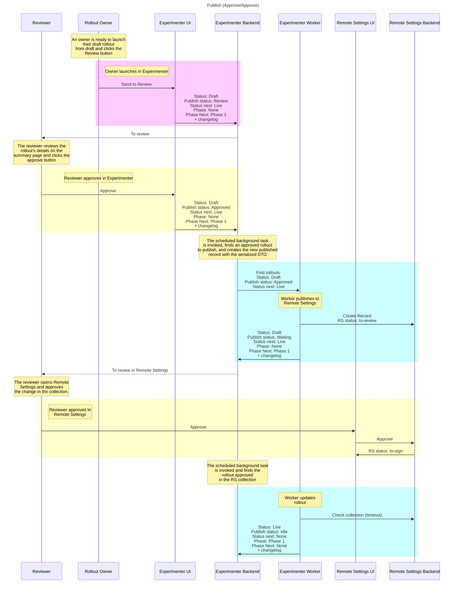
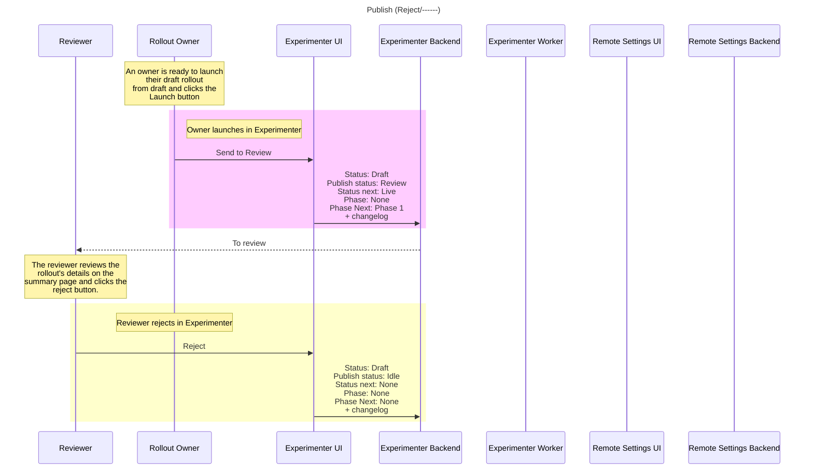
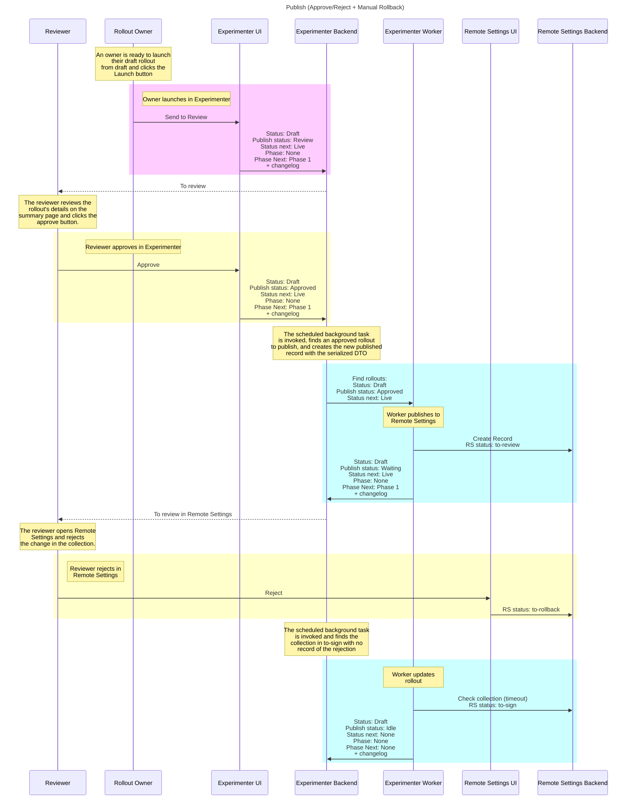
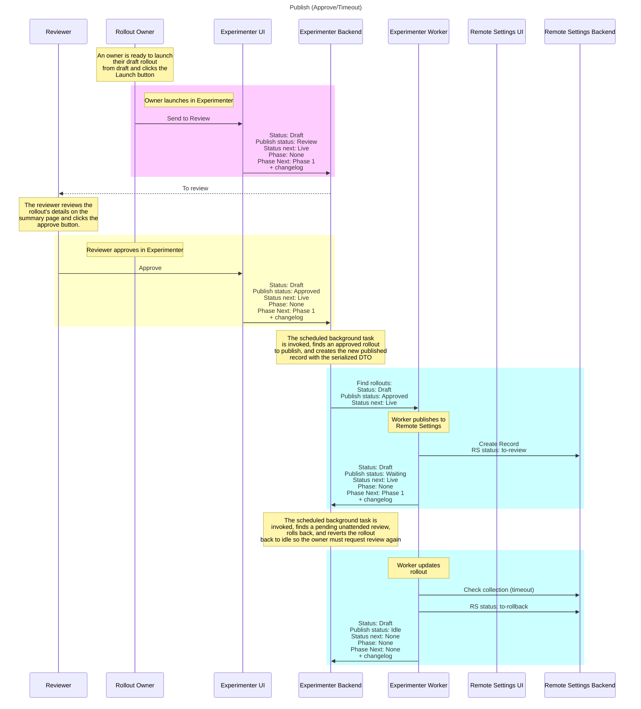
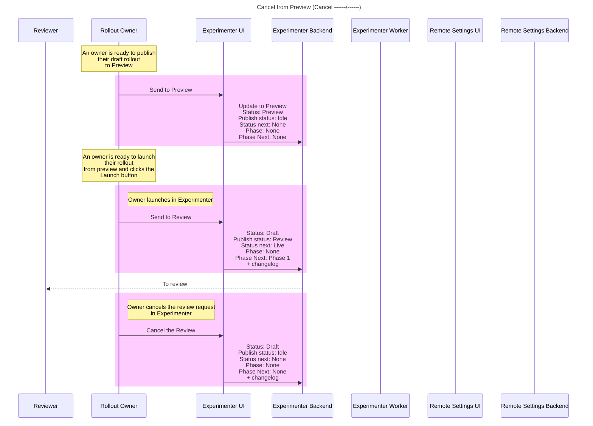
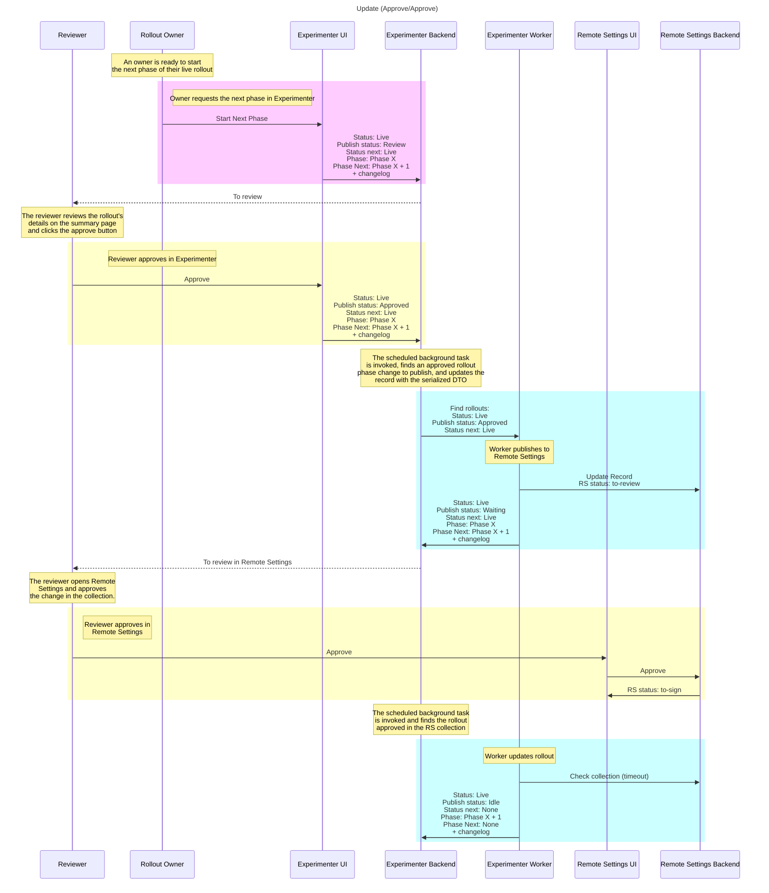
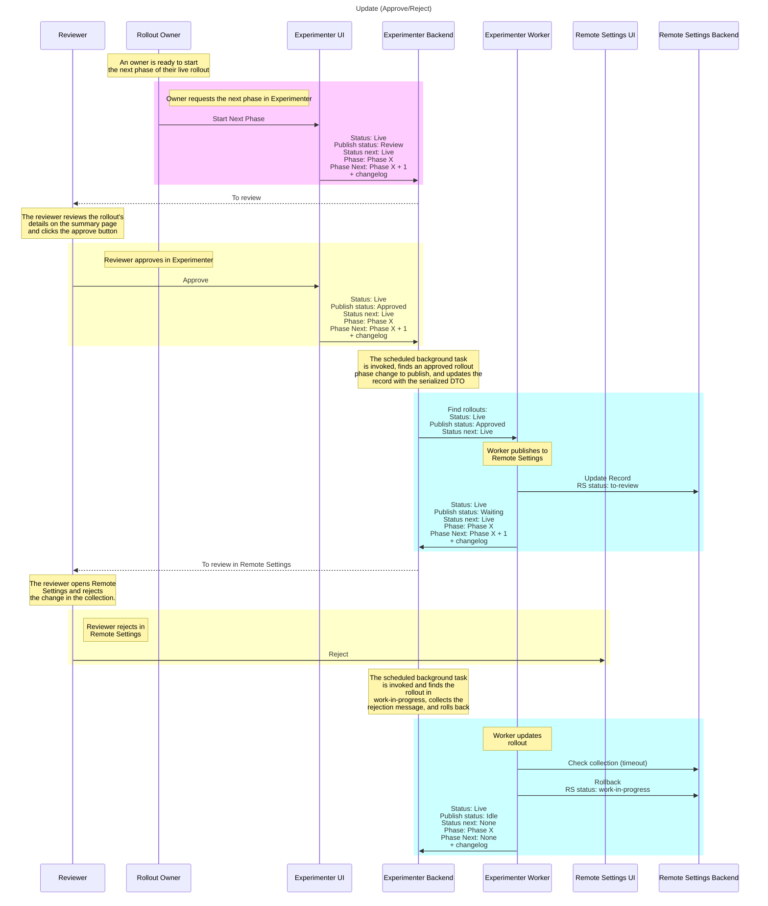
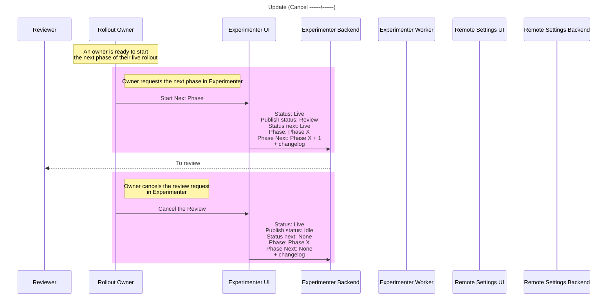
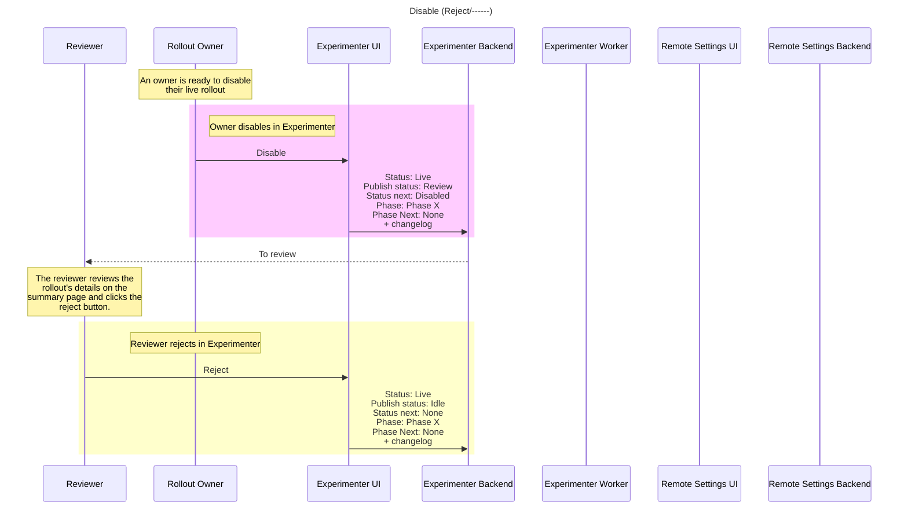
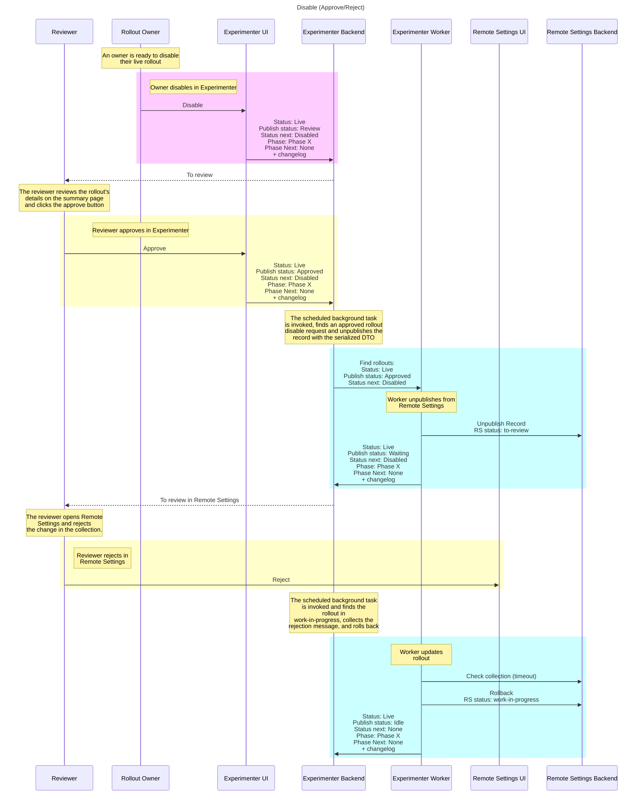

## Create

A new rollout which has yet to be sent for review or put into preview is marked for Draft.


## Preview

A draft rollout that has been validly completed is marked for Preview, is published to the preview collection in Remote Settings, and is then accessible to specially configured clients.


## Launch (approve/approve)

A draft rollout that has been validly completed is reviewed and approved in Experimenter, is reviewed and approved in Remote Settings, and is then accessible to clients.



## Launch (reject/----)

A draft rollout that has been validly completed is rejected by a reviewer in Experimenter. A rejection reason is captured in Experimenter and is displayed to the owner in Experimenter.



## Launch (approve/reject)

A draft rollout that has been validly completed is reviewed and approved in Experimenter, and is then reviewed and rejected in Remote Settings. A rejection reason is captured in Remote Settings and is displayed to the owner in Experimenter.


## Launch (approve/reject) + manual rollback

A draft rollout that has been validly completed is reviewed and approved in Experimenter, and is then reviewed and rejected in Remote Settings. The reviewer **manually rolls back** the Remote Settings collection. A rejection reason is captured in Remote Settings but is **unable to be recovered by Experimenter** because the collection was manually rolled back **before Experimenter could query its status**, and so Experimenter shows a generic rejection reason.



## Launch (approve/timed out)

A draft rollout that has been validly completed is reviewed and approved in Experimenter, is published to Remote Settings, and the collection is marked for review. Before the reviewer is able to review it in Remote Settings, the scheduled celery task is invoked and finds that the collection is blocked from further changes by having an unattended review pending. It rolls back the pending review to allow other queued changes to be made. This prevents unattended reviews in a collection from blocking other queued changes. The rollout returns to Idle so the owner must request review again.



## Launch (cancel)

When a draft rollout has requested review in Experimenter, the review can also be canceled in Experimenter. The review can only be canceled before it has been reviewed in Experimenter.


This can also be canceled when a rollout is in the Preview state and requests to be launched. When the review is canceled, the Preview rollout is sent back to Draft.



## Change Phase (Approve/Approve)

A live rollout can have its next phase pushed to its state while remaining Live. This phase change must be reviewed in order to be published to the user, following the same flow to be approved in both Experimenter and Remote Settings.



## Change Phase (Reject/------)

A live rollout phase change is reviewed and rejected in Experimenter. A rejection reason is captured in Experimenter and is displayed to the owner in Experimenter. The rollout remains in its current phase after the rejection.


## Change Phase (Approve/Reject)

A live rollout phase change is reviewed and approved in Experimenter, and is then reviewed and rejected in Remote Settings. A rejection reason is captured in Remote Settings and is displayed to the owner in Experimenter. The rollout remains in its current phase after the rejection.



## Change Phase (Approve/Reject) + manual rollback

A live rollout phase change is reviewed and approved in Experimenter, and is then reviewed and rejected in Remote Settings. The reviewer **manually rolls back** the Remote Settings collection. A rejection reason is captured in Remote Settings but is **unable to be recovered by Experimenter** because the collection was manually rolled back **before Experimenter could query its status**, and so Experimenter shows a generic rejection reason. The rollout remains in its current phase after the rejection.


## Change Phase (Approve/Timeout)

A live rollout phase change is reviewed and approved in Experimenter, is published to Remote Settings, and the collection is marked for review. Before the reviewer is able to review it in Remote Settings, the scheduled celery task is invoked and finds that the collection is blocked from further changes by having an unattended review pending. It rolls back the pending review to allow other queued changes to be made. This prevents unattended reviews in a collection from blocking other queued changes. The rollout returns to Idle, remains in its current phase, and the owner must request review again.


## Change Phase (Cancel ------/------)

A live rollout phase change can be requested while the rollout remains Live. These phase changes must be reviewed in order to be published to the user, following the same flow to be approved in both Experimenter and Remote Settings. Like the publish flow, these reviews can be canceled from Experimenter.



## Disable (Approve/Approve)

A live rollout that is published in Remote Settings is requested to be disabled by the owner, reviewed and approved in Experimenter, reviewed and approved in Remote Settings, is unpublished from the collection, and is then no longer accessible by clients.


## Disable (Reject/------)

A live rollout that is published in Remote Settings is requested to be disabled by the owner, and is then reviewed and rejected in Experimenter. A rejection reason is captured in Experimenter and is displayed to the owner in Experimenter. No change is made to Remote Settings and the rollout remains published.



## Disable (Approve/Reject)

A live rollout that is published in Remote Settings is requested to be disabled by the owner, reviewed and approved in Experimenter, and is then reviewed and rejected in Remote Settings. No change is made to Remote Settings and clients will continue to access the published rollout. A rejection reason is captured in Remote Settings and is displayed to the owner in Experimenter.



## Disable (Approve/Reject) + manual rollback

A live rollout that is published in Remote Settings is requested to be disabled by the owner, reviewed and approved in Experimenter, and is then reviewed and rejected in Remote Settings. The reviewer **manually rolls back** the Remote Settings collection. A rejection reason is captured in Remote Settings but is **unable to be recovered by Experimenter** because the collection was manually rolled back **before Experimenter could query its status**, and so Experimenter shows a generic rejection reason. No change is made to Remote Settings and the rollout remains published.


## Disable (Approve/Timeout)

A live rollout that is published in Remote Settings is requested to be disabled by the owner, reviewed and approved in Experimenter, and the unpublish change is pushed to Remote Settings. Before the reviewer is able to review it in Remote Settings, the scheduled celery task is invoked and finds that the collection is blocked from further changes by having an unattended review pending. It rolls back the pending review to allow other queued changes to be made. This prevents unattended reviews in a collection from blocking other queued changes. The rollout remains published in Remote Settings, returns to Idle, and the owner must request review again.


## Disable (Cancel ------/------)

A live rollout that is published in Remote Settings is requested to be disabled by the owner. The disable request can be canceled before it is approved in Experimenter. No change is made to Remote Settings and the rollout remains published.

```mermaid
    sequenceDiagram
        participant Reviewer
        participant Rollout Owner
        participant Experimenter UI
        participant Experimenter Backend
        participant Experimenter Worker
        participant Remote Settings UI
        participant Remote Settings Backend
        title Disable (Cancel ------/------)
        
        Note over Rollout Owner: An owner is ready to disable <br/> their live rollout

        rect rgb(255,204,255)
            Note right of Rollout Owner: Owner disables in Experimenter
            Rollout Owner->>Experimenter UI: Disable
            Experimenter UI->>Experimenter Backend: Status: Live <br/> Publish status: Review <br/> Status next: Disabled <br/> Phase: Phase X <br/> Phase Next: None <br/> + changelog
        end

        Experimenter Backend-->>Reviewer: To review
        
        rect rgb(255,204,255)
            Note right of Rollout Owner: Owner cancels the review request <br/> in Experimenter
            Rollout Owner->>Experimenter UI: Cancel the Review
            Experimenter UI->>Experimenter Backend: Status: Live <br/> Publish status: Idle <br/> Status next: None <br/> Phase: Phase X <br/> Phase Next: None <br/> + changelog
        end
```

## Enable (Approve/Approve)

A disabled rollout that is not published in Remote Settings is requested to be enabled by the owner. Enabling always moves the rollout to its next phase. The request is reviewed and approved in Experimenter, reviewed and approved in Remote Settings, the rollout is published to the collection, moves to Phase X + 1, and is then accessible to clients.

```mermaid
  sequenceDiagram
    participant Reviewer
    participant Rollout Owner
    participant Experimenter UI
    participant Experimenter Backend
    participant Experimenter Worker
    participant Remote Settings UI
    participant Remote Settings Backend
    title Enable (Approve/Approve)

    Note over Rollout Owner: An owner is ready to enable <br/> their disabled rollout

    rect rgb(255,204,255)
        Note right of Rollout Owner: Owner enables in Experimenter
        Rollout Owner->>Experimenter UI: Enable
        Experimenter UI->>Experimenter Backend: Status: Disabled <br/> Publish status: Review <br/> Status next: Live <br/> Phase: Phase X <br/> Phase Next: Phase X + 1 <br/> + changelog
    end

    Experimenter Backend-->>Reviewer: To review
    Note over Reviewer: The reviewer reviews the rollout's <br/> details on the summary page <br/> and clicks the approve button

    rect rgb(255,255,204)
        Note over Rollout Owner: Reviewer approves in Experimenter
        Reviewer->>Experimenter UI: Approve
        Experimenter UI->>Experimenter Backend: Status: Disabled <br/> Publish status: Approved <br/> Status next: Live <br/> Phase: Phase X <br/> Phase Next: Phase X + 1 <br/> + changelog
    end

    Note over Experimenter Backend: The scheduled background task <br/> is invoked, finds an approved rollout <br/> enable request and publishes the <br/> record with the serialized DTO

    rect rgb(204,255,255)
        Experimenter Backend->>Experimenter Worker: Find rollouts: <br/> Status: Disabled <br/> Publish status: Approved <br/> Status next: Live
        Note over Experimenter Worker: Worker publishes to <br/>Remote Settings
        Experimenter Worker->>Remote Settings Backend: Publish Record <br/> RS status: to-review
        Experimenter Worker->>Experimenter Backend: Status: Disabled <br/> Publish status: Waiting <br/> Status next: Live <br/> Phase: Phase X <br/> Phase Next: Phase X + 1 <br/> + changelog
    end

    Experimenter Backend-->>Reviewer: To review in Remote Settings

    Note over Reviewer: The reviewer opens Remote <br/> Settings and approves <br/> the change in the collection.

    rect rgb(255,255,204)
        Note right of Reviewer: Reviewer approves in <br/>Remote Settings
        Reviewer->>Remote Settings UI: Approve
        Remote Settings UI->>Remote Settings Backend: Approve
        Remote Settings Backend->>Remote Settings UI: RS status: to-sign
    end

    Note over Experimenter Backend: The scheduled background task <br/> is invoked and finds the rollout <br/> approved in the RS collection

    rect rgb(204,255,255)
        Note over Experimenter Worker: Worker updates rollout
        Experimenter Worker->>Remote Settings Backend: Check collection (timeout)
        Experimenter Worker->>Experimenter Backend:  Status: Live <br/> Publish status: Idle <br/> Status next: None <br/> Phase: Phase X + 1 <br/> Phase Next: None <br/> + changelog
    end
```

## Enable (Reject/------)

A disabled rollout that is not published in Remote Settings is requested to be enabled by the owner, which would move it to its next phase, and is then reviewed and rejected in Experimenter. A rejection reason is captured in Experimenter and is displayed to the owner in Experimenter. No change is made to Remote Settings and the rollout remains unpublished in its current phase.

```mermaid
  sequenceDiagram
    participant Reviewer
    participant Rollout Owner
    participant Experimenter UI
    participant Experimenter Backend
    participant Experimenter Worker
    participant Remote Settings UI
    participant Remote Settings Backend
    title Enable (Reject/------)

    Note over Rollout Owner: An owner is ready to enable <br/> their disabled rollout

    rect rgb(255,204,255)
        Note right of Rollout Owner: Owner enables in Experimenter
        Rollout Owner->>Experimenter UI: Enable
        Experimenter UI->>Experimenter Backend: Status: Disabled <br/> Publish status: Review <br/> Status next: Live <br/> Phase: Phase X <br/> Phase Next: Phase X + 1 <br/> + changelog
    end

    Experimenter Backend-->>Reviewer: To review
    Note over Reviewer: The reviewer reviews the <br/> rollout's details on the <br/> summary page and clicks the <br/> reject button.

    rect rgb(255,255,204)
        Note over Rollout Owner: Reviewer rejects in Experimenter
        Reviewer->>Experimenter UI: Reject
        Experimenter UI->>Experimenter Backend: Status: Disabled <br/> Publish status: Idle <br/> Status next: None <br/> Phase: Phase X <br/> Phase Next: None <br/> + changelog
    end
```

## Enable (Approve/Reject)

A disabled rollout that is not published in Remote Settings is requested to be enabled by the owner, which would move it to its next phase, reviewed and approved in Experimenter, and is then reviewed and rejected in Remote Settings. No change is made to Remote Settings and the rollout remains unpublished in its current phase. A rejection reason is captured in Remote Settings and is displayed to the owner in Experimenter.

```mermaid
  sequenceDiagram
    participant Reviewer
    participant Rollout Owner
    participant Experimenter UI
    participant Experimenter Backend
    participant Experimenter Worker
    participant Remote Settings UI
    participant Remote Settings Backend
    title Enable (Approve/Reject)

    Note over Rollout Owner: An owner is ready to enable <br/> their disabled rollout

    rect rgb(255,204,255)
        Note right of Rollout Owner: Owner enables in Experimenter
        Rollout Owner->>Experimenter UI: Enable
        Experimenter UI->>Experimenter Backend: Status: Disabled <br/> Publish status: Review <br/> Status next: Live <br/> Phase: Phase X <br/> Phase Next: Phase X + 1 <br/> + changelog
    end

    Experimenter Backend-->>Reviewer: To review
    Note over Reviewer: The reviewer reviews the rollout's <br/> details on the summary page <br/> and clicks the approve button

    rect rgb(255,255,204)
        Note over Rollout Owner: Reviewer approves in Experimenter
        Reviewer->>Experimenter UI: Approve
        Experimenter UI->>Experimenter Backend: Status: Disabled <br/> Publish status: Approved <br/> Status next: Live <br/> Phase: Phase X <br/> Phase Next: Phase X + 1 <br/> + changelog
    end

    Note over Experimenter Backend: The scheduled background task <br/> is invoked, finds an approved rollout <br/> enable request and publishes the <br/> record with the serialized DTO

    rect rgb(204,255,255)
        Experimenter Backend->>Experimenter Worker: Find rollouts: <br/> Status: Disabled <br/> Publish status: Approved <br/> Status next: Live
        Note over Experimenter Worker: Worker publishes to <br/>Remote Settings
        Experimenter Worker->>Remote Settings Backend: Publish Record <br/> RS status: to-review
        Experimenter Worker->>Experimenter Backend: Status: Disabled <br/> Publish status: Waiting <br/> Status next: Live <br/> Phase: Phase X <br/> Phase Next: Phase X + 1 <br/> + changelog
    end

    Experimenter Backend-->>Reviewer: To review in Remote Settings

    Note over Reviewer: The reviewer opens Remote <br/> Settings and rejects <br/> the change in the collection.

    rect rgb(255,255,204)
        Note right of Reviewer: Reviewer rejects in <br/>Remote Settings
        Reviewer->>Remote Settings UI: Reject
    end

    Note over Experimenter Backend: The scheduled background task <br/> is invoked and finds the <br/> rollout in <br/> work-in-progress, collects the <br/> rejection message, and rolls back

    rect rgb(204,255,255)
        Note over Experimenter Worker: Worker updates <br/> rollout
        Experimenter Worker->>Remote Settings Backend: Check collection (timeout)
        Experimenter Worker->>Remote Settings Backend: Rollback <br/> RS status: work-in-progress
        Experimenter Worker->>Experimenter Backend:  Status: Disabled <br/> Publish status: Idle <br/> Status next: None <br/> Phase: Phase X <br/> Phase Next: None <br/> + changelog
    end
```

## Enable (Approve/Reject) + manual rollback

A disabled rollout that is not published in Remote Settings is requested to be enabled by the owner, which would move it to its next phase, reviewed and approved in Experimenter, and is then reviewed and rejected in Remote Settings. The reviewer **manually rolls back** the Remote Settings collection. A rejection reason is captured in Remote Settings but is **unable to be recovered by Experimenter** because the collection was manually rolled back **before Experimenter could query its status**, and so Experimenter shows a generic rejection reason. No change is made to Remote Settings and the rollout remains unpublished in its current phase.

```mermaid
  sequenceDiagram
    participant Reviewer
    participant Rollout Owner
    participant Experimenter UI
    participant Experimenter Backend
    participant Experimenter Worker
    participant Remote Settings UI
    participant Remote Settings Backend
    title Enable (Approve/Reject + Manual Rollback)

    Note over Rollout Owner: An owner is ready to enable <br/> their disabled rollout

    rect rgb(255,204,255)
        Note right of Rollout Owner: Owner enables in Experimenter
        Rollout Owner->>Experimenter UI: Enable
        Experimenter UI->>Experimenter Backend: Status: Disabled <br/> Publish status: Review <br/> Status next: Live <br/> Phase: Phase X <br/> Phase Next: Phase X + 1 <br/> + changelog
    end

    Experimenter Backend-->>Reviewer: To review
    Note over Reviewer: The reviewer reviews the rollout's <br/> details on the summary page <br/> and clicks the approve button

    rect rgb(255,255,204)
        Note over Rollout Owner: Reviewer approves in Experimenter
        Reviewer->>Experimenter UI: Approve
        Experimenter UI->>Experimenter Backend: Status: Disabled <br/> Publish status: Approved <br/> Status next: Live <br/> Phase: Phase X <br/> Phase Next: Phase X + 1 <br/> + changelog
    end

    Note over Experimenter Backend: The scheduled background task <br/> is invoked, finds an approved rollout <br/> enable request and publishes the <br/> record with the serialized DTO

    rect rgb(204,255,255)
        Experimenter Backend->>Experimenter Worker: Find rollouts: <br/> Status: Disabled <br/> Publish status: Approved <br/> Status next: Live
        Note over Experimenter Worker: Worker publishes to <br/>Remote Settings
        Experimenter Worker->>Remote Settings Backend: Publish Record <br/> RS status: to-review
        Experimenter Worker->>Experimenter Backend: Status: Disabled <br/> Publish status: Waiting <br/> Status next: Live <br/> Phase: Phase X <br/> Phase Next: Phase X + 1 <br/> + changelog
    end

    Experimenter Backend-->>Reviewer: To review in Remote Settings

    Note over Reviewer: The reviewer opens Remote <br/> Settings and rejects <br/> the change in the collection.

    rect rgb(255,255,204)
        Note right of Reviewer: Reviewer rejects in <br/>Remote Settings
        Reviewer->>Remote Settings UI: Reject
        Remote Settings UI->>Remote Settings Backend: RS status: to-rollback
    end

    Note over Experimenter Backend: The scheduled background task <br/> is invoked and finds the <br/> collection in to-sign with no <br/> record of the rejection

    rect rgb(204,255,255)
        Note over Experimenter Worker: Worker updates <br/> rollout
        Experimenter Worker->>Remote Settings Backend: Check collection (timeout) <br/> RS status: to-sign
        Experimenter Worker->>Experimenter Backend:  Status: Disabled <br/> Publish status: Idle <br/> Status next: None <br/> Phase: Phase X <br/> Phase Next: None <br/> + changelog
    end
```

## Enable (Approve/Timeout)

A disabled rollout that is not published in Remote Settings is requested to be enabled by the owner, which would move it to its next phase, reviewed and approved in Experimenter, and the publish change is pushed to Remote Settings. Before the reviewer is able to review it in Remote Settings, the scheduled celery task is invoked and finds that the collection is blocked from further changes by having an unattended review pending. It rolls back the pending review to allow other queued changes to be made. This prevents unattended reviews in a collection from blocking other queued changes. The rollout remains unpublished in Remote Settings and in its current phase, returns to Idle, and the owner must request review again.

```mermaid
  sequenceDiagram
    participant Reviewer
    participant Rollout Owner
    participant Experimenter UI
    participant Experimenter Backend
    participant Experimenter Worker
    participant Remote Settings UI
    participant Remote Settings Backend
    title Enable (Approve/Timeout)

    Note over Rollout Owner: An owner is ready to enable <br/> their disabled rollout

    rect rgb(255,204,255)
        Note right of Rollout Owner: Owner enables in Experimenter
        Rollout Owner->>Experimenter UI: Enable
        Experimenter UI->>Experimenter Backend: Status: Disabled <br/> Publish status: Review <br/> Status next: Live <br/> Phase: Phase X <br/> Phase Next: Phase X + 1 <br/> + changelog
    end

    Experimenter Backend-->>Reviewer: To review
    Note over Reviewer: The reviewer reviews the rollout's <br/> details on the summary page <br/> and clicks the approve button

    rect rgb(255,255,204)
        Note over Rollout Owner: Reviewer approves in Experimenter
        Reviewer->>Experimenter UI: Approve
        Experimenter UI->>Experimenter Backend: Status: Disabled <br/> Publish status: Approved <br/> Status next: Live <br/> Phase: Phase X <br/> Phase Next: Phase X + 1 <br/> + changelog
    end

    Note over Experimenter Backend: The scheduled background task <br/> is invoked, finds an approved rollout <br/> enable request and publishes the <br/> record with the serialized DTO

    rect rgb(204,255,255)
        Experimenter Backend->>Experimenter Worker: Find rollouts: <br/> Status: Disabled <br/> Publish status: Approved <br/> Status next: Live
        Note over Experimenter Worker: Worker publishes to <br/>Remote Settings
        Experimenter Worker->>Remote Settings Backend: Publish Record <br/> RS status: to-review
        Experimenter Worker->>Experimenter Backend: Status: Disabled <br/> Publish status: Waiting <br/> Status next: Live <br/> Phase: Phase X <br/> Phase Next: Phase X + 1 <br/> + changelog
    end

    Note over Experimenter Backend: The scheduled background task is <br/> invoked, finds a pending unattended review, <br/> rolls back, and reverts the rollout <br/> back to idle so the owner must request review again

    rect rgb(204,255,255)
        Note over Experimenter Worker: Worker updates <br/> rollout
        Experimenter Worker->>Remote Settings Backend: Check collection (timeout)
        Experimenter Worker->>Remote Settings Backend: RS status: to-rollback
        Experimenter Worker->>Experimenter Backend:  Status: Disabled <br/> Publish status: Idle <br/> Status next: None <br/> Phase: Phase X <br/> Phase Next: None <br/> + changelog
    end
```

## Enable (Cancel ------/------)

A disabled rollout that is not published in Remote Settings is requested to be enabled by the owner, which would move it to its next phase. The enable request can be canceled before it is approved in Experimenter. No change is made to Remote Settings and the rollout remains unpublished in its current phase.

```mermaid
    sequenceDiagram
        participant Reviewer
        participant Rollout Owner
        participant Experimenter UI
        participant Experimenter Backend
        participant Experimenter Worker
        participant Remote Settings UI
        participant Remote Settings Backend
        title Enable (Cancel ------/------)

        Note over Rollout Owner: An owner is ready to enable <br/> their disabled rollout

        rect rgb(255,204,255)
            Note right of Rollout Owner: Owner enables in Experimenter
            Rollout Owner->>Experimenter UI: Enable
            Experimenter UI->>Experimenter Backend: Status: Disabled <br/> Publish status: Review <br/> Status next: Live <br/> Phase: Phase X <br/> Phase Next: Phase X + 1 <br/> + changelog
        end

        Experimenter Backend-->>Reviewer: To review

        rect rgb(255,204,255)
            Note right of Rollout Owner: Owner cancels the review request <br/> in Experimenter
            Rollout Owner->>Experimenter UI: Cancel the Review
            Experimenter UI->>Experimenter Backend: Status: Disabled <br/> Publish status: Idle <br/> Status next: None <br/> Phase: Phase X <br/> Phase Next: None <br/> + changelog
        end
```

## Enable with no next phase (Create New Phase)

A disabled rollout that is not published in Remote Settings is requested to be enabled by the owner, but no next phase is defined. Experimenter displays a warning that a new phase will be created with the same current size X%. If the owner confirms, a new Phase X + 1 is created with the same population size and the enable request proceeds to review.

```mermaid
    sequenceDiagram
    participant Reviewer
    participant Rollout Owner
    participant Experimenter UI
    participant Experimenter Backend
    participant Experimenter Worker
    participant Remote Settings UI
    participant Remote Settings Backend
    title Enable with no next phase (Create New Phase)

    Note over Rollout Owner: An owner is ready to enable <br/> their disabled rollout

    rect rgb(255,204,255)
        Note right of Rollout Owner: Owner enables in Experimenter
        Rollout Owner->>Experimenter UI: Enable
        Experimenter UI-->>Rollout Owner: Warning: No next phase defined, <br/> a new phase will be created <br/> with the same current size X%.
        Rollout Owner->>Experimenter UI: Yes, create new phase
        Experimenter UI->>Experimenter Backend: Create Phase X + 1 <br/> Population size: X%
        Experimenter UI->>Experimenter Backend: Status: Disabled <br/> Publish status: Review <br/> Status next: Live <br/> Phase: Phase X <br/> Phase Next: Phase X + 1 <br/> + changelog
    end

    Experimenter Backend-->>Reviewer: To review

    Note over Reviewer: The reviewer reviews the rollout's <br/> details on the summary page <br/> and clicks the approve button

    rect rgb(255,255,204)
        Note over Rollout Owner: Reviewer approves in Experimenter
        Reviewer->>Experimenter UI: Approve
        Experimenter UI->>Experimenter Backend: Status: Disabled <br/> Publish status: Approved <br/> Status next: Live <br/> Phase: Phase X <br/> Phase Next: Phase X + 1 <br/> + changelog
    end

    Note over Experimenter Backend: The scheduled background task <br/> is invoked, finds an approved rollout <br/> enable request and publishes the <br/> record with the serialized DTO

    rect rgb(204,255,255)
        Experimenter Backend->>Experimenter Worker: Find rollouts: <br/> Status: Disabled <br/> Publish status: Approved <br/> Status next: Live
        Note over Experimenter Worker: Worker publishes to <br/>Remote Settings
        Experimenter Worker->>Remote Settings Backend: Publish Record <br/> RS status: to-review
        Experimenter Worker->>Experimenter Backend: Status: Disabled <br/> Publish status: Waiting <br/> Status next: Live <br/> Phase: Phase X <br/> Phase Next: Phase X + 1 <br/> + changelog
    end

    Experimenter Backend-->>Reviewer: To review in Remote Settings

    Note over Reviewer: The reviewer opens Remote <br/> Settings and approves <br/> the change in the collection.

    rect rgb(255,255,204)
        Note right of Reviewer: Reviewer approves in <br/>Remote Settings
        Reviewer->>Remote Settings UI: Approve
        Remote Settings UI->>Remote Settings Backend: Approve
        Remote Settings Backend->>Remote Settings UI: RS status: to-sign
    end

    Note over Experimenter Backend: The scheduled background task <br/> is invoked and finds the rollout <br/> approved in the RS collection

    rect rgb(204,255,255)
        Note over Experimenter Worker: Worker updates rollout
        Experimenter Worker->>Remote Settings Backend: Check collection (timeout)
        Experimenter Worker->>Experimenter Backend: Status: Live <br/> Publish status: Idle <br/> Status next: None <br/> Phase: Phase X + 1 <br/> Phase Next: None <br/> + changelog
    end
```

## Enable with no next phase (Cancel)

A disabled rollout that is not published in Remote Settings is requested to be enabled by the owner, but no next phase is defined. Experimenter displays a warning that a new phase will be created with the same current size X%. If the owner cancels, no new phase is created, no review is requested, and the rollout remains Disabled and unpublished in its current phase.

```mermaid
    sequenceDiagram
    participant Reviewer
    participant Rollout Owner
    participant Experimenter UI
    participant Experimenter Backend
    participant Experimenter Worker
    participant Remote Settings UI
    participant Remote Settings Backend
    title Enable with no next phase (Cancel)

    Note over Rollout Owner: An owner is ready to enable <br/> their disabled rollout

    rect rgb(255,204,255)
        Note right of Rollout Owner: Owner enables in Experimenter
        Rollout Owner->>Experimenter UI: Enable
        Experimenter UI-->>Rollout Owner: Warning: No next phase defined, <br/> a new phase will be created <br/> with the same current size X%.
        Rollout Owner->>Experimenter UI: Cancel
        Experimenter UI->>Experimenter Backend: Status: Disabled <br/> Publish status: Idle <br/> Status next: None <br/> Phase: Phase X <br/> Phase Next: None
    end
```
