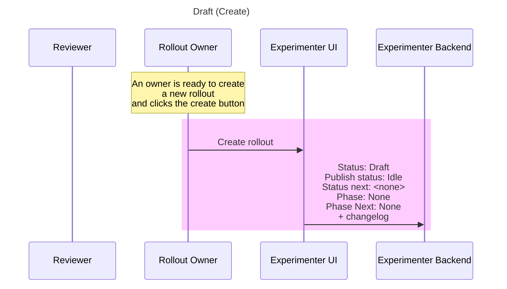
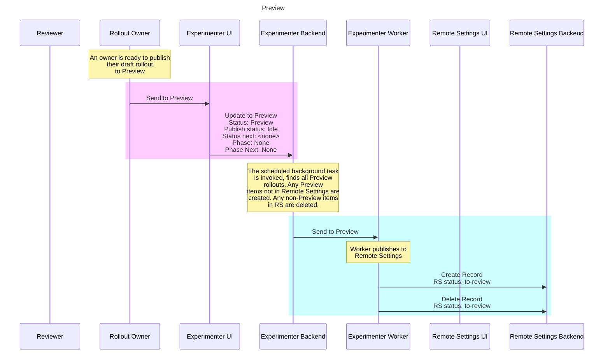
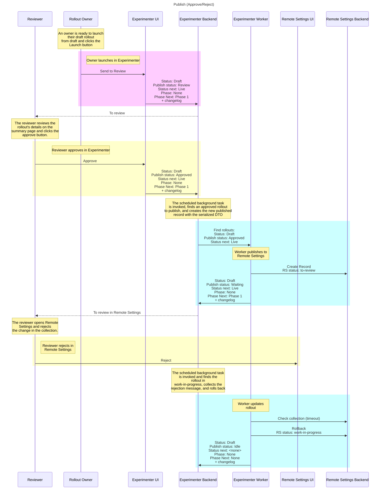
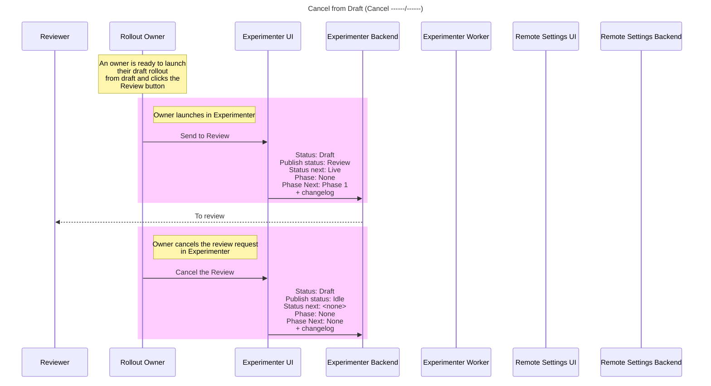
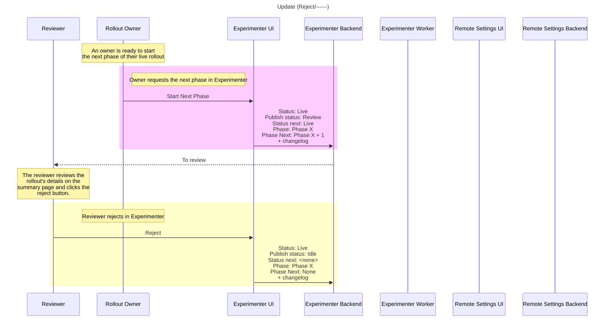
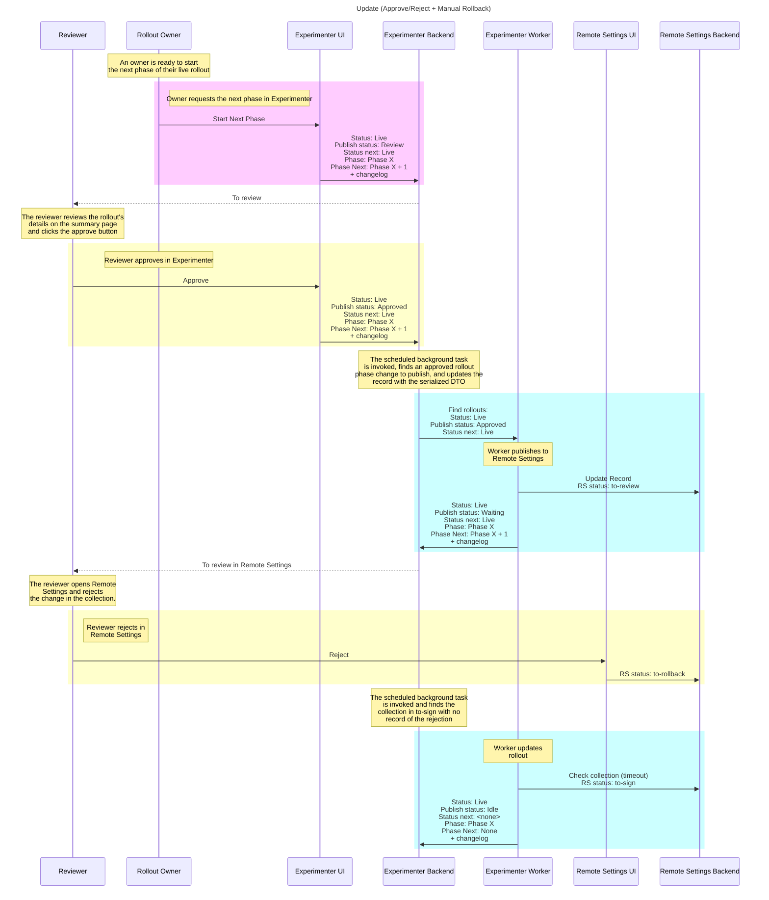
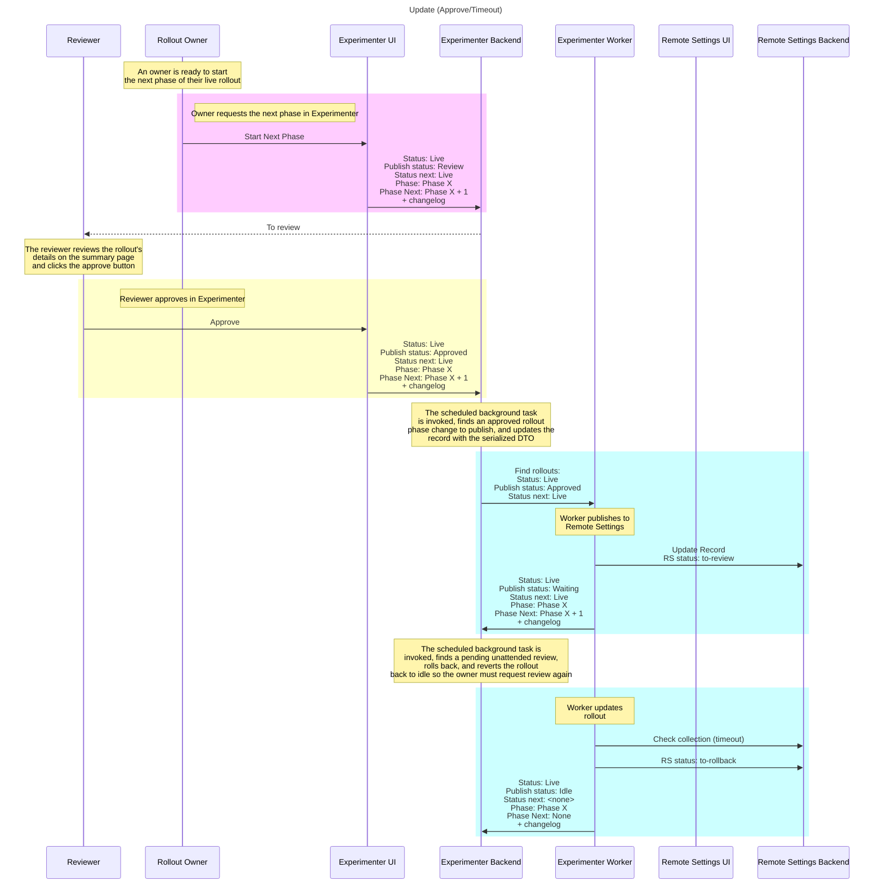
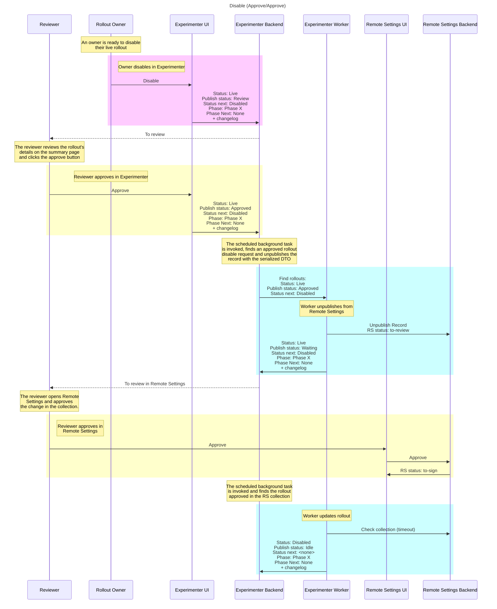
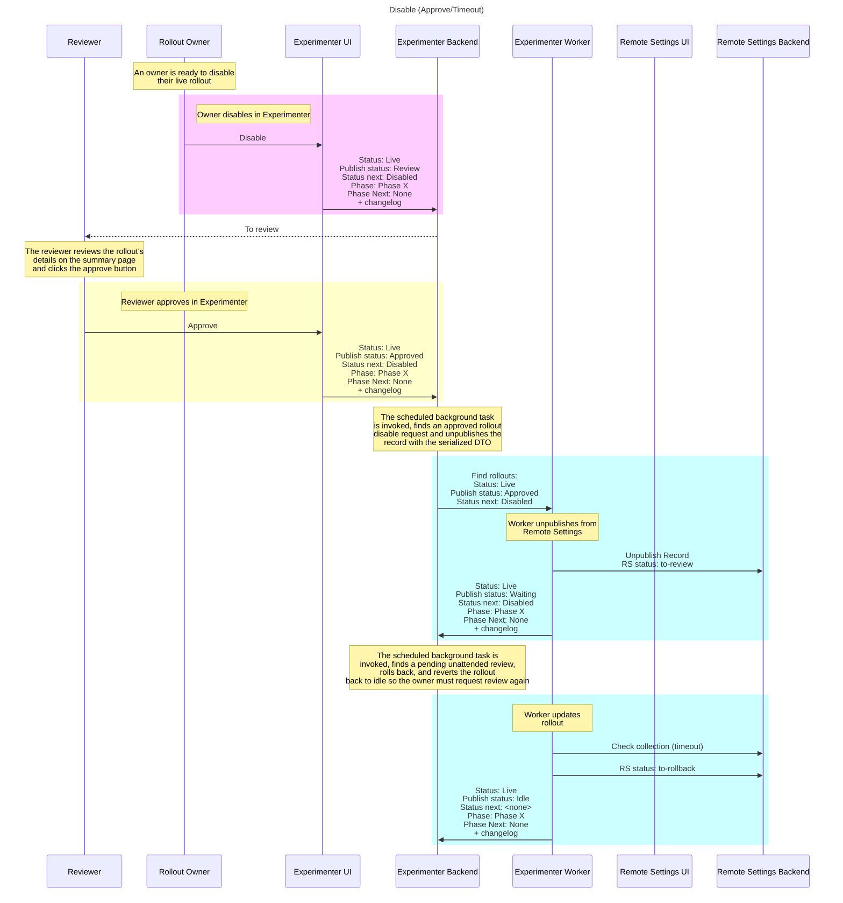

## Create

A new rollout is created in Experimenter. Since it has not been sent to Preview or sent for review yet, it remains in Draft with no active phase.



## Preview

A draft rollout is sent to Preview. The rollout is published to the Preview collection in Remote Settings, but it is not Live yet and does not have an active phase.



## Launch (approve/approve)

A draft rollout is sent for review, approved in Experimenter, published to Remote Settings, and then approved in Remote Settings. After both approvals are complete, the rollout becomes Live and starts in Phase 1.


## Launch (reject/----)

A draft rollout is sent for review but rejected in Experimenter. The rollout stays in Draft and returns to Idle so the owner can make changes and request review again.


## Launch (approve/reject)

A draft rollout is approved in Experimenter and sent to Remote Settings, but the Remote Settings reviewer rejects it. The rollout is rolled back and returns to Draft and Idle so the owner can request review again.



## Launch (approve/reject) + manual rollback

A draft rollout is approved in Experimenter and rejected in Remote Settings, but the Remote Settings rollback is handled manually before Experimenter can recover the rejection reason. The rollout returns to Draft and Idle.


## Launch (approve/timed out)

A draft rollout is approved in Experimenter and sent to Remote Settings, but the Remote Settings review times out. The rollout returns to Draft and Idle, so the owner must request review again.


## Launch (cancel)

A rollout launch review is canceled in Experimenter before it is approved in Experimenter. The rollout returns to Idle and the owner can request review again later.



A rollout can also be launched from Preview. If that review is canceled before approval, the rollout returns to Draft and Idle.


## Change Phase (Approve/Approve)

A live rollout moves to the next phase while remaining Live. The phase change is approved in Experimenter, approved in Remote Settings, and then the active phase is updated.


## Change Phase (Reject/------)

A live rollout phase change is sent for review but rejected in Experimenter. The rollout remains Live in the current phase and returns to Idle.



## Change Phase (Approve/Reject)

A live rollout phase change is approved in Experimenter but rejected in Remote Settings. The rollout is rolled back and remains Live in the current phase.


## Change Phase (Approve/Reject) + manual rollback

A live rollout phase change is approved in Experimenter and rejected in Remote Settings, but the Remote Settings rollback is handled manually before Experimenter can recover the rejection reason. The rollout remains Live in the current phase and returns to Idle.



## Change Phase (Approve/Timeout)

A live rollout phase change is approved in Experimenter and sent to Remote Settings, but the Remote Settings review times out. The rollout stays Live in the current phase and returns to Idle, so the owner must request review again.



## Change Phase (Cancel ------/------)

A live rollout phase change review is canceled in Experimenter before it is approved in Experimenter. The rollout remains Live in the current phase and returns to Idle.


## Disable (Approve/Approve)

A live rollout is disabled after being approved in Experimenter and approved in Remote Settings. Disabling means the rollout is unpublished from Remote Settings. The rollout moves from Live to Disabled while staying in the same phase.



## Disable (Reject/------)

A live rollout disable request is rejected in Experimenter. The rollout remains Live and published in Remote Settings, and returns to Idle.


## Disable (Approve/Reject)

A live rollout disable request is approved in Experimenter but rejected in Remote Settings. The unpublish change is rolled back and the rollout remains Live and published in Remote Settings.


## Disable (Approve/Reject) + manual rollback

A live rollout disable request is approved in Experimenter and rejected in Remote Settings, but the Remote Settings rollback is handled manually before Experimenter can recover the rejection reason. The unpublish change is rolled back, so the rollout remains Live and published in Remote Settings.


## Disable (Approve/Timeout)

A live rollout disable request is approved in Experimenter and sent to Remote Settings as an unpublish change, but the Remote Settings review times out. The rollout stays Live and published in Remote Settings, and returns to Idle so the owner must request review again.



## Disable (Cancel ------/------)

A live rollout disable review is canceled in Experimenter before it is approved in Experimenter. The rollout remains Live and published in Remote Settings, and returns to Idle.

```mermaid
    sequenceDiagram
        participant Reviewer
        participant Rollout Owner
        participant Experimenter UI
        participant Experimenter Backend
        participant Experimenter Worker
        participant Remote Settings UI
        participant Remote Settings Backend
        title Disable (Cancel ------/------)
        
        Note over Rollout Owner: An owner is ready to disable <br/> their live rollout

        rect rgb(255,204,255)
            Note right of Rollout Owner: Owner disables in Experimenter
            Rollout Owner->>Experimenter UI: Disable
            Experimenter UI->>Experimenter Backend: Status: Live <br/> Publish status: Review <br/> Status next: Disabled <br/> Phase: Phase X <br/> Phase Next: None <br/> + changelog
        end

        Experimenter Backend-->>Reviewer: To review
        
        rect rgb(255,204,255)
            Note right of Rollout Owner: Owner cancels the review request <br/> in Experimenter
            Rollout Owner->>Experimenter UI: Cancel the Review
            Experimenter UI->>Experimenter Backend: Status: Live <br/> Publish status: Idle <br/> Status next: <none> <br/> Phase: Phase X <br/> Phase Next: None <br/> + changelog
        end
```

## Enable (Approve/Approve)

A disabled rollout is enabled after being approved in Experimenter and approved in Remote Settings. Enabling means the rollout is published in Remote Settings. The rollout moves from Disabled back to Live while staying in the same phase.

```mermaid
  sequenceDiagram
    participant Reviewer
    participant Rollout Owner
    participant Experimenter UI
    participant Experimenter Backend
    participant Experimenter Worker
    participant Remote Settings UI
    participant Remote Settings Backend
    title Enable (Approve/Approve)

    Note over Rollout Owner: An owner is ready to enable <br/> their disabled rollout

    rect rgb(255,204,255)
        Note right of Rollout Owner: Owner enables in Experimenter
        Rollout Owner->>Experimenter UI: Enable
        Experimenter UI->>Experimenter Backend: Status: Disabled <br/> Publish status: Review <br/> Status next: Live <br/> Phase: Phase X <br/> Phase Next: None <br/> + changelog
    end

    Experimenter Backend-->>Reviewer: To review
    Note over Reviewer: The reviewer reviews the rollout's <br/> details on the summary page <br/> and clicks the approve button

    rect rgb(255,255,204)
        Note over Rollout Owner: Reviewer approves in Experimenter
        Reviewer->>Experimenter UI: Approve
        Experimenter UI->>Experimenter Backend: Status: Disabled <br/> Publish status: Approved <br/> Status next: Live <br/> Phase: Phase X <br/> Phase Next: None <br/> + changelog
    end

    Note over Experimenter Backend: The scheduled background task <br/> is invoked, finds an approved rollout <br/> enable request and publishes the <br/> record with the serialized DTO

    rect rgb(204,255,255)
        Experimenter Backend->>Experimenter Worker: Find rollouts: <br/> Status: Disabled <br/> Publish status: Approved <br/> Status next: Live
        Note over Experimenter Worker: Worker publishes to <br/>Remote Settings
        Experimenter Worker->>Remote Settings Backend: Publish Record <br/> RS status: to-review
        Experimenter Worker->>Experimenter Backend: Status: Disabled <br/> Publish status: Waiting <br/> Status next: Live <br/> Phase: Phase X <br/> Phase Next: None <br/> + changelog
    end

    Experimenter Backend-->>Reviewer: To review in Remote Settings

    Note over Reviewer: The reviewer opens Remote <br/> Settings and approves <br/> the change in the collection.

    rect rgb(255,255,204)
        Note right of Reviewer: Reviewer approves in <br/>Remote Settings
        Reviewer->>Remote Settings UI: Approve
        Remote Settings UI->>Remote Settings Backend: Approve
        Remote Settings Backend->>Remote Settings UI: RS status: to-sign
    end

    Note over Experimenter Backend: The scheduled background task <br/> is invoked and finds the rollout <br/> approved in the RS collection

    rect rgb(204,255,255)
        Note over Experimenter Worker: Worker updates rollout
        Experimenter Worker->>Remote Settings Backend: Check collection (timeout)
        Experimenter Worker->>Experimenter Backend:  Status: Live <br/> Publish status: Idle <br/> Status next: <none> <br/> Phase: Phase X <br/> Phase Next: None <br/> + changelog
    end
```

## Enable (Reject/------)

A disabled rollout enable request is rejected in Experimenter. The rollout remains Disabled and unpublished in Remote Settings, and returns to Idle.

```mermaid
  sequenceDiagram
    participant Reviewer
    participant Rollout Owner
    participant Experimenter UI
    participant Experimenter Backend
    participant Experimenter Worker
    participant Remote Settings UI
    participant Remote Settings Backend
    title Enable (Reject/------)

    Note over Rollout Owner: An owner is ready to enable <br/> their disabled rollout

    rect rgb(255,204,255)
        Note right of Rollout Owner: Owner enables in Experimenter
        Rollout Owner->>Experimenter UI: Enable
        Experimenter UI->>Experimenter Backend: Status: Disabled <br/> Publish status: Review <br/> Status next: Live <br/> Phase: Phase X <br/> Phase Next: None <br/> + changelog
    end

    Experimenter Backend-->>Reviewer: To review
    Note over Reviewer: The reviewer reviews the <br/> rollout's details on the <br/> summary page and clicks the <br/> reject button.

    rect rgb(255,255,204)
        Note over Rollout Owner: Reviewer rejects in Experimenter
        Reviewer->>Experimenter UI: Reject
        Experimenter UI->>Experimenter Backend: Status: Disabled <br/> Publish status: Idle <br/> Status next: <none> <br/> Phase: Phase X <br/> Phase Next: None <br/> + changelog
    end
```

## Enable (Approve/Reject)

A disabled rollout enable request is approved in Experimenter but rejected in Remote Settings. The publish change is rolled back and the rollout remains Disabled and unpublished in Remote Settings.

```mermaid
  sequenceDiagram
    participant Reviewer
    participant Rollout Owner
    participant Experimenter UI
    participant Experimenter Backend
    participant Experimenter Worker
    participant Remote Settings UI
    participant Remote Settings Backend
    title Enable (Approve/Reject)

    Note over Rollout Owner: An owner is ready to enable <br/> their disabled rollout

    rect rgb(255,204,255)
        Note right of Rollout Owner: Owner enables in Experimenter
        Rollout Owner->>Experimenter UI: Enable
        Experimenter UI->>Experimenter Backend: Status: Disabled <br/> Publish status: Review <br/> Status next: Live <br/> Phase: Phase X <br/> Phase Next: None <br/> + changelog
    end

    Experimenter Backend-->>Reviewer: To review
    Note over Reviewer: The reviewer reviews the rollout's <br/> details on the summary page <br/> and clicks the approve button

    rect rgb(255,255,204)
        Note over Rollout Owner: Reviewer approves in Experimenter
        Reviewer->>Experimenter UI: Approve
        Experimenter UI->>Experimenter Backend: Status: Disabled <br/> Publish status: Approved <br/> Status next: Live <br/> Phase: Phase X <br/> Phase Next: None <br/> + changelog
    end

    Note over Experimenter Backend: The scheduled background task <br/> is invoked, finds an approved rollout <br/> enable request and publishes the <br/> record with the serialized DTO

    rect rgb(204,255,255)
        Experimenter Backend->>Experimenter Worker: Find rollouts: <br/> Status: Disabled <br/> Publish status: Approved <br/> Status next: Live
        Note over Experimenter Worker: Worker publishes to <br/>Remote Settings
        Experimenter Worker->>Remote Settings Backend: Publish Record <br/> RS status: to-review
        Experimenter Worker->>Experimenter Backend: Status: Disabled <br/> Publish status: Waiting <br/> Status next: Live <br/> Phase: Phase X <br/> Phase Next: None <br/> + changelog
    end

    Experimenter Backend-->>Reviewer: To review in Remote Settings

    Note over Reviewer: The reviewer opens Remote <br/> Settings and rejects <br/> the change in the collection.

    rect rgb(255,255,204)
        Note right of Reviewer: Reviewer rejects in <br/>Remote Settings
        Reviewer->>Remote Settings UI: Reject
    end

    Note over Experimenter Backend: The scheduled background task <br/> is invoked and finds the <br/> rollout in <br/> work-in-progress, collects the <br/> rejection message, and rolls back

    rect rgb(204,255,255)
        Note over Experimenter Worker: Worker updates <br/> rollout
        Experimenter Worker->>Remote Settings Backend: Check collection (timeout)
        Experimenter Worker->>Remote Settings Backend: Rollback <br/> RS status: work-in-progress
        Experimenter Worker->>Experimenter Backend:  Status: Disabled <br/> Publish status: Idle <br/> Status next: <none> <br/> Phase: Phase X <br/> Phase Next: None <br/> + changelog
    end
```

## Enable (Approve/Reject) + manual rollback

A disabled rollout enable request is approved in Experimenter and rejected in Remote Settings, but the Remote Settings rollback is handled manually before Experimenter can recover the rejection reason. The publish change is rolled back, so the rollout remains Disabled and unpublished in Remote Settings.

```mermaid
  sequenceDiagram
    participant Reviewer
    participant Rollout Owner
    participant Experimenter UI
    participant Experimenter Backend
    participant Experimenter Worker
    participant Remote Settings UI
    participant Remote Settings Backend
    title Enable (Approve/Reject + Manual Rollback)

    Note over Rollout Owner: An owner is ready to enable <br/> their disabled rollout

    rect rgb(255,204,255)
        Note right of Rollout Owner: Owner enables in Experimenter
        Rollout Owner->>Experimenter UI: Enable
        Experimenter UI->>Experimenter Backend: Status: Disabled <br/> Publish status: Review <br/> Status next: Live <br/> Phase: Phase X <br/> Phase Next: None <br/> + changelog
    end

    Experimenter Backend-->>Reviewer: To review
    Note over Reviewer: The reviewer reviews the rollout's <br/> details on the summary page <br/> and clicks the approve button

    rect rgb(255,255,204)
        Note over Rollout Owner: Reviewer approves in Experimenter
        Reviewer->>Experimenter UI: Approve
        Experimenter UI->>Experimenter Backend: Status: Disabled <br/> Publish status: Approved <br/> Status next: Live <br/> Phase: Phase X <br/> Phase Next: None <br/> + changelog
    end

    Note over Experimenter Backend: The scheduled background task <br/> is invoked, finds an approved rollout <br/> enable request and publishes the <br/> record with the serialized DTO

    rect rgb(204,255,255)
        Experimenter Backend->>Experimenter Worker: Find rollouts: <br/> Status: Disabled <br/> Publish status: Approved <br/> Status next: Live
        Note over Experimenter Worker: Worker publishes to <br/>Remote Settings
        Experimenter Worker->>Remote Settings Backend: Publish Record <br/> RS status: to-review
        Experimenter Worker->>Experimenter Backend: Status: Disabled <br/> Publish status: Waiting <br/> Status next: Live <br/> Phase: Phase X <br/> Phase Next: None <br/> + changelog
    end

    Experimenter Backend-->>Reviewer: To review in Remote Settings

    Note over Reviewer: The reviewer opens Remote <br/> Settings and rejects <br/> the change in the collection.

    rect rgb(255,255,204)
        Note right of Reviewer: Reviewer rejects in <br/>Remote Settings
        Reviewer->>Remote Settings UI: Reject
        Remote Settings UI->>Remote Settings Backend: RS status: to-rollback
    end

    Note over Experimenter Backend: The scheduled background task <br/> is invoked and finds the <br/> collection in to-sign with no <br/> record of the rejection

    rect rgb(204,255,255)
        Note over Experimenter Worker: Worker updates <br/> rollout
        Experimenter Worker->>Remote Settings Backend: Check collection (timeout) <br/> RS status: to-sign
        Experimenter Worker->>Experimenter Backend:  Status: Disabled <br/> Publish status: Idle <br/> Status next: <none> <br/> Phase: Phase X <br/> Phase Next: None <br/> + changelog
    end
```

## Enable (Approve/Timeout)

A disabled rollout enable request is approved in Experimenter and sent to Remote Settings as a publish change, but the Remote Settings review times out. The rollout stays Disabled and unpublished in Remote Settings, and returns to Idle so the owner must request review again.

```mermaid
  sequenceDiagram
    participant Reviewer
    participant Rollout Owner
    participant Experimenter UI
    participant Experimenter Backend
    participant Experimenter Worker
    participant Remote Settings UI
    participant Remote Settings Backend
    title Enable (Approve/Timeout)

    Note over Rollout Owner: An owner is ready to enable <br/> their disabled rollout

    rect rgb(255,204,255)
        Note right of Rollout Owner: Owner enables in Experimenter
        Rollout Owner->>Experimenter UI: Enable
        Experimenter UI->>Experimenter Backend: Status: Disabled <br/> Publish status: Review <br/> Status next: Live <br/> Phase: Phase X <br/> Phase Next: None <br/> + changelog
    end

    Experimenter Backend-->>Reviewer: To review
    Note over Reviewer: The reviewer reviews the rollout's <br/> details on the summary page <br/> and clicks the approve button

    rect rgb(255,255,204)
        Note over Rollout Owner: Reviewer approves in Experimenter
        Reviewer->>Experimenter UI: Approve
        Experimenter UI->>Experimenter Backend: Status: Disabled <br/> Publish status: Approved <br/> Status next: Live <br/> Phase: Phase X <br/> Phase Next: None <br/> + changelog
    end

    Note over Experimenter Backend: The scheduled background task <br/> is invoked, finds an approved rollout <br/> enable request and publishes the <br/> record with the serialized DTO

    rect rgb(204,255,255)
        Experimenter Backend->>Experimenter Worker: Find rollouts: <br/> Status: Disabled <br/> Publish status: Approved <br/> Status next: Live
        Note over Experimenter Worker: Worker publishes to <br/>Remote Settings
        Experimenter Worker->>Remote Settings Backend: Publish Record <br/> RS status: to-review
        Experimenter Worker->>Experimenter Backend: Status: Disabled <br/> Publish status: Waiting <br/> Status next: Live <br/> Phase: Phase X <br/> Phase Next: None <br/> + changelog
    end

    Note over Experimenter Backend: The scheduled background task is <br/> invoked, finds a pending unattended review, <br/> rolls back, and reverts the rollout <br/> back to idle so the owner must request review again

    rect rgb(204,255,255)
        Note over Experimenter Worker: Worker updates <br/> rollout
        Experimenter Worker->>Remote Settings Backend: Check collection (timeout)
        Experimenter Worker->>Remote Settings Backend: RS status: to-rollback
        Experimenter Worker->>Experimenter Backend:  Status: Disabled <br/> Publish status: Idle <br/> Status next: <none> <br/> Phase: Phase X <br/> Phase Next: None <br/> + changelog
    end
```

## Enable (Cancel ------/------)

A disabled rollout enable review is canceled in Experimenter before it is approved in Experimenter. The rollout remains Disabled and unpublished in Remote Settings, and returns to Idle.

```mermaid
    sequenceDiagram
        participant Reviewer
        participant Rollout Owner
        participant Experimenter UI
        participant Experimenter Backend
        participant Experimenter Worker
        participant Remote Settings UI
        participant Remote Settings Backend
        title Enable (Cancel ------/------)

        Note over Rollout Owner: An owner is ready to enable <br/> their disabled rollout

        rect rgb(255,204,255)
            Note right of Rollout Owner: Owner enables in Experimenter
            Rollout Owner->>Experimenter UI: Enable
            Experimenter UI->>Experimenter Backend: Status: Disabled <br/> Publish status: Review <br/> Status next: Live <br/> Phase: Phase X <br/> Phase Next: None <br/> + changelog
        end

        Experimenter Backend-->>Reviewer: To review

        rect rgb(255,204,255)
            Note right of Rollout Owner: Owner cancels the review request <br/> in Experimenter
            Rollout Owner->>Experimenter UI: Cancel the Review
            Experimenter UI->>Experimenter Backend: Status: Disabled <br/> Publish status: Idle <br/> Status next: <none> <br/> Phase: Phase X <br/> Phase Next: None <br/> + changelog
        end
```
